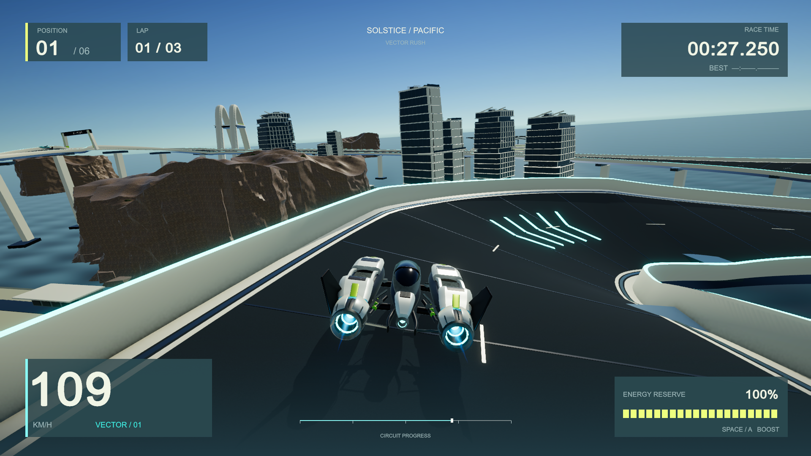

# VECTOR RUSH

A playable, original anti-gravity racing prototype for Apple Silicon macOS. Pilot Kestrel 07 through three laps of Nocturne Circuit against five rivals. The current development direction is a night urban circuit.

[Private GitHub repository](https://github.com/emrickk/vector-rush) · [Build brief](docs/GPT6-BUILD-PROMPT.md) · [Development history](docs/development-history.md) · [Ship art plan](docs/ship-art-plan.md)

## Current night milestone — racing HUD

The HUD now groups speed and boost in one instrument, adds the actual circuit map with live racer markers, and uses bundled Rajdhani typography. Compact position/lap and race-time panels keep the road center clear; actual lap transitions trigger a brief final-lap cue. Countdown, pause and results share the same typography.

The native game now uses the corrected V3 ship with flush citron/07 paint, baked surface maps and authored engine anchors. The canopy, intake and nozzle contact artifacts are repaired. Recessed gallery panels and focused wall lighting create readable warm/cool corridors; plume length and brightness now follow actual throttle, strengthen during active boost, and extinguish after lift-off even at speed. A rival corridor guard prevents the repeated wall stalls observed in the earlier night candidate.

[Current HUD preview](evidence/hud-motion-01/VectorRush-HUD-current.mp4): 15 seconds at 1080p, silent, with automated steering at 24 simulation frames per second.

[Native HUD views](evidence/hud-native-02/): seven actual states at 1920×1080, 1280×800 and 1920×810, including an actual three-lap finish. The first rejected scaling pass is preserved separately. [Independent responsive-layout review](docs/hud-reviews/003-native-responsive-correction.md).

[Earlier night-scene preview (before the throttle fix and HUD redesign)](evidence/night-v4-motion-02/VectorRush-night-v4-current.mp4): 15 seconds at 1080p, silent, with automated steering at 24 simulation frames per second. It shows the road-gloss/lighting milestone, predates the throttle-response correction, and is separate from the real-time performance sample.

[Current native throttle check](evidence/throttle-native-01/throttle-evidence.json): [quarter throttle](evidence/throttle-native-01/02-quarter.png), [full throttle](evidence/throttle-native-01/03-full.png), [released while coasting](evidence/throttle-native-01/04-release-coasting.png), [boost](evidence/throttle-native-01/05-boost.png). Exhaust fell below 2% in 0.150 seconds while still at 242 km/h, then reached zero.

This is a playable prototype milestone, not AAA acceptance. Exterior buildings/windows and gallery bays remain repetitive, the ceiling is too dark, and residual diagonal road sheen remains visible. The last material adjustment lowers its contrast without claiming to repair the underlying cause. Human handling, competitive rival pacing and physical gamepad hardware need further assessment.

## Play

Open **[Builds/Vector Rush.app](Builds/Vector%20Rush.app)** or unpack **[the current night archive](Builds/VectorRush-macOS-HUD-2026-09-07.zip)**. The **[VectorRush-macOS-2026-09-07.zip](Builds/VectorRush-macOS-2026-09-07.zip)** archive contains the earlier coastal delivery and is historical. Build products stay local and are excluded from Git; source and selected evidence are in the private repository.

| Action | Keyboard | Gamepad |
|---|---|---|
| Start / confirm | Enter | A / south button |
| Accelerate | W / Up | Right trigger |
| Steer | A/D or Left/Right | Left stick |
| Brake | S / Down | Left trigger |
| Airbrakes | Q / E | Left / right shoulder |
| Boost | Space | A / south button |
| Recover | R | Y / north button |
| Pause | Escape / P | Start |

Menus support the pointer. Pause includes Resume, Restart, camera shake and Quit. Results supports another race.

## Current validation

- **21 native HUD phase/aspect captures complete**, with a real final-lap event and three-lap finish in 112.60 seconds, zero player recoveries. Native pointer Start/Resume/Restart/Quit and an outside-click rejection checked at 1280×800; keyboard Pause opened correctly.
- **32/32 Unity tests passed**, including analog trigger/release at high coasting speed, player exclusion, rival edge correction and adjacent-traffic clearance.
- **Three player laps in 112.60 seconds, zero recoveries across all six racers** during the observed race. Both restart launches and all three countdown-pause checks passed. Rivals had completed 2.27–2.74 laps when the player ended the race; their independent completion and competitive pacing are not established.
- **1920×1080 on Apple M2 Max:** 3,529 frame intervals over the real-time sample, VSync enabled, mean **17.01 ms**, P95 **20.60 ms**, P99 **25.34 ms**, with 250.3 MiB Unity allocation. This is not a locked 60fps or isolated GPU claim. No build/bake ran during the sample; idle desktop apps remained open.
- Eight calibrated native ship-control views confirm the geometry repair using unchanged prior maps. The final maps were rebaked, hash/dimension checked and exercised in native race/gameplay captures.

[Native race and metrics](evidence/night-v4-race-01/) · [Geometry review 009](docs/ship-reviews/009-native-contact-repair-control.md) · [Gallery/plume review 008](docs/ship-reviews/008-gallery-wash-and-plume-correction.md) · [Final review 010](docs/ship-reviews/010-night-playable-milestone.md)

The full race/performance sample preceded the road-gloss, throttle-driven presentation and HUD adjustments; gameplay code, geometry, light count and render settings are unchanged; the new HUD adds presentation drawing. The final native recording validates the road finish, and the six-stage virtual-gamepad run separately validates throttle-driven exhaust through normal physics. The current HUD has its own [native pointer check](evidence/hud-input-01/scope.md). Its motion recording is not a new performance measurement. Low-energy presentation and physical controller hardware still lack dedicated native coverage.

## Previous coastal delivery and evidence

- Revised Blender ship with layered armor, open structure and recessed engines; two authored tower designs grouped on substantial waterfronts; textured cliffs, additive exhaust, bloom and contact shading.
- **19/19 Unity tests passed**, covering race progress, finish order, recovery and paused input.
- **Three laps in 112.64 seconds, zero player recoveries**, using automated steering through ordinary hover physics. Both complete restart launches and three countdown/pause checks passed. Several rivals used recovery; AI tuning remains provisional.
- **1920×1080 on Apple M2 Max:** 60-second standalone sample, VSync enabled, mean 16.69 ms, P95 16.76 ms, P99 16.96 ms. These are observed frame intervals, not isolated GPU timings. Unity reported 203.6 MiB allocated memory. No Editor or asset generation ran during this sample.
- Native pointer activation checked at 1280×800 and 1920×1080, including outside-click rejection. Keyboard start/pause/resume and throttle were checked. Physical gamepad hardware and a sustained human handling assessment remain untested.

[Previous coastal gameplay preview](evidence/gameplay-final/VectorRush-gameplay-current.mp4): 15 seconds, 1280×720, 24 fps, silent. This is actual native gameplay with automated steering, recorded at fixed simulation time; it is separate from the real-time performance sample and does not show the newer night candidate.

The native race evidence is in [run-09-coastal](evidence/run-09-coastal). The unobstructed dedicated cliff inspection is in [coast-inspection-10](evidence/coast-inspection-10); the earlier obstructed inspection is retained as a failed capture. Earlier runs and negative diagnostics remain labeled history, not current presentation evidence.

## Previous coastal review and general limits

This is a working prototype, **not an AAA-quality game**. The independent critic accepts the inspected visual integration but rejects the AAA target. Broad cliff planes and texture repetition, sparse quays, dark tower glazing and simple water remain visible gaps. Minor close-up craft details and some environment export cleanup also remain. The previous severe road reflection artifact is absent from the inspected final views after using a matte Lit deck; other materials retain reflections.

The slice includes one course, one craft shape, five AI rivals and original procedural sound effects. It has no weapons, multiplayer, campaign, licensed soundtrack or additional circuits. Audio mix and human driving feel need further assessment.

## Project and editable sources

- [UnityProject](UnityProject/) — Unity **6000.6.0f1**, URP **17.6.0**. Open `Assets/Scenes/Solstice.unity` and press Play.
- [SourceAssets/hero-v2](SourceAssets/hero-v2/) — preserved previous ship, export generator, engine anchors and inspection metadata.
- [SourceAssets/hero-v3](SourceAssets/hero-v3/) — current ship source, immutable finish/bake payloads and preserved earlier passes.
- [SourceAssets/environment-v2](SourceAssets/environment-v2/) — editable tower/cliff kit, export scripts and texture sources.
- [Asset regeneration guide](docs/asset-regeneration.md) — safe staged rebuilds that protect the reviewed live assets.
- [Reference concept](references/solstice-chase-concept.png) — generated art direction, distinct from actual runtime and Blender inspection images.
- [Toolchain and provenance](docs/toolchain.md), [test results](evidence/editmode-results.xml), [current build manifest](evidence/throttle-native-01/build-manifest.json).

The craft, environment geometry, interface and sound synthesis are original. Cliff surface maps are **Rock 3 by Rob Tuytel / Poly Haven (CC0)**; original maps, hash manifests and the named Unity mask derivative are retained with [provenance](SourceAssets/environment-v2/textures/Rock3_PROVENANCE.md). No Wipeout assets or branding are included.

## Build

Run `./tools/unity.sh prepare`, `./tools/unity.sh test`, then `./tools/unity.sh build` with the pinned Editor installed. Close this project's Editor before batch commands. `./tools/unity.sh open` opens it interactively.

`./tools/blender.sh` shows explicit versioned asset operations. They write to fresh staging directories; review and copy payloads separately while preserving Unity metadata. The original V1 generator remains historical source and must not replace the current ship accidentally.
