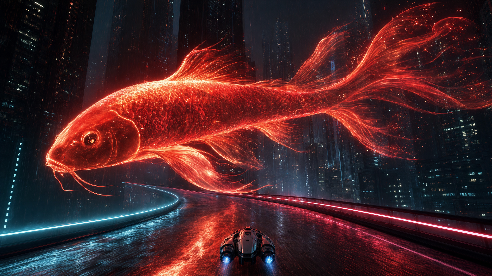

# Koi polish target — generated reference

Owner request: generate a reference image to guide further koi polish. Generated through **Scenario**, model `model_openai-gpt-image-2`, high quality, 2048×1152. The exact prompt and settings are in `request.json`; job/asset identities are stored alongside the PNG. This is generated concept art, not native gameplay or owner acceptance.

## What the next koi pass should take from this

- Natural carp head, curved gill cover, small integrated eyes and subtle barbels; a longer continuous body taper into the caudal peduncle.
- Broad layered fin membranes curling in flowing sheets, with nonuniform secondary filaments. Avoid the current even radial comb of bright rays.
- Pearl-hot crest and rim against darker crimson internal volume. Keep soft transparency and scattered light inside the body; avoid a uniform orange opaque shell.
- Anatomical scales that catch light selectively and follow the body, rather than repeated outlined circles or entirely blank skin.
- Restrained particles trailing from the thin fin edges, plus a soft red wet-road reflection and nearby light spill.
- The intimate overhead relationship: the small existing racing ship approaches directly beneath the fish.

The generated ship and buildings are context only; they do not authorize replacing the game's ship, HUD, course or city. The current native implementation remains revision 05, commit `50c4e54`. This turn adds reference art only. Motion must still be evaluated in a future native replay; a still cannot establish smooth animation. No game changes or full-scene fidelity claim are part of this reference delivery.

Optional reproduction: export the existing `SCENARIO_API_TOKEN` in the local environment and use `generate.py submit` in a fresh copy of this folder without `job.json`, then `generate.py poll`. The script preserves existing job identity and never stores credentials. No Scenario credential is required to view the saved image or build the game.
