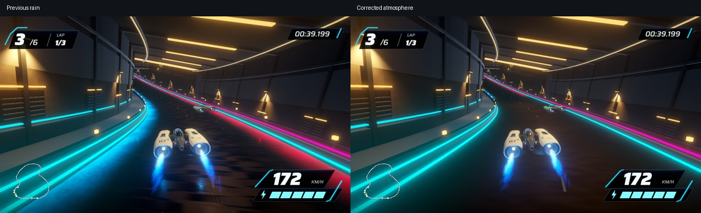
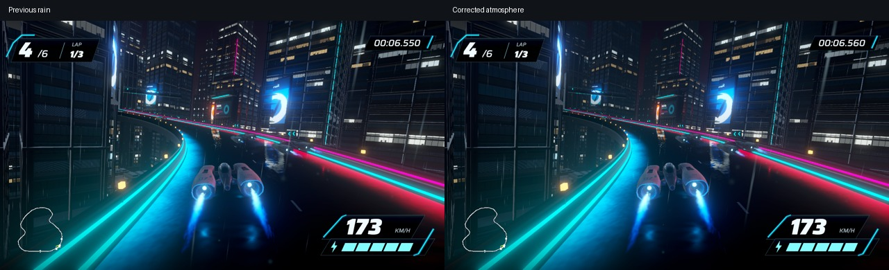
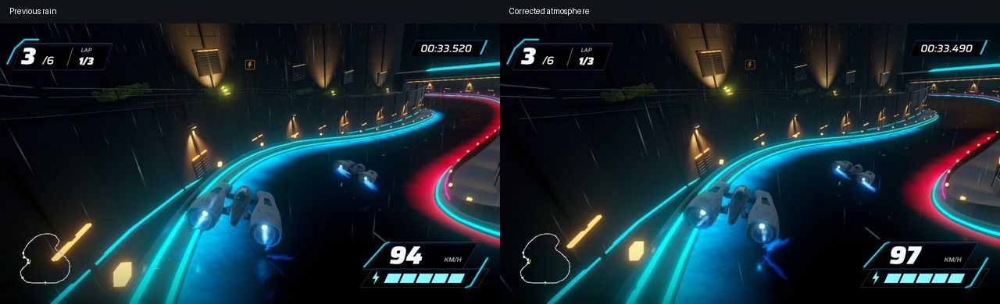

# Rain, tunnel shelter and city haze — September 17, 2026

Owner-approved correction for the rain candidate. Current scene: `Assets/Scenes/RainAtmosphereStage5.unity`, revision `rain-atmosphere-stage5-01`, build GUID `0aea73895a504a62b9380a8ec3e39c83`. This is a review candidate; owner visual acceptance remains open.

## Change and scope

- Covered road is matte, with wet reflections reduced to dry material response. An 8 m transition lies outside each roof edge.
- Ship surface spray is gated by road wetness and actual overhead roof checks. Existing sheltered rain spawning is retained; sheltered particles are culled during tunnel travel. Blue ship exhaust remains intact.
- Rain audio fades exponentially with depth from the portal, while the existing sheltered low-pass remains. Deep tunnel telemetry reaches 0.0000 at recorded precision, compared with 0.1900 outdoors.
- Outdoor exponential fog density increases from 0.0028 to 0.0055 and eases back toward 0.0028 in the tunnel. The city comparison shows a subtle reduction in distant contrast while nearby road and signs remain readable.
- Ship, HUD, handling, course, source road vertices and collision meshes remain preserved. Course hash: `a43cff0540e9b86cc0d60810b1f19e6cd49ae52d69e41ea43f6fb5b590790abc`.

`RainShelterProfile` samples the actual roof colliders at 3,840 positions, finding 373 covered samples. Four render surfaces reuse original vertices and triangle sets, partitioned into 17 material levels; MeshColliders keep original meshes. `AtmosphereSceneSetup` authors the new candidate from the preserved dry scene. Prior rain and dry scenes are retained. Apex icon source/settings from the merged relay are preserved and included in this successful build.

## Verification

282/282 EditMode tests passed, zero failed. New assertions cover roof wetness, depth attenuation, unchanged rendered road vertices, triangle count, course identity and no wet material triangles inside baked roof coverage. See `test-results.xml` and `authoring.txt`.

Native capture `preview-02`: complete 43.0293-second lap, 1,009 PNG frames at measured 23.4375 Hz, uniform 42.6667 ms capture intervals, 43.0293 seconds of non-silent stereo listener audio. Automated steering uses ordinary physics and original DSP timestamps. This is capture evidence, not performance or manual-play evidence. The first capture used an unexpected 3326×2104 window and was superseded by the correctly sized 1280×720 recording; it is not used for timing claims.

Native outdoor, descent, portal, interior and exit images were inspected. The tunnel comparison visibly removes the previous rippled wet-road reflections; no rain streaks or road spray are visible in the inspected interior. Eleven telemetry samples with camera roof depth greater than 25 m report player wetness 0.000. Particle counts are global and may include outdoor particles visible beyond portals; they do not independently prove zero indoor particles. Coverage tests and this recorded route do not cover every arbitrary manual position.

The complete browser frame replay runs to 0:43 and supports seeking to the tunnel. It is silent; the encoded MP4 retains game audio for an external player. Audio attenuation is verified by telemetry and captured output, with subjective listening review still open. Camera/racer poses may differ in near-matched comparisons. No wider art rollout or handling change is claimed.

The isolated 1920×1080 three-lap race passed with six finishers, zero recoveries, frozen results, pause and restart checks. Frame delivery: 8.33479 ms mean, 8.33334 ms P95/P99, 17.20417 ms maximum, zero frames above 33.3 ms. See `performance-validation.json`. Previous rain mean was 8.33451 ms, P99 9.32383 ms and max 16.85771 ms. This single capped frame-delivery sample shows no observed regression; it is not a GPU benchmark. Neither Unity, encoding nor browser playback overlapped this run.

## Native review

Local artifacts (not required for rebuilding source):
- App: `/Users/anping.wang/output/vector-rush-atmosphere-2026-09-17/Atmosphere01.app`
- Review: `http://127.0.0.1:8772/review/` (local server required)
- Video/audio: `/Users/anping.wang/output/vector-rush-atmosphere-2026-09-17/preview-02/full-lap.mp4`
- Raw telemetry: `weather.csv`; frame selection: `selected-frames.json`

Use `bash tools/current-game.sh open` or `build` for the new candidate. Do not rerun older authorers. Next is owner review of haze, portal transitions, dry tunnel and audio; manual/controller driving feel and wider environment fidelity remain open.
