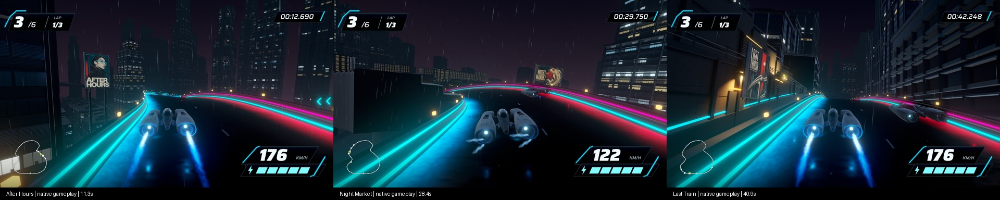

# Full-lap advertisements — September 17, 2026

Stage 8 revision `full-lap-ads-stage8-02` builds on Stage 7 `46e73a6`. The three existing Scenario artworks now appear in gameplay: After Hours at 31.5% of the course, Night Market at 68.5%, and Last Train at 93.5%. Five retained animated campaign groups span 6.7%, 26.5%, 61.5%, 76.5%, and 88.5%. Smaller wall-mounted displays fit the late cutting and tunnel. Cabinet frames, supports and reflection poses follow the new placements. No additional colliders.

## Play and review

- [Native replay with eight chapter buttons](http://127.0.0.1:8776/review/).
- Local app: `/Users/anping.wang/output/vector-rush-full-lap-ads-2026-09-17/FullLapAds02.app`.
- Default `tools/current-game.sh build` selects `Assets/Scenes/FullLapAdsStage8.unity`; `stage7-build` and `p4-build` retain comparisons.
- Reopen the local review server with `python3 tools/serve-native-review.py /Users/anping.wang/output/vector-rush-full-lap-ads-2026-09-17 --port 8776`.
- Authoring: Unity `-executeMethod VectorRush.Editor.FullLapAdsSetup.Prepare -productionEvidence <fresh absolute directory>`; build using the portable wrapper. Packaging: `tools/production-preview.py <capture>` then `tools/full-lap-ad-review.py --capture <capture> --output <review>`.

## Verification

Build GUID `83fe81ff96284df4a3182cfa5cb1587d`. All **292/292 EditMode tests passed** on revision 02. Course hash remains `a43cff0540e9b86cc0d60810b1f19e6cd49ae52d69e41ea43f6fb5b590790abc`. Baseline scenes, road/collision assets, runtime scripts, ship, HUD, handling and weather files remain unchanged. Tests compare scene collision geometry, shelter/fog, campaign assets and reflection poses, and check the banked driving corridor against local mesh bounds.

The final actual native capture contains 759 frames over 43.093 seconds at 1920×1080, with recorded game audio and frame timestamps. Captured mean rate is 17.59 Hz; this recording is not a frame-rate benchmark. Inspected driving-camera frames show the three artworks at replay times 11.3, 28.4 and 40.9 seconds, plus the triptych at 33.5 and tunnel display at 38.5 seconds. HUD race time includes the earlier start offset. Browser verification confirmed all eight images loaded and chapter seeking/playback advanced. The range-aware server is required for reliable seeking.

Separate uncaptured native three-lap run completed in 128.667 seconds, with all six racers finishing, zero recoveries and frozen-results/pause/clean-start checks passing. Logged surface: 1920×1080. Delivered frames: mean 8.334 ms, P95 9.066 ms, P99 9.233 ms, maximum 16.663 ms; zero frames above 33.3 ms. One focus change was recorded; this is a local observation, not a controlled performance guarantee or GPU timing.

## Boundaries and iterations

All driving uses existing automated steering; manual/controller feel and owner artistic acceptance remain open. Outdoor supports are simpler than the preserved P4 facade mounts. This milestone changes billboard placement only; it does not integrate the separate speed-blur task or rebuild the city.

Revision 01 had late signs hidden outside the corridor walls and was superseded. Revision 02 moved them inside, scaled them to fit, replaced the projecting blade orientation with a flush lower ticker, and corrected the angled-mesh clearance check. Failed authoring outputs and superseded captures remain in the external output directory. No current technical or visual claim relies on revision 01.

Source is saved locally; no publication is included in this request. Compact evidence is adjacent; apps, raw frames and full logs remain outside Git.
