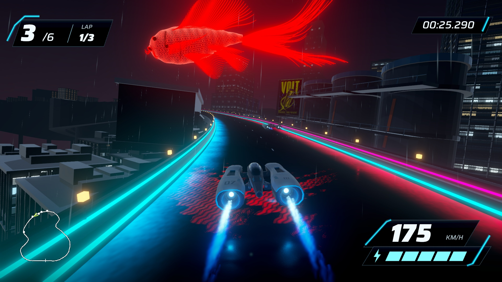
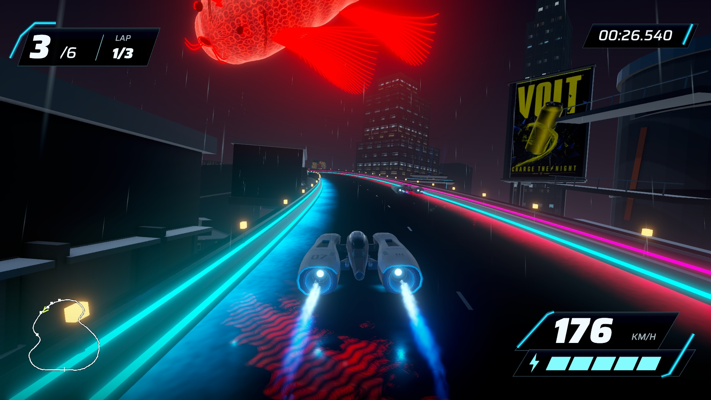

# Giant overhead koi — September 17, 2026

Stage 10 revision 04 replaces the rejected ceramic/ring concept with a roughly 130 m translucent red-orange aerial koi. It glides across and along the bend in an 18-second loop, changing height, yaw and bank while a strong traveling wave sweeps its tail and fins. The player approaches and passes beneath it. This is an implemented native candidate for owner review, not a claim of owner artistic acceptance.

[Play the native turn and compare the old koi](http://127.0.0.1:8778/review/). Build: `/Users/anping.wang/output/vector-rush-holographic-koi-2026-09-17/HolographicKoi04.app`. Build GUID `78beb07b1d4e4bec9b7e3f6dae64c6c3`. Native replay has 741 timestamped frames over approximately 43.05 seconds with actual audio and automated steering through ordinary physics. It is not human driving or a performance benchmark. Review excerpts preserve the captured time intervals.

## Visual iterations and correction

The first luminous pass was too uniformly orange with a solid fan tail. The second opened up filament tips, but the owner called for much greater scale, free swimming movement and a close overhead encounter. Revision 03 moved and enlarged the fish and made the body translucent. Inspection found the imported FBX reverses the authoring X axis: the head is positive X and tail negative X. The old shader consequently weighted the wrong end. Revision 04 corrects this direction, the reflection center and heading. Native frames show the changed tail curvature and the approach-to-underpass sequence; the moving replay is the primary review artifact.

The city can show through the body. Five coherent mesh groups provide anatomy, scale contours, membranes, filament rays and eyes/gills. Local colored lights follow the fish. A dedicated HDR camera provides the moving fish image for a banked-road reflection approximation. The off-road platform stays discreet; nearby VOLT/ORBIT display materials are subdued only in Stage 10. No new bitmap generation was needed.

## Validation and limits

296/296 EditMode tests pass. Authoring preserves the Stage 8 scene hash, course identity and original collider transforms/mesh references. The fish and projector add no colliders. The padded fish mesh bounds are sampled over 120 swim phases against 1,600 road positions, with a conservative minimum overhead clearance of 8.319 m. This samples the configured autonomous movement, not every imaginable player camera path. The solid platform remains 54.505 m from the nearest course center.

The reflection is a planar projection approximation, not a physically complete ray-traced scene reflection. Motion follows a bounded authored loop, not an intelligent creature simulation. The saved native frames and replay should be judged for the requested visual effect; technical checks do not establish polish or reference fidelity.

The separate uncaptured 1920×1080 three-lap run completed with six finishers, zero recoveries and passing result/pause/restart checks. Delivered-frame P95/P99/max: 9.085/9.295/17.549 ms, no frames over 33.3 ms; one focus change was recorded. These are frame-delivery values on this machine, not GPU timings or a cross-machine guarantee. No Editor, capture or encoding ran concurrently. The browser replay was subsequently opened, its playback advanced and completed, and all review images loaded.

## Rebuild and preservation

`tools/current-game.sh holo-koi-build <fresh absolute app> <fresh absolute evidence>` builds this serialized candidate. `koi-build` retains the rejected Stage 9 comparison; the normal build still selects Stage 8 pending owner review. Source and commands are in `SourceAssets/HolographicKoi/README.md`. Older scenes, HUD, ship, weather, handling, course and collisions remain preserved. No wider landmark rollout, external publication or delegation.
