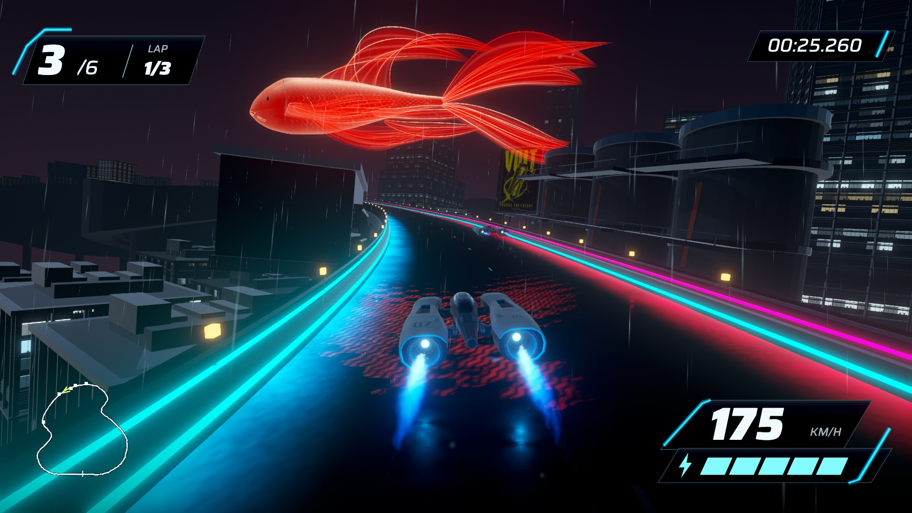
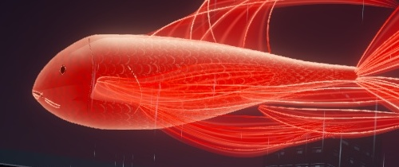

# Koi head and body correction — September 17, 2026

Owner rejected revision 07's head and fish shape. Stage 10 revision 08 independently shapes the back, belly and width to give the front more volume and the rear a gradual taper. Conformal eyes replace protruding spheres. A shallow horizontal mouth replaces the circular opening; the jaw, cheek and gill contour follow the revised body. Scale detail fades farther back from the head. Existing fins, lower placement, size, swimming motion and lighting remain.

[Native replay, revision 07 comparison and matching head crops](http://127.0.0.1:8778/review-08/). The new mouth, inset eye and fuller front were inspected in actual native approach and underpass frames. The generated reference remains separately labeled. The result still simplifies the reference's organic gill detail and filament texture; owner artistic acceptance remains open.

## Validation and limits

Build GUID `d3b49b97df5744bdb91b614601d49e6d`; app `/Users/anping.wang/output/vector-rush-holographic-koi-2026-09-17/HolographicKoi08.app`. Scene `Assets/Scenes/HolographicKoiStage10.unity`; use `tools/current-game.sh holo-koi-build`. Stage 8 remains the ordinary default.

All 296 EditMode tests pass. Authoring confirms the baseline and collisions are unchanged, with course hash `a43cff0540e9b86cc0d60810b1f19e6cd49ae52d69e41ea43f6fb5b590790abc`. Imported fish has 120,662 triangles across five renderers. Sampled conservative swim clearance is 7.073 m; this is not exhaustive manual-camera validation. No runtime motion/gameplay code changed.

The complete native lap records 1,539 frames over 43.051 seconds at 1280×720 with real timestamps and game audio. Mean capture rate is 35.76 Hz and the maximum interval is 42.67 ms; this is not a locked 60 fps recording or performance benchmark. Separate 1920×1080 captures supply the comparisons. Shots match route progress, with small camera/time differences; they are not pixel-identical poses. Both runs use automated steering. Playback advanced and all six browser images loaded.

No fresh uncaptured three-lap performance run was made for revision 08. Revision 07's performance results are historical and must not be represented as measurements of revision 08. Native builds/raw captures/logs remain outside source control. Publication, wider rollout and delegation remain outside scope.
