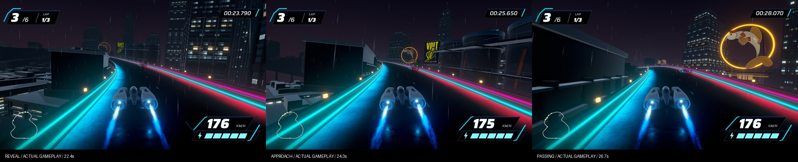

# Koi Lantern Tower turn trial — September 17, 2026

One owner-approved new landmark, built on Stage 8 ef3d386. Candidate scene: `Assets/Scenes/KoiLanternStage9.unity`, revision `koi-lantern-stage9-02`, native build `4140d7c362e242ad82952bc854aa91fb`. The ordinary wrapper build remains Stage 8; `bash tools/current-game.sh koi-build <fresh absolute app> <fresh absolute evidence>` selects this trial.

[Open the 9.5-second native turn replay and before/after review](http://127.0.0.1:8777/review/).

## New asset and siting

New editable Blender sculpture and architecture: textured porcelain koi with vermilion patches, four curved ribbed bronze fins, open amber ring, cables and piers, market tower windows, canopy and maintenance balcony. Two local spot lights illuminate the fish; fins rotate gently over roughly ten seconds. Scenario generated the concept and enamel surface; the 3D mesh is authored geometry. [Source, prompts and rebuild instructions](../../../SourceAssets/KoiLanternTower/README.md).

The rooftop sculpture was enlarged 20% after the first native capture because it read too small early in the approach. The ring is now about 31 metres across. World root (-275, 2, 156), yaw 60 degrees, ring center (-275, 75, 156); nearest course progress 65.13%. The tower axis is at least 54.505 metres from the whole course centerline. A conservative 20-metre mesh/fin envelope plus the road and clearance margin stays outside the driving corridor. The foundation reaches the city base at y=-39. No added colliders.

Native frames show the early partial reveal around progress .51 (replay 22.4 s), the full ring near the bend exit at .56 (24.3 s), and the larger roadside pass at .625 (26.7 s). The skyline occludes part of the earliest reveal and the existing VOLT sign still competes nearby. This is a trial for owner judgment of focal placement, not a whole-city art pass. Do not represent a screenshot overlay used for siting as gameplay.

## Verified results

- **294/294 EditMode tests pass** on final revision 02. The added checks preserve Stage 8 course/collisions/weather/advertisements and verify complete material/mesh/fin binding, foundation height and full-course clearance.
- Current native capture: 755 source frames, 43.051 seconds, game audio and actual frame timestamps, 1920×1080. Mean capture rate 17.52 Hz; captures are not performance measurements. The short review excerpt comes from this full lap.
- Separate uncaptured 1920×1080 automated three-lap race: 128.667-second player finish, all six racers finish, zero recoveries, frozen-result/pause/clean-start checks pass. Mean/P95/P99/max delivered frame times: 8.340/9.091/9.266/17.538 ms; no frames over 33.3 ms and zero recorded focus changes. These are local frame-delivery observations, not GPU timing or a guarantee for other machines.
- All original Stage 8 Unity files remain untouched. The only new runtime component animates the landmark fins. Course, ship, HUD, handling, weather, original advertising and speed-blur branch remain unchanged.
- Review page image loading and video playback checked in the in-app browser. Its initial tab crashed when operating the native player controls; a fresh tab with an explicit Play turn replay button recovered playback. No browser security setting changed.

## Local delivery and limits

App: `/Users/anping.wang/output/vector-rush-koi-landmark-2026-09-17/KoiLantern02.app`. Review folder: `/Users/anping.wang/output/vector-rush-koi-landmark-2026-09-17/review`. Restart its localhost server with `python3 tools/serve-native-review.py /Users/anping.wang/output/vector-rush-koi-landmark-2026-09-17 --port 8777`.

Keep source and compact evidence local; native apps/raw captures/logs remain outside Git. All driving uses existing automated steering. Manual/controller feel, owner visual acceptance, and the other two proposed landmarks remain open. Do not automatically roll out more landmarks or promote the trial to the default. The native asset has 13 renderers / 84,932 imported triangles; no LOD variants were added in this bounded trial.
