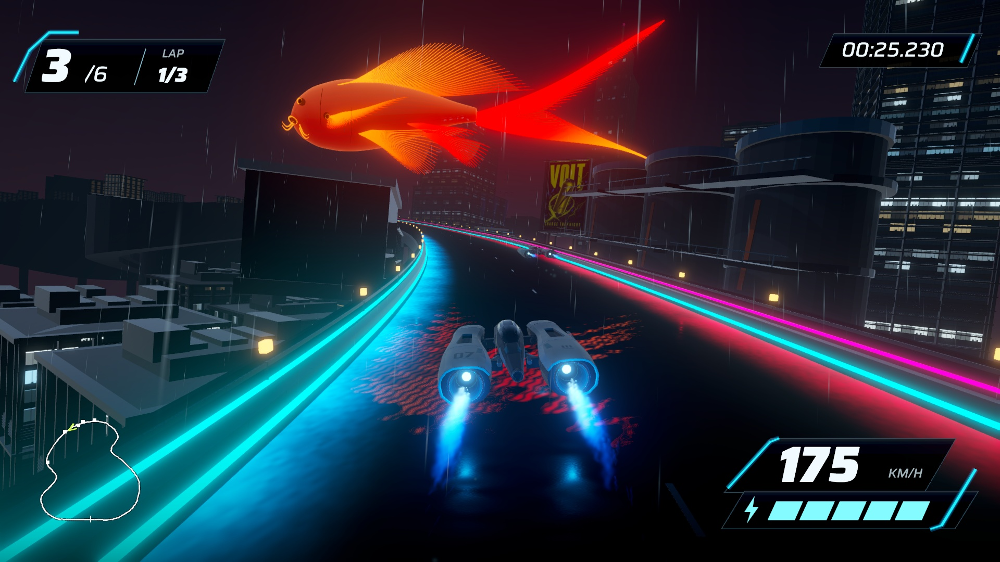
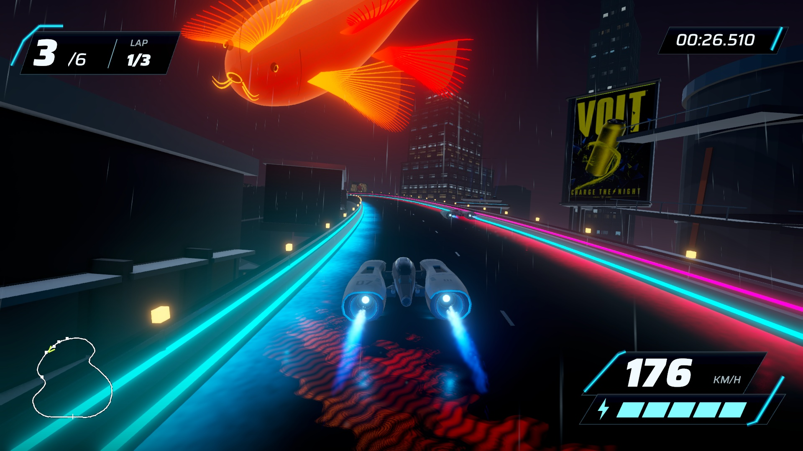

# Smoother, lower koi — September 17, 2026

The owner rejected Stage 10 revision 04 as unpolished and insufficiently smooth, and requested a lower encounter. Revision 05 changes the authored geometry, surface shading and movement and places the anchor **10 m lower** (88.159 m world height, previously 98.159 m).

The old ring-by-ring body interpolation produced visible ridges. Continuous monotone cubic interpolation now connects the body sections. Fin rays have 48 segments and eight sides, with continuous trailing contours and longer membranes replacing the jagged free ends. The oversized dorsal fin is reduced and swept back. Scale arcs are much quieter and fade with distance; the material uses warm orange/gold highlights. Surface normals follow the shader deformation. Tail motion slows from 2.8 to 1.9 radians per second, with less vertical bob and banking while preserving whole-body travel and a visible tail sweep.

[Play the updated native turn and compare revision 04](http://127.0.0.1:8778/review-05/). App: `/Users/anping.wang/output/vector-rush-holographic-koi-2026-09-17/HolographicKoi05.app`. Build GUID: `234594114df74da6a0e3c1d21cfefca8`. Scene stays `Assets/Scenes/HolographicKoiStage10.unity`; ordinary builds remain Stage 8, and `holo-koi-build` explicitly selects this candidate.

## Evidence and limits

The native video contains 1,534 source frames over about 43.05 seconds, recorded at 1280×720 with automated steering and game audio. Average encounter capture rate is 37.10 Hz; this improves on the previous capture but is not a locked 60 fps recording. Separate 1920×1080 native stills provide the matched visual comparison. The replay preserves captured timestamps, with no generated intermediate frames. Capture timing is not a performance benchmark.

296 EditMode tests pass. The unchanged Stage 8 baseline hash and original driving collisions are checked during authoring. Updated padded mesh bounds sampled over 120 swim poses against 1,600 road samples retain a conservative 9.737 m minimum overhead envelope clearance after lowering. Reduced pitch/bank and tighter padding for the gentler wave allow the lower position. This is a sampled check, not proof for every possible camera position. The fish has no colliders; road, ship, HUD, handling and weather remain preserved.

The revised asset has 209,140 triangles across five material groups. The reflection remains a planar projection approximation. The owner has not accepted the visual quality; this is the new native candidate for review. Prior scenes/builds and the rejected revision 04 replay are preserved. No external publication or delegation.

The separate uncaptured 1920×1080 three-lap race completed with six finishers, zero recoveries and passing result/pause/restart checks. Delivered-frame P95/P99/max were 9.142/9.328/16.674 ms, with zero frames above 33.3 ms and one recorded focus change. No Editor, recording or encoding overlapped this measurement. These are frame-delivery measurements on this machine, not GPU timings. Browser replay completion and loaded images were verified.
