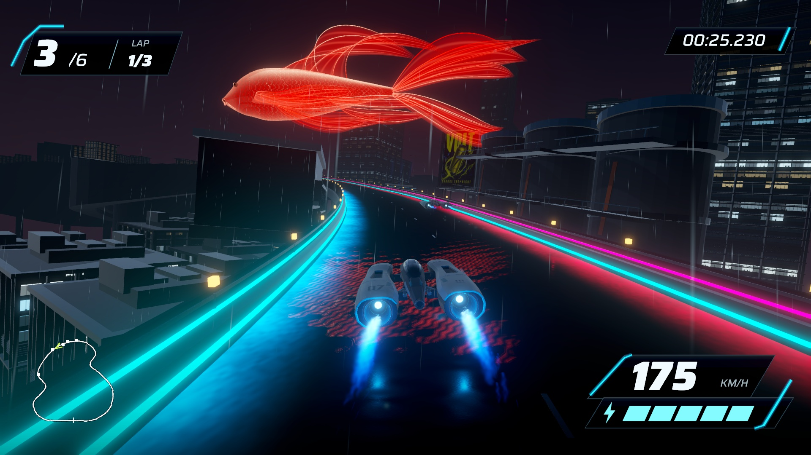
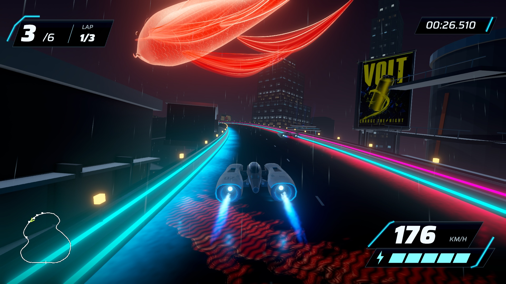

# Reference-led koi rebuild — September 17, 2026

The owner approved rebuilding the koi against the saved Scenario reference. **Stage 10 revision 07** replaces the previous radial fan structure with 13 folded fin membranes and 39 sparse veins/edge filaments. The native body has a longer taper, integrated eyes and curved gill contours. The surface uses selective open scale arcs, a bright crest and a darker translucent crimson interior. The fish keeps the lower anchor at world Y 88.159 m and remains roughly 130 m long.

[Native replay, revision 05 comparison and generated art target](http://127.0.0.1:8778/review-07/). The reference is separately labeled concept art. The game uses authored geometry and shaders, not a pasted reference image. Existing ship, HUD, road, buildings, gameplay and weather remain preserved.

## Visual decisions and limits

The first native rebuild (revision 06) had a washed-out crest and fins that read mainly as lines. Revision 07 narrows the bright crest, strengthens the crimson body and translucent membranes, reduces the number of bright veins, and broadens the dorsal attachment across the back. Actual native approaches were inspected before the final comparison was packaged.

The fins carry root-to-tip flexibility and phase in vertex colours. Their delayed motion follows the same traveling wave as the body, with zero extra movement at attachment. Whole-body travel remains the existing bounded loop, with less bank/pitch to preserve clearance at the lower anchor. This is authored deformation, not cloth or animal simulation. The shader normal correction approximates fin deformation; it does not reconstruct the complete cloth-normal field.

The result implements the approved anatomy, layered-fin, luminous-surface and fin-lag work. It still has a simpler filament structure than the generated reference and does not reproduce its fine particle cloud. The native replay is the basis for owner visual review; a generated image or passing tests do not establish artistic acceptance.

## Reproduction and evidence

Scene: `Assets/Scenes/HolographicKoiStage10.unity`. Build GUID: `2fc211bf931f495b920430df657dc952`. App: `/Users/anping.wang/output/vector-rush-holographic-koi-2026-09-17/HolographicKoi07.app`. Use `tools/current-game.sh holo-koi-build <fresh app> <fresh evidence>`; ordinary builds remain Stage 8. Source and geometry recipe: `SourceAssets/HolographicKoi/README.md`.

296 EditMode tests pass, including preservation and the imported fin-flexibility colour-channel contract.

The 1280×720 native replay contains 1,314 timestamped source frames over 50.304 seconds. The full capture has uneven intervals, including a 533 ms interval outside the koi excerpt. Encounter capture averages 33.56 Hz with a maximum source interval of 42.67 ms; it is not a locked 60 fps recording or performance benchmark. Separate 1920×1080 captures provide matched stills. Both use automated steering and preserve actual timestamps; no synthetic intermediate frames are generated.

Authoring verifies the original Stage 8 scene hash and all original collision transforms/mesh references. The fish adds no colliders. Its padded bounds sampled over 120 whole-body poses against 1,600 road positions retain 7.073 m conservative overhead clearance. The padding includes the maximum body and fin wave displacement. The lower anchor is unchanged; slightly reduced bank/pitch provides room for the longer fins. This is sampled clearance evidence, not exhaustive proof for every manual camera path. The solid projector remains 54.505 m from the road center.

The imported fish has 123,158 triangles across five material groups. A dedicated HDR capture camera supplies the existing planar wet-road reflection approximation. Historical assets/scenes remain; publication and additional landmarks are not authorized.

The separate uncaptured 1920×1080 three-lap run completed with six finishers, zero recoveries and passing result/pause/restart checks. Delivered-frame P95/P99/max were 9.165/9.318/16.810 ms, with no frames above 33.3 ms and zero focus changes. No Editor, capture or encoding overlapped this run. These are frame-delivery values on this machine, not GPU timings or a cross-machine guarantee. Browser replay playback advanced, all four images loaded, and the review tab was left open.
