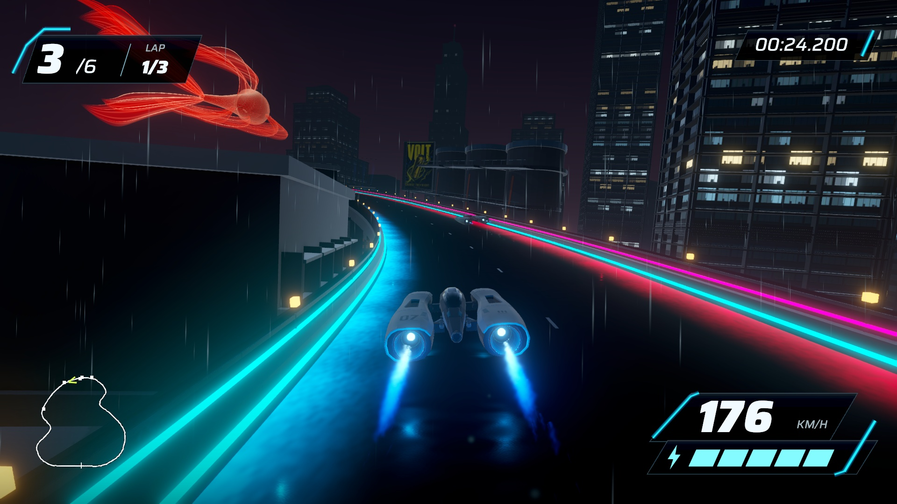
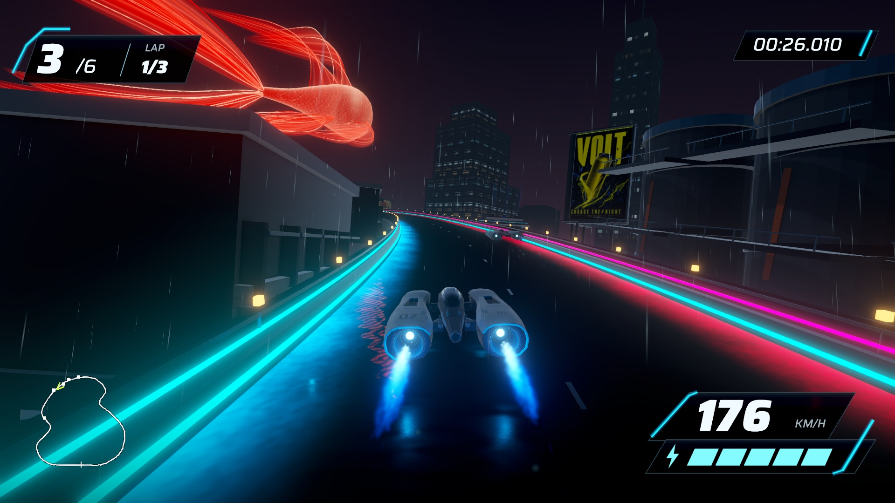

# Oblique swimming turn — September 17, 2026

The owner approved turning the koi away so the rear body and long tail dominate, and explicitly asked to retain an angle relative to the player. **Stage 10 revision 13** presents an oblique rear-quarter view with a modest 16-degree nose-up inclination. Facial details turn to the far side. The body follows a substantially curved spine, with traveling flank contraction and delayed fins, instead of simply rotating a straight fish.

[Native replay and revision 08 comparison](http://127.0.0.1:8778/review-13/). The earlier reference remains labeled generated concept art; it guides material/fins rather than this new camera composition. The front-body silhouette can still appear at the far end in some poses; the main approach emphasizes the bent flank and long tail, without a direct face view. The giant fins extend outside the frame during the close pass. Owner artistic acceptance remains open.

## Final implementation

The body is bent around a continuous curved spine, with cross sections rotated along its tangent. Curvature varies over an 18-second cycle; a traveling lateral wave moves through the midbody and tail. Subtle width contraction has reciprocal vertical expansion to retain cross-sectional area. Fin flexibility supplies delayed secondary motion. Normals use the deformation Jacobian; the fin-flexibility gradient remains approximate. This is authored animation, not biological muscle or fluid simulation. Rest meshes/Blender source remain the revision 08 anatomy.

The landmark pivot moves from course progress .615 to .64, with heading derived from the earlier bend and a sideward offset to keep an oblique view. The resulting anchor is (-214.235, 95.020, 153.114) rather than revision 08's (-187.675, 88.159, 190.511). The tilted pose brings the trailing fins lower relative to the pivot. Giant scale remains 2.2; no gameplay, track, collision, ship, HUD, weather or other-scene edits.

Earlier native trials 09/10 retained too much of the front underside or pushed the tail out of frame too early. Trial 12 incorporated the owner's angle correction but needed a stronger body bend. Revision 13's native full lap and approach/underpass frames were inspected. Revision 11 was built but superseded before native inspection. Earlier candidates remain outside source control as local comparison builds.

## Validation and reproduction

Build GUID `0dd58ea419884e2fb54ca240b4318b5f`; app `/Users/anping.wang/output/vector-rush-holographic-koi-2026-09-17/HolographicKoi13.app`. Scene `Assets/Scenes/HolographicKoiStage10.unity`; rebuild using `tools/current-game.sh holo-koi-build <fresh app> <fresh evidence>`. Stage 8 remains the ordinary default.

All 296 EditMode tests pass, including shader compilation, course/collision/weather/ad preservation and animated clearance. Authoring confirms the original Stage 8 bytes and collision state are unchanged. The fish remains 120,662 triangles across five renderers and adds no colliders.

Rendering bounds sample all vertices through 90 deformation poses with padding. Clearance now uses actual deformed vertices through 120 complete swim poses, rather than corners of an overly loose all-cycle bounding box. It checks a padded world envelope against 1,600 road positions, and raises the anchor only as needed for an 8 m sampled margin. The final minimum is 8.0 m. This is sampled conservative-envelope evidence, not exhaustive continuous-time or manual-camera proof. Keep CPU deformation and shader deformation synchronized.

The native 1280×720 replay completes a 43.051-second lap with 1,525 timestamped frames and game audio. Mean capture rate is 35.41 Hz; the maximum source interval is 42.67 ms. Separate 1920×1080 captures supply matched-progress stills. Both use automated steering; capture rate is not game performance. Frame poses/times differ slightly between runs. No synthetic intermediate frames or image retouching.

The separate uncaptured 1920×1080 three-lap performance run completed with six finishers, zero recoveries and passing result/pause/restart checks. P95/P99/max delivered frames were 8.333/8.883/16.216 ms, with zero frames above 33.3 ms and zero focus changes. No Editor, capture, encoder or browser playback overlapped the run. These are frame-delivery measurements on this machine, not GPU timings or a cross-machine guarantee. Builds, raw frames and logs stay outside source control; publication and broader rollout are not authorized.

Browser playback advanced, all four review images loaded, and the native turn was visually checked in the displayed page. The review tab is left open.
