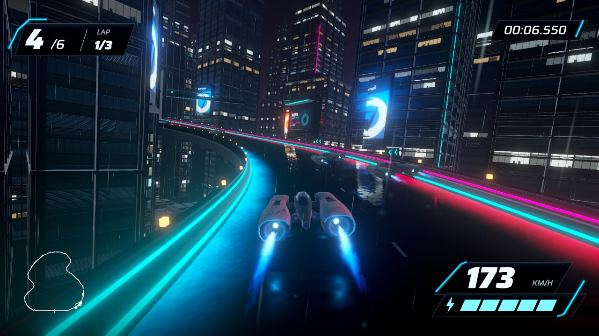
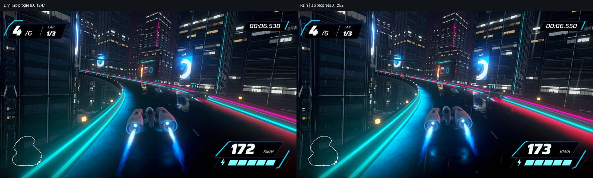
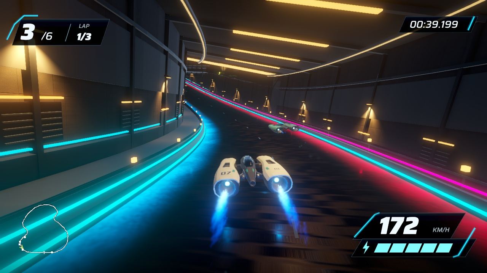

# Rain over the city, September 17, 2026

A restrained rain presentation pass on the corrected road: fine silver streaks respond to camera speed, real roofs shelter precipitation, low spray follows ships, and stronger localized reflections make the road read wet. The rain sound softens under cover. Handling, road/collision meshes, ship and HUD are unchanged.

## Play and review

Current candidate: `Assets/Scenes/RainRoadStage4.unity`, revision `rain-road-stage4-02`, build `79586df76e61472b8a858042da9574b5`. The portable `tools/current-game.sh` opens/builds this candidate. The dry `SmoothRoadStage3.unity` remains byte-identical.

Local playable build: `/Users/anping.wang/output/vector-rush-rain-2026-09-17/RainRoad03.app`.

[Native frame replay and comparisons](http://127.0.0.1:8771/review/). The browser replay is silent and uses actual captured native frames with their original timestamps. MP4/WebM with game audio are available in the local output directory for external playback. Both video formats crashed this Codex embedded browser during verification; this is why the review uses image replay. Full native apps, clips, raw frames and local Unity logs are excluded from Git.

## Evidence and limits

- [279 tests passed](tests.xml): actual collider shelter versus ignored vehicle layer, effects mute/pause audio response, and matching serialized driving meshes/course.
- [Authored scene](authoring.txt): four separate wet material assets; dry scene and handling preserved. No runtime physics settings are changed.
- [Native capture](capture.json): complete 43.029-second lap; 1,009 frames, 23.44 fps mean at real recorded timestamps, captured game audio. Automated steering through ordinary physics, not human driving or a benchmark.
- [Weather telemetry](weather-summary.json), with [raw samples](weather.csv): outdoor normalized lap progress 0.05–0.20 has mean exposure 1 and rain-audio volume 0.19. Tunnel 0.825–0.87 has exposure 0 and volume approximately 0.025. Mean live rain particles decrease from about 965 to 26; remaining outdoor particles may still exist outside the tunnel, so global particle count is not indoor rainfall. Inspected tunnel frames show the interior sheltered.
- Native sequence review covers the city bends, overpass, descent, tunnel and exit. Road edges and HUD remain legible in inspected frames. Low mist spray is intentionally subtle and can be overpowered by the existing blue exhaust.

Rain has a fixed intensity; no weather controls, traction changes, windshield droplets or new gameplay are included. Roof checks use existing environment colliders. Static wet reflections remain present under cover, representing a damp road; no accumulating puddle or drainage simulation is claimed. Controller hardware testing and owner visual acceptance remain open. Broader city art quality remains outside this pass.

- [Uncaptured three-lap race and performance](performance.json): six finishers, zero recoveries, pause/result/restart checks passed. Mean 8.335 ms, P95 9.189 ms, P99 9.324 ms; maximum 16.858 ms and no frames above 33.3 ms. Dry comparison: 8.337 ms mean and 9.303 ms P99. These capped frame-delivery measurements are comparable locally and do not measure spare GPU capacity.

## Source and reproduction

`RainPresentation` uses bounded world-space particle systems, private random streams, environment-only raycasts and the existing effects volume. It pauses particles/audio with game pause. Captures optionally record weather telemetry; ordinary play does not write it. `RainSceneSetup.Prepare` copies the dry candidate and clones only wet materials, preserving mesh references. Use a fresh authoring evidence folder; the tool replaces its own rain scene/materials.

`tools/generate-city-rain.py` exactly reproduces `Assets/Audio/Rain/CityRain.wav`: original filtered stereo noise with a loop crossfade, no external recordings or API assets. The particle shader is original procedural shading. Unity 6000.6.0f1 and existing project dependencies suffice to build.

## Relay integration

Preserved the newer owner-selected Apex icon commit when publishing this rain milestone. That merge adds branding assets and default icon settings, plus history notes, without changing rain or driving implementation. The measured RainRoad03 app was built before that icon-only merge; its runtime validation is unchanged, but it does not claim the new application icon.
