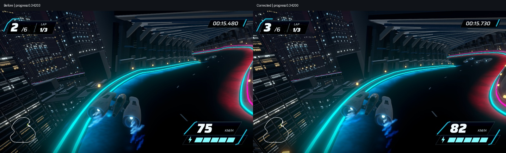
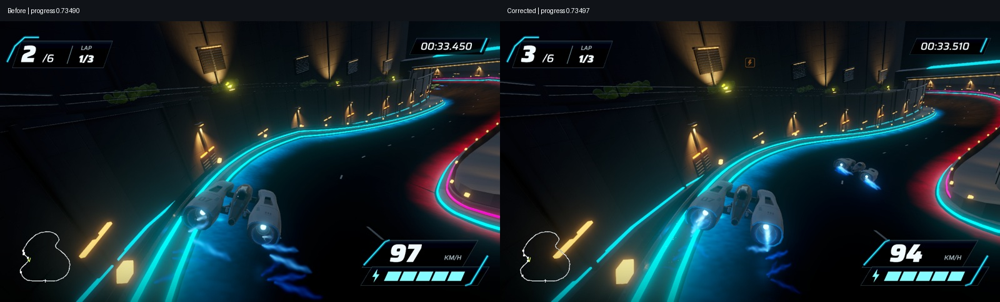
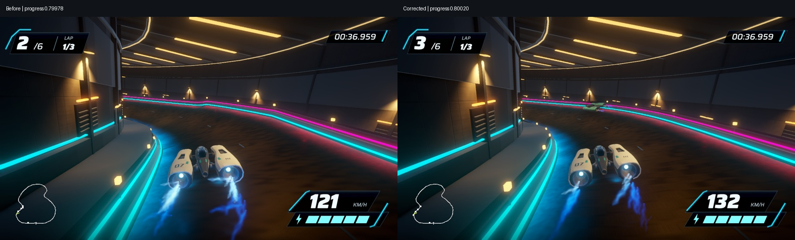

# Road curvature and banking correction, September 17, 2026

Playable correction ready for owner review. The previous road changed corner tightness and banking abruptly; the new opt-in profile uses filtered periodic cubic curves and gradual banking, with matching 3,840-segment road, shoulder, barrier and reflective surfaces. Existing rail meshes follow the corrected path. HUD, ship and underground architecture are preserved.

## Identity and reproduction

Scene `Assets/Scenes/SmoothRoadStage3.unity`; revision `smooth-road-stage3-01`; native build `1dd288cb14fb4fb998f4f165a89a864a`; Unity 6000.6.0f1. Use `bash tools/current-game.sh build <fresh absolute .app> <fresh absolute evidence>` or open the scene explicitly. Previous underground candidate remains available in `UndergroundGalleryStage2.unity`.

## Verified evidence

- [276 passing EditMode tests](tests.xml), including continuity, banking-rate and serialized road checks. A repeat run stalled in compiler startup; the subsequent complete run passed.
- [Three automated native races](races.json): six finishers each, no DNF, zero recoveries, and pause/result/restart checks passed.
- [Road clearance](road-clearance.txt): 14,400 lane probes, no detected obstacle intrusions and approximately 1.1 mm maximum running-surface alignment error.
- [Camera clearance](camera-clearance.txt): 1,544 actual recorded poses, no underground enclosure crossing or six-axis proximity hit within 0.35 m.
- [Geometry](smoothness.json), sampled every 0.5 m: maximum curvature rate 0.052328 to 0.002195 m⁻²; maximum banking rate 2.1866 to 0.5308 degrees/m. Maximum corresponding centerline displacement 1.4904 m. Lap length 1,850.73 to 1,844.49 m.
- [Native capture](preview-validation.json): 43.115-second lap, 1,544 raw frames, approximately 35.8 fps average. Largest recorded gap 170.7 ms. The zero-duration final frame is retained raw but omitted from encoded playback. Captured audio is non-silent.

- [Uncaptured performance](performance.json): 8.337 ms mean, 9.135 ms P95, 9.303 ms P99, 24.805 ms maximum; zero frames above 33.3 ms. Previous build measured 8.33 ms mean and 9.32 ms P99 locally. Frame-delivery timings include the normal game cap and are not GPU headroom measurements.

## Review and limitations

[Local before/after playback](http://127.0.0.1:8770/review/). Playable app: `/Users/anping.wang/output/vector-rush-smooth-road-2026-09-17/SmoothRoad01.app`. Full videos and raw captures remain outside Git in that output directory.

Frames use nearest normalized progress, not identical camera poses. The corrected road changes banking and racing outcomes; matching video times are not exact location matches. Native stills show a more gradual road contour, but automated capture cannot establish subjective steering feel. Controller hardware and owner feel/visual acceptance remain open. Capture gaps can still look like stutter; these recordings are not performance benchmarks. Preserved rails and architecture retain their authored mesh detail. Wider environment foliage, facade variety and concrete detail remain unfinished relative to the reference.

Build import normalized material metadata; those incidental source changes were removed after verification. No gameplay tuning or new art is included. Editor-only authoring/camera-validation changes after the build were covered by the successful repeated suite; runtime implementation and saved candidate match the tested build.
