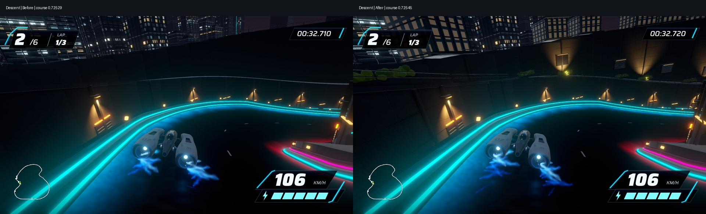
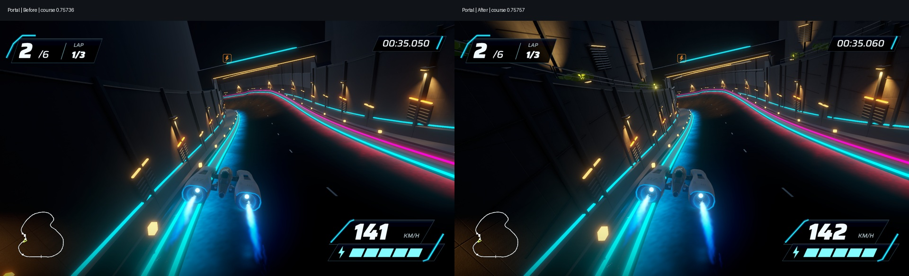
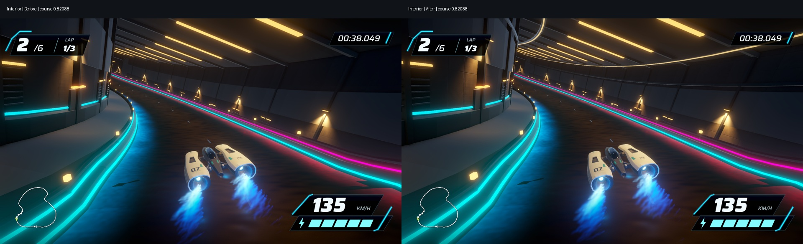
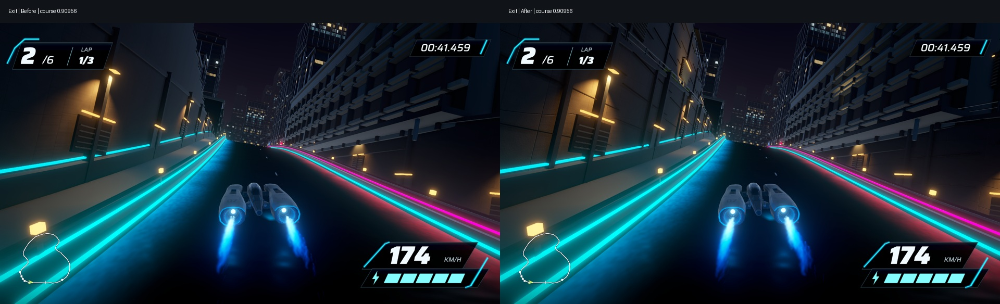

# Underground terrace finish, September 17, 2026

Review candidate based on `e3d3ff6`, authored in Game P2 and validated/delivered in its continuation task. Scene remains `Assets/Scenes/UndergroundGalleryStage2.unity`; build GUID `b0c358a8850b446da15227ead1951e33`, revision `underground-gallery-finish-03`.

## Implemented

An additive serialized finish layer adds 48 terrace spans, 160 planted clusters, 22 podium bays, upper wall joints and service recesses, 12 warm lights, and continuous curved ceiling services. Nine material batches and an editable normal texture live in `Assets/Art/UndergroundGalleryFinish`. `UndergroundGalleryFinish.Apply` rebuilds its own layer while retaining asset identities. It is optional authoring tooling; opening/building the saved scene does not require running it.

The five authoritative driving mesh fingerprints, course hash, completed HUD baseline, ship and runtime handling are preserved. Previously published game files changed only in the candidate scene and candidate foundation material. New editor code and two preservation/corridor tests are included.

## Verification

- Current complete Editor suite: **273 passed, zero failed/skipped**; see `tests.xml`.
- Native build succeeded with the GUID above; see `build.json`.
- Actual automated native lap: **43.136 s, 405 frames**, game audio recorded and encoded using original timestamps. Approximately 10 Hz capture is not a performance benchmark.
- Saved finish corridor check: **7,200 rays**; five driving mesh fingerprints and baseline SHA-256 unchanged.
- Recorded camera: **405 samples, 1,831.07 m** swept path, zero new-enclosure crossings, zero six-axis proximity hits within 0.35 m. This covers the recorded automated path, not arbitrary manual driving.
- **Three consecutive automated three-lap races passed**: all six racers finished every race, zero recoveries, frozen results, pause and clean restart checks passed. See `races.json`. Deterministic repeated inputs establish lifecycle reliability for this route, not broad gameplay coverage.

## Local performance comparison

Separate uncaptured 1920 × 1080 three-lap runs, same machine and course. The current run had all six finishers and zero recoveries. No Unity Editor, capture or encoding job overlapped this measurement. Normal desktop activity was not eliminated. Frame delivery uses `Time.unscaledDeltaTime`, not GPU timings.

| Frame time | Previous build | Finish candidate |
|---|---:|---:|
| Mean | 8.334 ms | 8.334 ms |
| P95 | 9.153 ms | 9.260 ms |
| P99 | 9.312 ms | 9.318 ms |
| Maximum | 16.676 ms | 16.078 ms |
| Frames >33.3 ms | 0 | 0 |

These single local samples show similar frame delivery under the current display limit; they do not prove unchanged GPU cost, performance headroom or cross-machine behavior. Full reports: `performance-before.json`, `performance.json`.

## Native/reference review

All 134 consecutive recorded frames spanning course progress 0.6665 to 0.9747 were inspected in sequence sheets, covering approach, descent, portal, interior and exit. The continuous video was encoded and browser playback verified. This is a frame-sequence review and playback check, not a human driving/controller playtest.

The upper faces now have terraces, planted edges and illuminated service bays; building fronts connect the descent to the city. Ceiling services follow the curve without the first iteration's stepped discontinuities. Four matched before/after images below use nearest course progress from the preceding published native build and this candidate. Exact frame metadata is in `comparison-frames.json`; small timing/camera differences are retained rather than edited away.

The [generated direction reference](../evidence/underground-descent-reference.png) remains more convincing in concrete variation, foliage silhouettes and facade diversity. Current plants read as simplified rounded masses; some repeated window grids and dark planar building ends remain visible. This pass improves the local architecture but does not establish reference fidelity or owner artistic acceptance. Wider-city changes were not performed.

## Play and review locally

- Native app: `/Users/anping.wang/output/vector-rush-underground-finish-2026-09-17/UndergroundFinish03.app`.
- Review page: same output directory, `review/index.html`.
- Continuous footage: `preview-03/full-lap.mp4`.
- Raw evidence: `author-04`, `tests-01`, `build-03`, `preview-03`, `races-03`, `performance-03`.

Enter starts/confirms; WASD/arrows steer; Space boosts; Q/E airbrake; R recovers; Escape/P pauses. Builds and raw captures remain outside Git. A new machine should use `tools/current-game.sh` to build the serialized scene.

## Next boundary

Owner review and manual/controller play remain open. Review this underground milestone before whole-circuit rollout. If refining this section, focus on foliage silhouettes, facade repetition and concrete readability while preserving course and HUD. Wider-city composition, district transitions and billboard variety remain later authorized planning items, not completed features.
