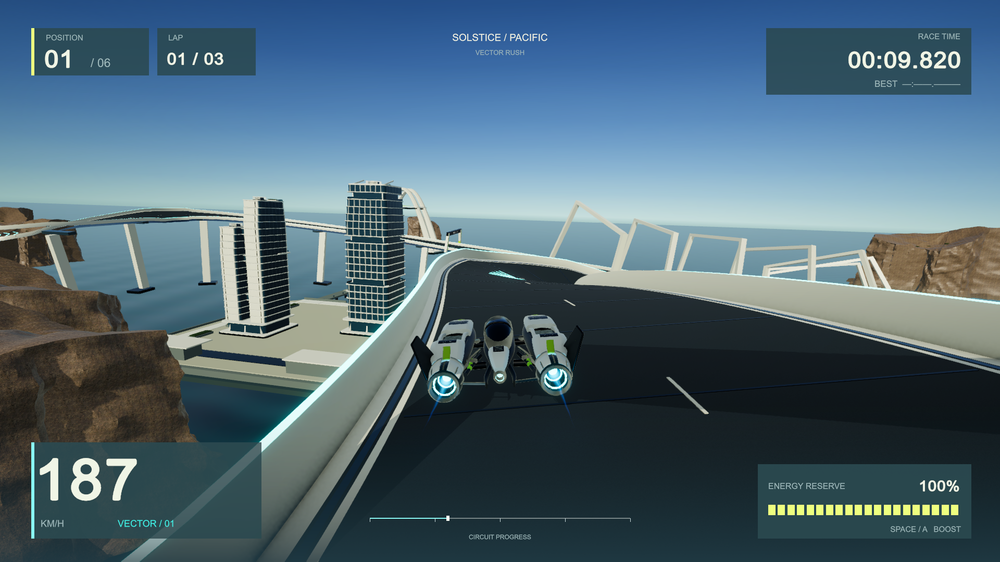
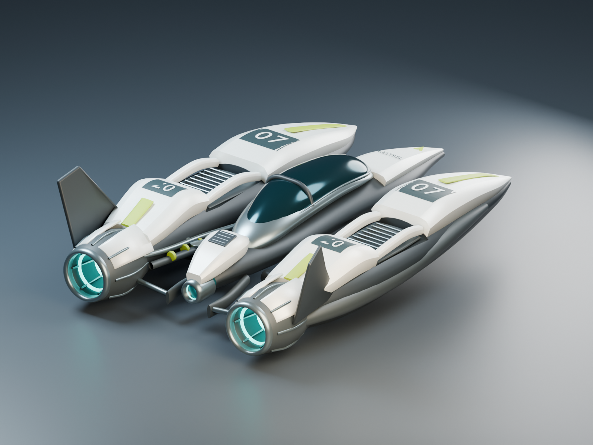
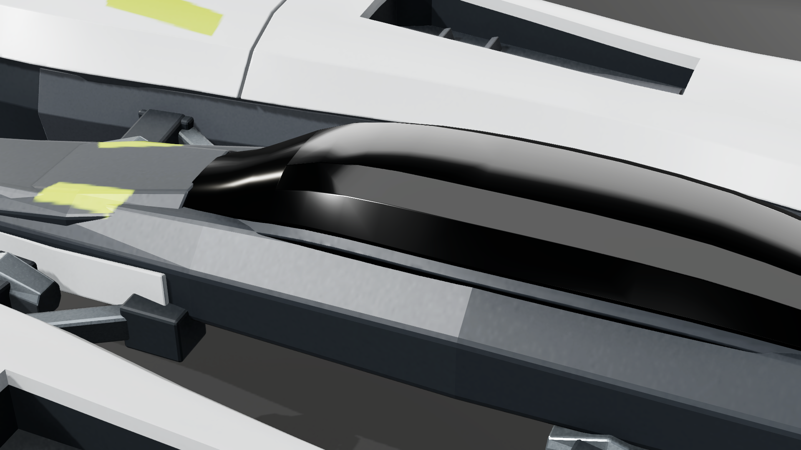
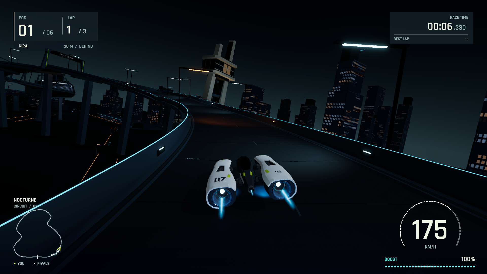
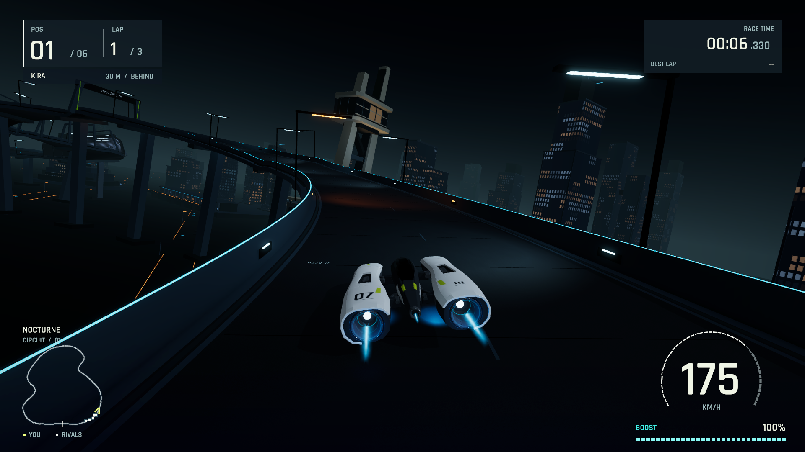
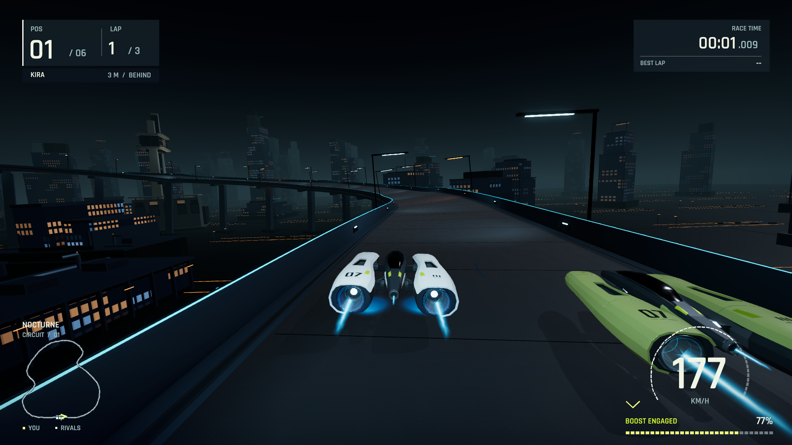

# Vector Rush complete development work record

This document records the development of Vector Rush from the first design on September 7, 2026 through the saved September 8 checkpoint `3097bc8`. It explains what we inspected, what those inspections revealed, which tools and source changes we used, and what the subsequent checks actually established. It includes rejected models, failed visual experiments, debugging mistakes and incomplete checks as well as accepted work.

The result is an original playable macOS anti-gravity racing prototype: one circuit, six racers, a three-lap race, keyboard/gamepad controls, a custom HUD, authored craft and environment assets, synthesized audio and reproducible evidence. Its presentation improved in several specific areas, but the complete game did not earn the requested AAA-level verdict. The latest saved app combines improved night atmosphere with the clearer earlier road treatment; production road response remains unfinished.

“We” refers to the integrator and the explicitly assigned asset, gameplay and review agents. An independent critic's observations are attributed as review findings; the document does not imply that one person manually performed every operation. Dates in the commit ledger use America/Los_Angeles time. Asset and native reports sometimes retain UTC timestamps.

Subsequent work is recorded separately in the [resumed road-response decision](../evidence/night-production/road-response/decision.md): one smoothness candidate was rejected and the exact control restored. The [current handoff](HANDOFF.md) records its fresh validation and the proposed next step. This retrospective retains its original 60-commit cutoff.

## How to read this record

The chapters follow the development of each system, with commit anchors to reconnect overlapping work to the chronology. Each substantive entry describes the evidence or problem, the implemented action, the tool or source involved, and the result with its limits. The final ledger lists all 60 recorded commits through the checkpoint. Linked source recipes, images and reports provide the detailed evidence behind the narrative.

The earliest implementation and corrections were partly combined in commit `acc8252`; GitHub history was requested after development had begun. Those early edits cannot honestly be reconstructed as separate commits. Some rejected early model images survive without the exact corresponding source mesh. The record identifies those limits rather than inventing a complete command-by-command replay.

## Tools and what we actually used them for

| Tool or method | Actual role in this project | What it does not establish |
| --- | --- | --- |
| Built-in image generation | Created the original coastal concept, the three Nocturne target images and the later two-panel environment concept. Exact prompts and provenance were saved. | Generated targets are not native game screenshots or proof that the implementation achieved them. |
| Image inspection | Parent and critics opened studio renders and native PNGs to evaluate silhouette, gaps, contact defects, material response, road artifacts, city composition, HUD and controls. | A still image cannot prove continuous motion, audio quality, handling or performance. |
| Python inside Blender through `bpy` | Constructed and revised meshes, applied modifiers, assigned materials, prepared UVs, rendered inspection views, baked maps, exported FBX and audited reimported geometry. | A successful model script or studio render is not native-game visual acceptance. |
| Blender background command line | Executed reproducible asset scripts and bake/render/audit jobs. The wrapper uses `--factory-startup --background --python`; preserved later logs confirm background execution. | BlenderMCP addon registration in a log does not prove an MCP command performed the modeling. |
| Blender MCP | Was available and explicitly permitted by the owner as an optional route. The specific operations in this record are attributed to MCP only if there is evidence of such an invocation. The preserved modeling recipes and identified run logs primarily establish Python/CLI work. | It would be inaccurate to relabel all Blender work as MCP-driven merely because the plugin was installed. |
| Python outside Blender | Generated texture/livery masks, inspected structured telemetry and mesh/export data, checked hashes and channels, selected natural route crossings, compared capture states, validated PNG streams, verified archive/video identities and assembled records. | Numerical integrity checks do not replace visual criticism. |
| C# and shader editing | Implemented the game systems, procedural world assembly, lighting/material integration, custom shaders, native inspection/capture components and diagnosed gameplay/rendering fixes. | Editing a value is not evidence that a retained shader variant or native runtime behaves as intended. |
| Unity Editor in batch mode | Prepared/imported assets and serialized settings, ran EditMode tests and built the native macOS player through project-owned wrappers. | A clean compile or test pass is not a complete playability or art-quality pass. |
| Native macOS game launches | Recorded actual rendering, exercised normal physics with labeled automated steering, verified race/restart/pause behavior and sampled real-time frame intervals. | Fixed simulation-time captures do not measure real-time frame rate; automated driving does not become human play. |
| Desktop UI control and input checks | Exercised selected native menu/pointer/keyboard flows and checked display/app state when capture was obstructed. Virtual gamepad tests separately exercised input logic. | These checks do not imply a sustained human race or physical-controller hardware test. |
| FFmpeg | Encoded original sequential PNGs at their recorded cadence and decoded finished videos to check file integrity. | Complete decoding does not mean a reviewer watched every frame at normal speed. |
| Git and GitHub | Preserved source, editable assets, selected native evidence, critiques and separate correction commits; pushed to the approved private repository. | Source publication did not authorize a GitHub release, and local app archives were kept out of Git. |

The project pinned the user's installed Unity **6000.6.0f1**, URP **17.6.0**, Input System **1.20.0** and Test Framework **1.8.0**. Blender **5.2.0 LTS**, Xcode and FFmpeg were already available. We installed/configured the official Unity CLI **1.0.0-beta.8** and added the experimental Unity Pipeline **0.6.0-exp.1** project tooling; the native build/test wrapper still invoked the pinned Editor's batch methods. The owner installed the Editor, rather than us claiming to have installed it. The target machine was an Apple M2 Max with 32 GB RAM. See the [toolchain record](toolchain.md).

## Original scope and changes in direction

The owner initially requested a visually exceptional original racing game inspired by Wipeout Omega's quality, parallel asset/gameplay work, reference images and a harsh independent critic. We rewrote this into a practical build brief with a bounded vertical slice, original assets/branding, explicit ownership, native validation and honest limits. The first theme was Solstice: a bright coastal circuit with ivory architecture, blue ocean, cliffs and a twin-nacelle craft.

After playing/reviewing the coastal prototype, the owner rejected its visual quality and asked to try an easier-to-control night-road setting, stronger propulsion and further iteration. We created Nocturne targets, then prioritized ship shape under an independent reviewer. The owner later clarified that the primary form should become coherent and close enough to advance, rather than indefinitely matching every reference contour. Work then moved through materials, propulsion, HUD, environment construction, closer racing, landmarks and selective lighting.

The owner subsequently observed that the earlier coast still looked stronger as a whole. Our comparison agreed: detailed local improvements had not guaranteed better complete-image hierarchy. A newly supplied night-racing clip then established the desired integrated finish, while the owner chose to retain the night direction. We planned the production pass, began its lighting/road stage, and stopped at the owner's requested checkpoint. The latest request asks for this detailed retrospective and a plan for the next development step; it does not retroactively change the acceptance status of any earlier build.

Reference records: [original brief](GPT6-BUILD-PROMPT.md), [coastal concept prompt](../references/generation-prompt.txt), [Nocturne references and exact prompts](../references/nocturne/README.md), [environment concept provenance](environment-art-direction/concept-provenance.md), [supplied video brief](../references/night-production-video.md).

*Earlier coastal build, actual native racing image. Large white structures, blue ocean and shaded road made a stronger broad composition than several more detailed later revisions. The coast/night comparison chapter returns to that finding.*

## Gameplay, input, presentation and native validation audit

This chapter reconstructs the work completed on 7–8 September 2026 from committed source, existing reports and preserved evidence. It is a documentation audit: no Unity execution, new playtest, performance run or runtime edit was performed for it. The audited checkpoint is `3097bc8` on `build/first-playable`. Dates in native JSON/logs are often UTC and therefore fall on 8 September when the corresponding local work occurred on 7 September.

The initial implementation was developed in parallel and recorded as a combined checkpoint. [The implementation plan](implementation-plan.md) assigns gameplay scripts to the gameplay worker, track/setup/integration and native execution to the parent, and HUD/audio to the presentation task. Later it explicitly assigns IonPropulsion/VehicleVFX and the HUD evidence harness to gameplay, RaceHUD/integration to the parent, and native visual review to Astra. Commit author metadata records the repository identity, not the individual agent who wrote every line. Attribution below follows those recorded ownership statements; it does not infer an agent's identity from Git authorship.

### 1. First playable: implementation and corrective source review

**Request and boundary.** [Design commit `ca58eec`](https://github.com/emrickk/vector-rush/commit/ca58eec) defined an original one-course anti-gravity racer: one craft design, five rivals, three laps, keyboard/gamepad controls, race menus, procedural audio and an Apple Silicon native build. [The design contract](design.md) fixed metres, +Y up, +Z forward, a 22 m track and the interface between track, gameplay and presentation. The integrated source was preserved in [`acc8252`](https://github.com/emrickk/vector-rush/commit/acc8252). As [development history](development-history.md) states, several early implementation/correction edits preceded that checkpoint; there are no individual historical commits for all of them.

**Actual implementation.** [VectorBootstrap](../UnityProject/Assets/Scripts/VectorBootstrap.cs) creates the track/world, six rigidbody racers, a director, camera and presentation. It sets a 100 Hz physics step (`Time.fixedDeltaTime=1/100`) and caps accumulated delta at 0.1 s. [TrackPath](../UnityProject/Assets/Scripts/World/TrackPath.cs) supplies Catmull–Rom positions, arc-length evaluation, local forward/right/up frames and closest progress. Reconstructing its 1,200-segment arc-length table for the later pace audit gave approximately 1,844.517 m.

[HoverVehicle](../UnityProject/Assets/Scripts/Gameplay/HoverVehicle.cs) uses four downward suspension probes at local X ± 1.5/Z ± 2.2 m. Its body is 850 kg, with gravity disabled, continuous dynamic collision, interpolation, linear damping 0.05 and a lowered centre of mass. `FixedUpdate` applies hover springs/damping, downward acceleration, alignment torque, steering torque, forward thrust, braking and lateral-slip damping. Baseline cruise/boost limits are 78/108 m/s and acceleration 34 m/s². Boost requires grounded flight, throttle above 0.1 and reserve above 0.01; it consumes 0.23 reserve/s, regenerates 0.12/s and multiplies thrust by 1.65. Airbrakes modify yaw and lateral grip. Recovery uses the last validated checkpoint, resets pose/velocity and costs 0.15 reserve; automatic thresholds include 2.7 s airborne and 4.5 s stalled. These are actual force-based mechanics, not movement along a prerecorded spline.

[RaceProgress](../UnityProject/Assets/Scripts/Gameplay/RaceProgress.cs) has 12 ordered sectors, explicit start arming, forward crossing checks, invalid-sample/re-entry rejection and a race-distance value limited by validated progress. [RaceDirector](../UnityProject/Assets/Scripts/Gameplay/RaceDirector.cs) owns Menu → Countdown → Racing → Finished, pause/resume and reset. It measures laps from actual crossing fractions, maintains finish order and freezes the field when the player finishes. [ChaseCamera](../UnityProject/Assets/Scripts/Gameplay/ChaseCamera.cs) follows the physics craft with authored distance 10.5 m/height 4.6 m, speed response and optional impact shake. Later night art changes did not constitute a camera redesign.

**Problems exposed by the first independent source review.** [Critique 01](critique-01.md) preceded runtime acceptance and reported six concrete integration/race defects. [Critique 02](critique-02.md) separately inspected the corrected source and the 17-test XML:

| Finding and evidence | Actual corrective operation | Verified outcome and limit |
| --- | --- | --- |
| Hover height 2.5 m and a 1.25 m collider left its bottom at 1.995 m, above the 1.2 m barrier. | Hover height became 1.55 m; collider 5.2 × 1.2 × 7.2 m, centred at (0, .12, .1); barrier raised to 2 m. | Corrected level overlap is .93 m. Source geometry supports containment; that arithmetic alone did not demonstrate glancing contact. |
| Barrier shell triangles faced into the wall. | Reversed mirrored triangle winding in `WorldBuilder`. | Source re-review confirmed inward-facing road-side normals and upward tops; subsequent runtime imagery was a separate check. |
| A projected off-track crossing could award a gate. | `RaceDirector.IsValidGateSample` now requires lateral position ≤ half-width + .75 m, height .25 to hover-height + 2 m and forward speed > .5 m/s; `RaceProgress.Sample` requires consecutive valid samples. | Tests reject off-track crossings/re-entry and invalid finish samples. This is bounded rule coverage, not proof against every possible shortcut. |
| Prestart recovery always moved to .995, gaining the player about 4.777 m. | `RaceProgress` retains the racer's actual starting progress until the first forward crossing. | `StartingGridRecoveryStillRequiresForwardStartCrossing` passes. |
| Same-physics-step finish order followed racer-list order. | Calculate `LastCrossingFraction`, sort same-step finishers and interpolate crossing time. | Fraction test distinguishes crossings; no actual photo-finish race was demonstrated. |
| Known Ceramic/WhiteMark slots fell through to hull ivory. | Explicit runtime material mappings preserve dark engine casing and white markings. | Source mapping fixed; native material/art quality remained separately reviewed. |

[The initial XML](../evidence/editmode-results-initial.xml) contains 17/17 passes. It verifies executed EditMode rules, not a playable race. The first native race then completed three laps in **155.43 s with seven player recoveries**, preserved in [run 01 verification](../evidence/run-01/race-verification.txt). [Runtime critique 01](critique-runtime-01.md) still rejected the visuals and found broken essential HUD text. The integrated checkpoint included subsequent controller/readability corrections; [`c68efd6`](https://github.com/emrickk/vector-rush/commit/c68efd6) records the next native run at **112.58 s, zero player recoveries**, with three countdown-pause/reset checks. NOVA still recovered once. These early checks did not yet include the later complete restart-to-movement assertions.

### 2. Native toolchain and the difference between build success and usable output

The project used the owner's installed Unity **6000.6.0f 1**, URP **17.6.0**, Input System **1.20.0**, Test Framework **1.8.0**, Blender **5.2.0 LTS**, and Apple M2 Max/32 GB host. [Toolchain record](toolchain.md) documents the separately installed official Unity CLI 1.0.0-beta.8 and project Pipeline 0.6.0-exp.1 package. [The manifest](../UnityProject/Packages/manifest.json) pins the actual project packages. The record does not claim that the experimental Pipeline tool or Unity CLI performed every operation: [tools/unity.sh](../tools/unity.sh) actually invokes the pinned Editor for preparation, EditMode tests and builds.

[VectorRushSetup.Prepare/BuildMac](../UnityProject/Assets/Editor/VectorRushSetup.cs) persists the scene, renderer and materials; configures Linear colour, HDR, MSAA 4, Forward+, per-pixel additional lights, windowed/resizable 1920×1080, Mono and both input backends; and builds `Assets/Scenes/Solstice.unity` to the local app. `BuildMac` already calls `Prepare`. The source uses a serialized URP additional-light property because the installed API does not expose the needed public setter. Compiler/build outcomes were recorded separately from visual and playability verdicts.

Two rendering setup faults directly affected gameplay presentation. [`43a4d95`](https://github.com/emrickk/vector-rush/commit/43a4d95) restores the missing renderer `PostProcessData` and a saved emissive Lit keyword/colour, so configured ACES/bloom/grading and emissive variants survive native preparation. It also replaces opaque Lit trail ribbons with additive vertex-alpha propulsion. [The native baseline image](../evidence/road-diagnostic-05/diag-01-baseline.png) was inspected after the fix. The result supported improved visible road/craft presentation, not a universal road-artifact diagnosis or AAA acceptance.

### 3. Track physics, paused input and macOS pointer corrections

**Track continuity.** Road banding prompted numerical examination of discontinuous bank frames and wide twisting quads. [`f0401f7`](https://github.com/emrickk/vector-rush/commit/f0401f7) changed `TrackPath.Evaluate` from segment-discrete heading/bank to continuous `Spline(t)` and analytic `SplineTangent(t)`. It projects incoming/outgoing curve vectors onto the horizontal plane so grade cannot create lateral bank; signed turn uses `atan2`, multiplied by −2.5 and clamped to ± 17°. `WorldBuilder.Ribbon` retains 960 longitudinal segments but gives ribbons wider than 5 m twelve lateral columns instead of one. [Run 04](../evidence/run-04-geometry/race-verification.txt) finished in **112.64 s, zero player recoveries** and verified both results-to-racing and paused-race-to-racing launches, including reset time/laps/energy/recoveries and renewed movement. Road shading still failed visually: fixing geometric continuity did not prove that every later dark band came from the mesh.

**Paused recovery.** Unity `Update` still runs while paused, while `FixedUpdate` does not. A recovery button edge could therefore remain queued until resume. [`fece904`](https://github.com/emrickk/vector-rush/commit/fece904) makes `HoverVehicle.Update` clear steering, throttle, brakes, boost and recovery requests whenever the director is absent or not Racing. [HoverVehicleInputTests](../UnityProject/Assets/Tests/Editor/HoverVehicleInputTests.cs) drive a temporary Input System gamepad to prove pause rejection without spending reserve, and that ordinary racing recovery still works. An initial fixture failed to exercise EditMode input correctly: [its preserved XML](../evidence/editmode-results-input-fixture-failed.xml) records 17 passes/2 failures. The fixture was corrected to explicitly process player input and restore package update settings; the recorded rerun passed 19/19. The failed fixture is not concealed or misreported as a game regression.

**Pointer cause and fix.** Native macOS IMGUI events carried a desktop-origin offset, while Input System reported correct window pixels. An initial correction before `GUI.matrix` was insufficient because changing the matrix restored raw event position. [`c122f6e`](https://github.com/emrickk/vector-rush/commit/c122f6e) adds optional input diagnostics and applies `Event.current.mousePosition = correctedMouse / scale` **after** the root canvas scale, converting bottom-origin Input System Y via `Screen.height - y`. It restores the raw event/matrix afterward. [Native activation evidence](../evidence/native-input-verification.txt) records actual visible-window actions: outside-click rejection; Start, camera-shake toggle, Resume and Restart at 1280×800; and outside-click rejection, Start, Resume and Quit at 1920×1080. The implementation plan separately records keyboard Start/Pause/Resume and throttle taps reaching 21 km/h. These are actual input checks, not direct callback invocation, but they are not sustained human driving or physical-gamepad testing.

### 4. Propulsion and audio: presentation changed in response to observed failures

The daytime opaque wake was replaced by [IonTrail.shader](../UnityProject/Assets/Shaders/IonTrail.shader) and fading additive trails in [`43a4d95`](https://github.com/emrickk/vector-rush/commit/43a4d95). The first night effect in [`d3fad40`](https://github.com/emrickk/vector-rush/commit/d3fad40) still read as a hard crystal/cone. After [night critique 01](critique-night-01.md), [`742776c`](https://github.com/emrickk/vector-rush/commit/742776c) changed the plume to crossed translucent density sheets rather than a closed cone. [IonPropulsion.CreatePlume](../UnityProject/Assets/Scripts/Presentation/IonPropulsion.cs) uses three crossed sheets, fourteen rows and shader fading before mesh edges. Authored engine-anchor support later preserved attachment to the imported V3 geometry with the older fallback, rather than changing the physics collider to fit VFX.

[Native review 007](ship-reviews/007-native-gallery-and-boost-stills.md) found the plume too faint beyond the nozzle and the gallery too black. [`184629c`](https://github.com/emrickk/vector-rush/commit/184629c) enlarged the short attached plasma envelope and reduced nozzle point-light spill alongside the separate gallery correction. [Review 008](ship-reviews/008-gallery-wash-and-plume-correction.md) compared selected matched native gallery/boost stills. Motion 03 captured 360 frames, including 32 observed boost frames; this supported improved attachment and readability in those images, not a continuously watched motion verdict.

**Throttle correction.** The owner then rejected the always-on flame appearance. The old `IonPropulsion.Update` used `.18 + speed*.50` in ordinary Racing and `.08` outside it; visible thrust persisted while coasting. [`e7a6735`](https://github.com/emrickk/vector-rush/commit/e7a6735) exposes `HoverVehicle.ThrottleInput` and changes demand to actual clamped throttle × **1.35 while boosting**, zero outside Racing. Exponential response rates are **18/s rising and 26/s falling**, with response below .003 snapped to zero. Plume length, width and intensity follow response; both plume renderers disable at zero. Faint powered cores/annuli remain distinct. Pause freezes presentation. This change does not alter propulsion force, vehicle speed or user controls.

[ThrottleEvidence](../UnityProject/Assets/Scripts/ThrottleEvidence.cs) disables testing autopilot, creates a temporary virtual Input System gamepad, supplies stick/trigger/button state through the input update path and records end-of-frame telemetry. It does not assign speed, body pose, engine demand or VFX response. `Time.captureFramerate=0`; it is an input/rendering test, not a performance test. The six native stages are off, quarter, full, lift-off while coasting, boost and off after boost. [The report](../evidence/throttle-native-01/throttle-evidence.json) verifies .25/1.0/1.35 settled demand and response, and release below .02 in **0.150131 s while still travelling 242.018 km/h**, within the specified .25 s/80 km/h gate; it later reaches zero. Parent inspected quarter/full/release/boost PNGs. Three added input cases bring the suite to **32/32**. A malformed new `.meta` GUID caused the first compile failure and was corrected before the passing build. Later traffic in the scripted sequence prevents treating this as a full-race handling verdict. [Its manifest](../evidence/throttle-native-01/build-manifest.json) identifies the separate corrected archive.

**Audio is implemented but not listening-validated.** [RaceAudio](../UnityProject/Assets/Scripts/Presentation/RaceAudio.cs) synthesizes original 22,050 Hz core/turbine/wind/energy loops and countdown/start/finish/impact signals; it uses no licensed soundtrack or external recordings. `Update` still derives engine pitch and volume primarily from speed (`SpeedKph/420`), with active-phase fades and boost state. `PlayImpact` rate-limits collision sounds. The throttle-driven visual change did **not** also convert engine audio to throttle load. No silent preview can establish audible mix quality, and no sustained manual-with-audio acceptance is recorded.

### 5. HUD redesign: first native failure, correction and final awareness cue

The owner requested a more polished HUD after the throttle fix. [`14b1212`](https://github.com/emrickk/vector-rush/commit/14b1212) replaced distributed telemetry cards with position/lap, timing, a live circuit map and unified speed/boost instrument; bundled Rajdhani SemiBold with its OFL licence; added actual lap/GO feedback; and removed stale underlying telemetry from pause/results. [HUD design](hud-design.md) explains the data: actual TrackPath, live world-position markers, directional player arrow, actual reserve and lap times, smoothed speed rather than invented RPM/gears/sector values.

The gameplay worker owned [HudEvidence](../UnityProject/Assets/Scripts/HudEvidence.cs) and its bootstrap hook; the parent owned [RaceHUD](../UnityProject/Assets/Scripts/Presentation/RaceHUD.cs), typography and integration; Astra authored independent reviews. The harness follows ordinary race transitions and vehicle physics, briefly freezing for matched aspect stills. It observes boost and real lap events rather than assigning phase/lap/speed/energy.

| Iteration | Observed problem → actual change | Native result and limit |
| --- | --- | --- |
| First HUD | `Line()` used `GUIUtility.RotateAroundPivot` under root scaling. Rotated strokes fragmented/offscreen at 1280×800 and 1920×810, although text/rectangles were positioned correctly. Zero/unavailable timers looked broken; control hints were too small. | [Review 002](hud-reviews/002-native-first-pass.md) inspected all 18 native phase/aspect views and **failed** responsive acceptance despite a completed 112.603 s race with zero player recoveries. |
| Responsive correction | Compose local line translation/rotation after the saved root scale (`before * Matrix4x4.TRS`); antialias strokes; render valid zero time and unavailable `--`; enlarge hints; add actual final-lap capture. | [Review 003](hud-reviews/003-native-responsive-correction.md) inspected all **21 views: seven states × three sizes**. Full map/arc/arrow and controls now fit. Final-lap event was observed at race time 75.368 and pictured at 75.698; results 112.603 s. A seconds/fraction gap remained. |
| Final timer polish | Tighten seconds-to-milliseconds spacing while retaining smaller fractions. | [Review 004](hud-reviews/004-final-timer-and-contrast.md) accepts four inspected 1080p exterior/gallery/boost/lap 2 frames from the separate 360-frame preview. One small label intersects an overhead lamp. This was not continuous video viewing. |

The existing **32 tests** passed; [HUD native input scope](../evidence/hud-input-01/scope.md) records CUA clicking visible Start/Resume/Restart/Quit, Escape pause and outside-Start rejection at 1280×800, rather than invoking callbacks. This input run preceded only the final timing-spacing change. [HUD build manifest](../evidence/hud-build-manifest.json) distinguishes that coverage from the silent 15-second 1080p/24-simulation-fps preview. Physical gamepads, low/empty energy, results pointer activation and subjective continuous transitions were not all verified.

After pace tuning, [independent close-race critique 009](environment-reviews/009-close-race-critique.md) found that nearby rivals behind the camera remained hard to perceive. [`1c0a92f`](https://github.com/emrickk/vector-rush/commit/1c0a92f) adds `RaceHUD.UpdateRivalCue`: choose the nearest unfinished rival by validated signed race-distance gap within 100 m, additionally require wrapped track separation within 100 m and physical distance under 100 m, and show name/metres/AHEAD/BEHIND (SIDE BY SIDE only below 2 m). This avoids counting a lapped or separate-branch craft as nearby racing. [Parent verification 010](environment-reviews/010-close-race-verification.md), explicitly **not a second independent critique**, checks KIRA 3 m/BEHIND, AXIOM27 m/BEHIND and AXIOM 17 m/BEHIND against −3.404/−27.115/−16.882 m telemetry. The cue supports awareness; it does not demonstrate an overtake.

### 6. Rival safety first: why zero recoveries did not mean competitive racing

The older night logs repeated three grounded stalls exactly: NOVA at 8.57 s/progress.07248/lateral 7.97 m, RENN at 16.34 s/.07172/7.98 m and KIRA at 17.12 s/.30516/7.97 m, all zero speed after 4.50 stalled seconds with recent impact. Matching pre-V3 events meant the imported V3 art was not evidence of a newly introduced physics failure. [Wall-contact diagnosis](ai-wall-contact-diagnosis.md) compares [night 02 log](../evidence/night-02-player.log) and [V3 motion 03 log](../evidence/night-v3-motion-03.log).

The 5.2×1.2×7.2 m box projects about 3.67 m laterally at 20° yaw; a centre at 7.97 m approaches the barrier's inner face at 11.7 m. That geometry and reduced low-speed yaw authority supported a persistent-contact mechanism, although the initiating contact/yaw had not been recorded.

The gameplay worker implemented a bounded rival-only `ApplyRivalCorridorGuard` and clearance helpers, integrated with the combined night milestone [`ee0e9ea`](https://github.com/emrickk/vector-rush/commit/ee0e9ea). It previews `.45s` of lateral drift; activates above 6.2 m and releases below 5.6 m; temporarily clamps target within ± 4.6 m; caps desired speed at 42 m/s; and suppresses AI boost. It preserves reserved lanes 0/± 5.8 m, the collider, recovery timing and player/testing-player exclusion. While guarding, `KeepCorrectionClear` respects racers within ± 12 m longitudinally using projected box widths +.4 m (at least 5.5 m), and applies the existing following rule to traffic up to 65 m on the corrected path. It uses ordinary steering/throttle/braking, not teleportation.

Ten focused guard/clearance cases took the suite from 19 to**29 passes**. [Night-v 4 race evidence](../evidence/night-v4-race-01/race-verification.txt) shows 112.60 s, three player laps, zero player recoveries; the full telemetry/log reports zero for all six and no recurrence of the three early stalls. Both complete restart launches and all three countdown-pause checks passed. Rivals had only completed 2.2656–2.7417 laps when the player finished, because the director freezes everyone then. This solved a bounded stall problem through the observed race; it did not demonstrate every rival finishing or a competitive field.

### 7. Closer racing: measured failed caps, pursuit correction, physical assistance and final calibration

The owner authorized slowing the actual player, followed by one visual critique/correction and delivery. [Pace review 001](pace-reviews/001-baseline-diagnosis.md) first analysed the existing 1,008-frame environment full-lap capture. It reconstructed longitudinal separation using unwrapped track progress, not Euclidean distance across course branches. After five seconds there were **zero frames within 30/40/60 m of a rival**. The fastest rival had the least inferred edge-guard duty; Rivals 1/3/5 spent long stretches outside. This was an inference from 24 fps pose samples, explicitly lacking controller/contact telemetry.

[`fc0ee39`](https://github.com/emrickk/vector-rush/commit/fc0ee39) added [PaceEvidence](../UnityProject/Assets/Scripts/PaceEvidence.cs) and read-only driver fields for actual guard, desired speed, brake, reserved lane, settings, impacts and race progress. It runs the real player with testing autopilot through ordinary physics, `Time.captureFramerate=24`, approximately 0.1 s telemetry sampling, full three-player-lap outcome and optional pack screenshots. No performance claim attaches to this mode.

[Pace review 002](pace-reviews/002-native-pace-comparison.md) independently recalculated signed gaps as `(rival.RaceProgress − player.RaceProgress) × track.Length`, checking recorded values within.000061 m, then duration-weighted states after 5 s. It separately grouped every player lap and galleries .390–.432/.860–.902. It excludes already-finished rivals and cross-checks unwrapped physical progress so frozen finish progress cannot create fake proximity. Positive means ahead; all close observations in these completed candidates were behind. Some earlier development-history headline values are **Euclidean** thresholds; the table below consistently uses the validated longitudinal metric from review 002.

| Trial / committed milestone | Actual player cruise/boost, m/s | Finish, simulation s / samples | Within 60 m after 5 s | Lap 1/2/3 within 60 m | Mean nearest gap, m | Nearest finish gap, m / rivals within 200 m | Verdict |
| --- | --- | --- | --- | --- | --- | --- | --- |
| [Baseline](../evidence/pace-baseline-01/pace-evidence.json), `fc0ee39` |78/108|112.603 /1,127|0%|0/0/0%|280.1|476.6 /0|Solitary after launch despite zero recoveries.|
| [01](../evidence/pace-candidate-01/pace-evidence.json), [`5ea643a`](https://github.com/emrickk/vector-rush/commit/5ea643a)|60/82|120.912 /1,210|26.6%|11.7/25.1/41.6%|81.5|177.1 /1|Improvement; all three closeness/finish gates fail.|
| [02](../evidence/pace-candidate-02/pace-evidence.json), [`4c043ed`](https://github.com/emrickk/vector-rush/commit/4c043ed)|55/75|125.969 /1,261|33.1%|77.2/26.1/0%|152.9|494.1 /0|Slower cap still collapses late; cap-only tuning rejected.|
| [03](../evidence/pace-candidate-03/pace-evidence.json), [`171a26a`](https://github.com/emrickk/vector-rush/commit/171a26a)|60/82 + pursuit|120.708 /1,208|27.9%|69.7/15.6/2.5%|113.3|167.1 /1|Yaw mapping corrected; persistent rail state and closeness failure remain.|
| [04](../evidence/pace-candidate-04/pace-evidence.json), [`d630e55`](https://github.com/emrickk/vector-rush/commit/d630e55)|60/82 + pursuit/side force|120.716 /1,208|38.3%|76.1/23.5/18.8%|78.4|240.0 /0|Physical edge exposure improves; pace still separates.|
| [05](../evidence/pace-candidate-05/pace-evidence.json), [`df176bf`](https://github.com/emrickk/vector-rush/commit/df176bf)|55/75 + same controller|125.567 /1,257|66.4%|82.7/77.3/40.7%|49.2|160.4 /2|Sustained overall proximity passes; nearest finish gate fails.|
| [06](../evidence/pace-candidate-06/pace-evidence.json), [`5735895`](https://github.com/emrickk/vector-rush/commit/5735895)|53/72 + same controller|128.320 /1,285|80.9%|86.2/77.7/79.2%|38.4|100.85 /2|Retain for intended sustained proximity; literal 100 m gate still narrowly fails.|

Every listed run completed with **zero recoveries across all six racers**. All five rivals remained unfinished when the player finished; these are finish-distance gaps, not invented rival finish-time spreads. Build GUIDs and report hashes are retained in each report/analysis pair. These are sequential native runs with changed interactions, not identical-input rival replays.

**Why the second cap failed.** Candidate 02 raised actual guard duties to 82.5/78.2/81.8/64.8/62.8% for Rivals 1–5. Rivals 2/4 mean speeds fell from 160.8/163.7 km/h in 01 to 141.1/145.0 km/h. Approximately 48%/37% of their post-start samples were guarded at absolute lane>8 m despite reserved lane+5.8 m. Changing relative arrival timing changed traffic/contact outcomes: player speed reduction was not monotonic improvement. The telemetry's `AITargetLane` exposed only reserved lane, so it could not uniquely distinguish blocked inward clearance from understeering; candidate 03 added `AIResolvedTargetLane` after clearance resolution.

**What pursuit changed, and why it was insufficient.** Old steering was `clamp(angleDegrees/26)`; physical yaw multiplied by 1.12 above 26 m/s, a small-angle gain about 2.468rad/s per radian. A pure-pursuit approximation calls for `2*forwardSpeed*sin(angle)/planarChord`; the old gain was below the approximate 3.248 at 42 m/s and 4.082 at 75 m/s for existing lookahead. `PursuitSteering` uses nonnegative forward speed, actual planar chord clamped to at least 1 m, and divides desired yaw by the same `1.12*lerp(.25,1,speed/26)` authority before clamping steering ± 1. Four known-radius cases failed the original mapping; the suite then passed**37**. This function affects every AI-driven craft, including testing autopilot, while manual stick/keyboard steering is separate. Native candidate 03 still failed: correct pursuit algebra alone did not free the bodies.

**Causal discrimination after 03.** The analysis reconstructed hull orientation, velocity direction and the actual resolved target. At guarded |lane|>8 m, mean slip was only.80–1.45° (median.18–.37°), while the existing inward target angle was about 13° and target lateral error 4.11–4.38 m. A velocity-heading change would add only about.7–1.1° on average; evidence did not support slip as the main remedy. Projected collider-to-barrier clearance averaged.064–.104 m, with 82–94% of those outer-edge samples below.15 m. This was a reconstructed local-plane approximation, not actual recorded contact points, but it supported the long hull's stern blocking inward yaw.

**Physical escape assistance.** `RivalCorridorAcceleration` returns zero for player, inactive guard, or a target not at least.05 m inward. Otherwise it clamps `(targetLane-currentLane)*3 - lateralSpeed*2` to**± 6 m/s²**. `DriveAI` applies the result with `Body.AddForce(frame.Right*acceleration, ForceMode.Acceleration)` after collision-clear target resolution. It assigns neither position nor velocity, preserves steering/braking/traffic restrictions, and its damping may oppose fast inward travel. Two mirrored contact cases failed the old zero-force response; the completed suite passed**42**. In 04, rival |lane|>8 m exposure fell from 20.0–40.5% to 3.3–5.0%, and longest guarded outer episodes were.79–2.00 s. Guard duty remained 41.8–65.6%, so this is mitigation in a deterministic race, not proof of zero contact or universally solved AI.

**Final actual-player calibration.** [VectorBootstrap](../UnityProject/Assets/Scripts/VectorBootstrap.cs) applies 53/72 directly to the `i==0` player, not only to its testing autopilot; rival engine defaults and acceleration stay unchanged. In 06, post-start within 30/40/60/100 m is 56.0/66.4/80.9/98.1%. Mean gap stays 35.2/40.4/39.3 m by lap; both galleries have a rival within 60 m for 100% of sampled duration. The player averages 154.6 km/h, strongest rivals 155.4/155.5. Signed finish gaps are −248.87/−361.31/−100.85/−112.95/−469.23 m. The reviewer retained this setting for the bounded objective while explicitly recording the 100.85 m miss and **no actual pass/rank change**. Nearby telemetry behind the camera is not evidence of visible wheel-to-wheel action or manual-player balance.

After the HUD/light-only visual correction, [final pace comparison](../evidence/close-race-final/pace-comparison.json) reproduces all 1,285 sampled racer states/timestamps of 06 exactly. That is stronger invariance evidence for those presentation edits than a compile alone, while remaining specific to the scripted run.

### 8. Native performance, test coverage and delivery boundaries

The native [RaceEvidence](../UnityProject/Assets/Scripts/RaceEvidence.cs) harness separates modes. Its replay path sets captureFramerate 24 and records 360 end-of-frame images/metadata; regular profiling collects `Time.unscaledDeltaTime*1000` over 60 wall-clock seconds, sorts observed intervals, and records percentiles plus Unity allocated memory. `VerifyRace` waits for the actual director result; `VerifyRestartLaunch` checks source phase, reset state, Racing after 4.2 s and renewed speed>10 km/h. Three separate countdown-pause checks confirm that the countdown remains frozen. These tests automate the ordinary control/physics route; they are not human driving assessments.

All performance rows below are native 1920×1080, Apple M2 Max, VSync 1. They are **observed frame intervals**, not isolated GPU timings or guaranteed frame rates. Variable display refresh and outside workloads limit cross-run causality.

| Preserved run | Samples | Mean / P 95 / P 99, ms | Unity allocated MiB | Qualification |
| --- | ---: | --- | ---: | --- |
| [run 02](../evidence/run-02/runtime-metrics.txt)|3,758|15.97 /16.82 /16.89|184.8|112.58 s race, zero player recoveries; one rival recovery remained.|
| [run 06 models](../evidence/run-06-models/runtime-metrics.txt)|3,527|17.02 /18.86 /25.07|196.9|Authoring overlapped; not isolated final performance.|
| [run 09 coastal](../evidence/run-09-coastal/runtime-metrics.txt)|3,595|16.69 /16.76 /16.96|203.6|No Editor or asset generation during sample;112.64 s race.|
| [night 01](../evidence/night-01/runtime-metrics.txt)|3,601|16.67 /16.79 /16.85|237.9|Visual target still failed.|
| [night 02](../evidence/night-02/runtime-metrics.txt)|3,601|16.67 /16.82 /17.31|241.0|Static visual target still failed.|
| [night-v4](../evidence/night-v4-race-01/runtime-metrics.txt)|3,529|17.01 /20.60 /25.34|250.3|No build/bake overlapped; idle desktop apps remained. No locked 60 fps claim.|
| [environment final](../evidence/environment-final-performance/runtime-metrics.txt)|6,804|8.82 /15.14 /15.99|240.1|No build/bake/encoding;32-test source regression passed.|
| [close-race final](../evidence/close-race-final/performance/runtime-metrics.txt)|7,189|8.35 /9.22 /9.32|239.5|128.32 s race, zero all-racer recoveries,2 full restarts +3 pause checks.|
| [landmarks first](../evidence/landmarks-final/performance/runtime-metrics.txt)|4,499|13.27 /16.66 /188.14|241.1|Real long intervals preserved; cause undetermined.|
| [landmarks repeat](../evidence/landmarks-final/performance-repeat/runtime-metrics.txt)|7,162|8.38 /9.23 /9.33|241.2|Same build returned near prior; does not erase first hitch.|
| [lighting-depth final](../evidence/lighting-depth-final/performance/runtime-metrics.txt)|7,184|8.35 /9.21 /9.33|240.7|Consistent with prior repeat;128.32 s race, all six zero recoveries,2+3 restart/pause checks.|

[Landmark comparison](../evidence/landmarks-final/performance-comparison.json) records Chrome GPU-helper CPU activity but correctly refuses to identify it as the hitch cause: the good repeat also had that activity, and CPU snapshots are not GPU utilisation. [Lighting-depth comparison](../evidence/lighting-depth-final/performance-comparison.json) notes that no build/encoding/asset generation ran during its sample; an existing idle Editor was left untouched. Neither comparison proves total system isolation.

Regression coverage grew from 17 race-rule tests to 19 with paused-input cases,29 with corridor/clearance,32 with analog-throttle cases,37 with pursuit mapping and 42 with lateral assistance. [Final close-race XML](../evidence/close-race-final/editmode-results.xml) and [lighting-depth XML](../evidence/lighting-depth-final/editmode-results.xml) both record 42/42. Tests cover ordered forward laps, reverse/duplicate/skipped crossings, shortcut clamping, respawn/reset/invalid inputs, crossing fractions, pause/ordinary recovery, analog throttle, pursuit and guard helpers. They do not certify subjective handling, every traffic configuration or all GUI states. This audit read the existing XML; it did not rerun tests.

**Artifacts and publication.** [`3351c38`](https://github.com/emrickk/vector-rush/commit/3351c38) packaged the coastal app: [manifest](../evidence/build-manifest.json),46,728,192 bytes and ZIP integrity pass, with a silent 1280×720/15 s preview. Later night-v4 and throttle fixes have separate manifests; the old clip does not pretend to show the new throttle effect. [`1c0a92f`](https://github.com/emrickk/vector-rush/commit/1c0a92f) identifies final close-race build`7da2883ade4f4223b7a611db8cf60eb6`,54,531,835byte archive/441 entries/CRC pass,189 app-file hashes, a 15 s preview and 42.75 s full-lap excerpt. The latter spans recorded start-line crossings; both are silent actual native rendering with automated steering at 24 simulationfps. Selected PNGs and decode checks establish content/file validity, not continuous human viewing.

Source/assets/evidence were committed and pushed to the private repository. The attempted close-race GitHub release was rejected by automatic approval review because release-asset publication required separate authorization; **no release was published**, clarified in [`e8805d4`](https://github.com/emrickk/vector-rush/commit/e8805d4). A local verified app archive is not a GitHub release.

The last fully checked lighting-depth delivery at [`a948825`](https://github.com/emrickk/vector-rush/commit/a948825) uses GUID`5c49b92643bd4d41820ba81857fdf8c7`:1,440 native frames;42.75 s full lap and 24 s lighting excerpt decoded; ten alternate-aspect station views;42 tests;193 source/resource/settings hashes and 189 app hashes unchanged after tests;56,664,092byte archive with 441 entries/CRC pass. [Its manifest](../evidence/lighting-depth-final/build-manifest.json) is the evidence authority. Exact prior-camera anchor comparisons failed due to small natural drift and remain labelled failures. A display-locked performance attempt was recorded as blocked in`e5196cc`; the subsequent unlocked race/performance check completed in`a948825`, rather than retroactively treating the blocked launch as a pass.

The newer owner-requested checkpoint [`3097bc8`](https://github.com/emrickk/vector-rush/commit/3097bc8) is a **different app**, GUID`40bed5f53c2449418e7fb56bf59739f6`, with accepted atmosphere and the clearer road control. [Handoff](HANDOFF.md) and [checkpoint validation](../evidence/night-production/lighting-road/checkpoint/checkpoint-validation.json) limit it to a successful native build, two short fog/title-to-race runs, five validated PNGs and unchanged 197 source/189 app hashes. It has no new 42-test run, full race/performance, alternate aspects, full-circuit, watched-motion or manual/audio acceptance, and no new ZIP/release. Gameplay remained paused; this documentation task does not reopen it.

### Remaining gameplay and experience limits

The prototype has one course, one craft shape and five rivals. There are no weapons, multiplayer, campaign or additional circuits. Physical gamepad hardware, sustained manual-player balance/handling, audible mix/engine-load response, broad nondeterministic AI coverage, genuine observed overtaking, all-rival independent finishes, low-energy HUD behaviour and continuous normal-speed audiovisual quality remain unproven. Existing procedural sound and decorative speed-pad signals must not be advertised as new functional systems. Independent visual reviews repeatedly reject an overall AAA claim despite narrowly accepting specific fixes. The record supports an increasingly usable native prototype and reproducible corrective process, with the failed trials and literal remaining gates intact.

## Ship production audit: original Kestrel through the contact-corrected native craft

This record follows the ship through authored geometry, rejected alternatives, controlled inspection, runtime material baking and native integration. It documents the evidence available in the repository; it does not rerun Blender, Unity or a visual critique. Visual findings below are attributed to the preserved independent reviews. Those reviews repeatedly distinguish a useful production advancement from a final hero-asset or AAA acceptance.

The implementation was concrete Python/Blender authoring followed by Unity integration. The retained generators use Blender's `bpy` API, while the production records include background Blender build, render, bake and reimport-audit logs. For example, the [pass02 build log](../evidence/ship-v3/pass-02-build.log) records FBX export, saved Blender source and the actual clay image; the [pass03 bake log](../evidence/ship-v3/pass-03-bake-01.log) records reading the staged source and baking maps. [The Blender wrapper](../tools/blender.sh) and [regeneration documentation](asset-regeneration.md) describe explicit staged command-line operations. This is evidence of a scripted background CLI workflow. It is not evidence that an MCP modeling session performed these operations, and no MCP provenance is claimed here.

### 1. The first craft established an editable asset pipeline

The original craft survives as [Kestrel07.blend](../SourceAssets/Kestrel07.blend), [build_assets.py](../SourceAssets/build_assets.py) and [asset-stats.json](../SourceAssets/asset-stats.json). The Python recipe constructs geometry using named lofts, polygon slabs, boxes, cylinders, rings, rods and text. Its loft helper creates octagonal cross sections; a dedicated glazing function constructs a curved canopy from successive sections. The recipe also authors exposed engine rings and blades, intake details and hydraulic links, rather than relying on an image pasted onto a proxy.

The original manifest records 120 editable source objects, nine exported meshes, 29,922 vertices and 51,772 triangles. Its source bounds are 5.4375 × 7.487 × 1.6941 metres in source XYZ. The source convention is nose toward −Y and up toward +Z; FBX is exported for −Z forward and +Y up. These numbers describe that retained revision. They should not be used as the final game's ship inventory.

The [original rear-quarter](../evidence/asset-renders/hero-rear-three-quarter.png), [front-quarter](../evidence/asset-renders/hero-front-three-quarter.png) and [top](../evidence/asset-renders/hero-top.png) images preserve the initial asset appearance. The accompanying [FBX validation record](../evidence/asset-renders/fbx-validation.json) establishes a separate export-check artifact. Neither studio imagery nor a successful export demonstrates native racing quality. The useful foundation was the ability to retain an editable source, reproduce geometry with Python, export material batches and compare actual images across revisions.

The top-level [source README](../SourceAssets/README.md) is a historical V2-era handoff and calls the original files legacy V1. Its statement that V2 is current is time-specific; subsequent V3/pass04 records supersede it. Keeping this distinction prevents a convenient old README from silently replacing the final asset identity.

### 2. Sculpted V2 improved assembly, then failed the hero review

V2 is retained in [Kestrel07-v2.blend](../SourceAssets/hero-v2/Kestrel07-v2.blend) and [build_hero_v2.py](../SourceAssets/hero-v2/build_hero_v2.py). Its [revision notes](../SourceAssets/hero-v2/REVISION-NOTES.md) document an earlier rejected sculpted pass: inflated armor, padded intake rails, thick grille bars, detached race plaques, rubber-like fin edging, an underbody filling the channels and no visible rear emission. The actual [first-pass front](../evidence/hero-v2/first-pass/hero-front-three-quarter.png) and [rear](../evidence/hero-v2/first-pass/hero-rear-three-quarter.png) images survive. The exact first-pass source and FBX do not. The current V2 generator represents the corrected pass, so it cannot be presented as a fully reproducible archive of that missing intermediate revision.

The documented correction altered actual construction: broader planar ceramic crowns and controlled longitudinal edges; unequal outer flank panels; narrower intake rails over seven thin swept vanes; shoulder-conforming number fields; removal of rounded fin piping; and a narrower keel that reopened the longitudinal gaps. It lowered the cockpit crown and narrowed the sill. The engine fix was particularly concrete: the first sculpted pass's carbon core physically occluded the throat. The revised core ends before the luminous chamber, and an intermediate emissive annulus sits 0.295 m behind the exit. A later local cut lowered the carbon pod crown beneath the intake so the well and individual vanes could be seen.

The [V2 manifest](../SourceAssets/hero-v2/asset-stats.json) records 142 editable source objects, nine exported meshes, 39,008 vertices and 73,364 triangles. The [integration contract](../SourceAssets/hero-v2/INTEGRATION.md) identifies nine material names and no required texture payload. It also records main Unity nozzle exits at `(±1.68, −0.035, −3.405)`, facing local −Z. Reusing older effects at ±1.9 would visibly separate propulsion from the mouths. This is an example of geometry changes requiring an explicit native attachment contract.

These improvements did not earn acceptance. [Independent review 001](ship-reviews/001-baseline-rejected.md) compared the corrected [V2 rear](../evidence/hero-v2/renders/hero-rear-three-quarter.png), [top](../evidence/hero-v2/renders/hero-top.png), [chase](../evidence/hero-v2/renders/hero-chase.png) and [native baseline](../evidence/ship-baseline-03/02-start.png) against [reference C](../references/nocturne/C-craft-materials.png). It rejected the swollen three-body reading, bulbous teal canopy, dominant rear slab fins, disconnected-looking pipes, uniform toy-like finish and luminous nozzle outlines. Ragged number edges and raised-looking citron accents compounded the construction problems. The reference was an aspirational target, not implemented-game evidence.

The resulting instruction was to rebuild large forms before adding weathering or fasteners. This preserved a causal link: the evidence showed primary silhouette and surface problems, so the next Python/Blender work changed nacelle sections, canopy volume, intakes and engine integration. Lighting alone was not credited as a solution to defects already visible under neutral studio conditions.

*Corrected V2 studio render, subsequently rejected by the independent ship review. This is an authored asset render, not a native racing screenshot.*

### 3. V3 pass01 overcorrected into a box-like form

The immutable [pass01 recipe](../SourceAssets/hero-v3/pass-01/recipe_snapshot.py), [source](../SourceAssets/hero-v3/pass-01/Kestrel07-v3.blend), [FBX](../SourceAssets/hero-v3/pass-01/HeroShip.fbx) and [manifest](../SourceAssets/hero-v3/pass-01/asset-stats.json) preserve the next candidate. It removed tall fins, lowered and lengthened the center, integrated the white nacelle shell around each engine and replaced puffy raised intake rails. The staged manifest records 21,176 triangles and source bounds of 5.14 × 6.885 × 1.515 m.

[Review 002](ship-reviews/002-form-pass-01.md) recognized those changes but rejected primary form again. The decisive [clay side](../evidence/ship-v3/pass-01/08-clay-side.png) and [top](../evidence/ship-v3/pass-01/07-clay-top.png) showed long nearly straight beams, broad flat roofs and short forebody tapers. The [neutral rear](../evidence/ship-v3/pass-01/02-neutral-rear-quarter.png) exposed abrupt shoulders, a coarse canopy wedge and rectangular intake wells. More detail would have subdivided the blockout without fixing its contour.

The prescribed correction was specific: shape the aft engine shoulder; introduce a cockpit-area waist; lower and slim the forebody; change the underside return along the craft; lengthen and sweep the intake with a ramped recess; and give the canopy a shallow convex crown while retaining its low height. Major panel boundaries also needed supported seams instead of deep cross-cuts. These were coupled surface changes, not a blanket subdivision or bevel increase.

Technical integration was also held. The saved [topology audit](../evidence/ship-v3/pass-01/topology-audit.json) reported boundary edges at rear rims, and tangent-export warnings remained. The reviewer distinguished the worker's diagnosis of a collapsing thin return from an independently rerun calculation. Both the mesh repair and its rendered appearance were required; a clean topology report alone could not pass form.

### 4. Native rig calibration made the comparison meaningful

The first native V2 neutral-rig attempt had a world-pose and lighting calibration failure and was excluded from material judgment. [Review 003](ship-reviews/003-native-rig-calibration.md) accepted the repaired setup after examining the eight images and [scope metadata](../evidence/ship-native-v2-neutral-02/inspection-scope.json). It accepted the inspection apparatus, not the rejected V2 ship.

The repaired [rear-quarter](../evidence/ship-native-v2-neutral-02/01-studio-rear-three-quarter.png) and [orthographic top](../evidence/ship-native-v2-neutral-02/04-studio-top-ORTHOGRAPHIC.png) placed the whole craft correctly above the floor with visible lighting and reflections. Runtime and canonical bounds agreed to floating-point precision. The metadata recorded eight calibration checks and a completed reflection probe. The [emission OFF](../evidence/ship-native-v2-neutral-02/05-studio-engine-emission-OFF.png) and [ON](../evidence/ship-native-v2-neutral-02/06-studio-engine-emission-ON.png) views used identical camera pose, lens and framing. This made the physical collar and chamber distinguishable from the luminous contribution.

[ShipInspection.cs](../UnityProject/Assets/Scripts/Presentation/ShipInspection.cs) is the native inspection implementation. Later V3 controls retain fixed neutral lighting, ACES at exposure zero, no bloom, vignette or fog, and no propulsion effects in studio views. That removes several changing presentation variables from geometry and material comparisons. Ordinary gameplay screenshots remain separate evidence because their race pose, effects, lighting and camera can differ.

### 5. Pass02 reached practical form readiness

The [pass02 recipe snapshot](../SourceAssets/hero-v3/pass-02/recipe_snapshot.py) implements longitudinally refined sections, a waisted nacelle envelope, shaped forward and aft crowns, changing lower returns and a controlled convex canopy. Named source objects preserve these construction roles. The [manifest](../SourceAssets/hero-v3/pass-02/asset-stats.json) records 38,036 staged triangles and bounds of 5.2256 × 6.885 × 1.5197 m. The increase from pass01 is a technical consequence of the candidate, not a quality score.

The first completed [rear clay image](../evidence/ship-v3/pass-02/01-clay-rear-quarter.png) supported a provisional advancement direction in [review 004](ship-reviews/004-form-pass-02-provisional.md). At that moment, the remaining angles were incomplete and V3 was still staged. The review deliberately did not backdate a full pass. After the user clarified that a close, coherent shape should advance into materials and the whole game's presentation, [review 005](ship-reviews/005-form-readiness-pass-02.md) inspected the completed [top](../evidence/ship-v3/pass-02/07-clay-top.png), [side](../evidence/ship-v3/pass-02/08-clay-side.png) and [chase](../evidence/ship-v3/pass-02/05-clay-chase.png).

Those views supported freezing the major form: a deliberate waist, lower forebody, longer integrated intakes, coherent dark center and recessed engines. Simple mounts, long aft panels and basic collars remained finish opportunities. Resumed captures used 32 samples without denoising, which limited fine surface judgments. The [capture record](../evidence/ship-v3/pass-02/README.md) preserves seven actual studio captures and states that optional remaining neutral/perspective views were stopped after readiness. The documentation must not imply every planned render completed.

The [export audit](../evidence/ship-v3/pass-02/export-audit.json) separately reported manifold source geometry, triangulated/manifold runtime meshes, valid tangents after FBX reimport and matching staged runtime/FBX triangle totals. The independent critic read this supplied report rather than rerunning it. Practical form readiness authorized finish work; native material, motion and overall-quality acceptance remained open.

### 6. Flush livery and baked runtime materials preserved the approved geometry

[build_finish_v3.py](../SourceAssets/hero-v3/build_finish_v3.py) loads the immutable pass02 source and writes a new [pass03 finish revision](../SourceAssets/hero-v3/pass-03-finish/asset-stats.json). It adds a packed `SHIP_LIVERY` node group for citron and 07 paint, with source-position projection and upper-surface masks. The [finish contract](../SourceAssets/hero-v3/pass-03-finish/finish-contract.json) explicitly states that no livery geometry was added. The finish also splits compact luminous disk meshes into `EngineCore`, allowing near-white core emission to differ from the dim cyan `Engine` annuli.

The UV policy matters: approved Ivory, Graphite, Glass, Metal and Ceramic runtime UVs were retained verbatim; Engine and EngineCore alone were re-atlased after their material split. The exact `EXPORT_RUNTIME` meshes became the final FBX source. Re-unwrapping those meshes after baking would invalidate the maps.

[bake_materials.py](../tools/ship/bake_materials.py) opens these joined runtime meshes, requires their existing UVs and writes a fresh output directory plus a separate baked-material Blender file. It uses CPU Cycles, a 16-pixel bake margin and no selected-to-active high-to-low transfer. Connected components receive small deterministic tone variation; position-driven procedural grain supplies restrained roughness and bump. Livery is carried through the coating replacement. Normal, albedo, roughness and AO are baked, and metallic/smoothness is packed for Unity.

The [pass03 manifest](../SourceAssets/hero-v3/pass-03-maps-01/material-manifest.json) records 1024-pixel outputs for four mapped categories: Ivory, Graphite, Metal and Ceramic. Runtime inputs are sRGB base color; linear metallic RGB with smoothness in alpha; linear occlusion sampled from green; and tangent-space OpenGL +Y normals. The authoring roughness images also remain in the package. The [pipeline contract](../tools/ship/README.md) and [ShipSurfaceMaps.cs](../UnityProject/Assets/Scripts/Presentation/ShipSurfaceMaps.cs) connect these payloads to Unity. A smoothness multiplier of one means the texture controls smoothness, not that every surface is a mirror.

The baker saves its preview using actual baked maps. [Review 006](ship-reviews/006-source-baked-native-finish.md) compared the [source finish](../evidence/ship-v3/pass-03-finish/01-neutral-rear-quarter.png), [baked rear](../evidence/ship-v3/pass-03-baked-preview/01-baked-rear.png), [baked chase](../evidence/ship-v3/pass-03-baked-preview/02-baked-chase.png) and all eight [native V3 captures](../evidence/ship-native-v3-01/inspection-scope.json). Armor, graphite, glazing and metal remained distinguishable, the flush aft number survived ordinary chase size, and matched engine OFF/ON views established physical depth plus a compact core. This cleared material/import readiness with follow-ups. It also exposed jagged canopy, intake and nozzle borders and weak propulsion volume, which became the next corrections.

### 7. Propulsion and gallery integration were judged together in gameplay

[IonPropulsion.cs](../UnityProject/Assets/Scripts/Presentation/IonPropulsion.cs) consumes [authored anchors](../UnityProject/Assets/Resources/Art/HeroShipEngineAnchors.json) through [ShipEngineAnchors.cs](../UnityProject/Assets/Scripts/Presentation/ShipEngineAnchors.cs). Effects are parented to the craft's visual root. The implementation separates a recessed core, thin annuli, short translucent crossed-sheet plumes and limited local lights. Its current response uses throttle and boost demand, with presentation frozen during pause. These source facts explain intended behavior; they do not independently establish motion stability.

[Review 007](ship-reviews/007-native-gallery-and-boost-stills.md) found that warm gallery lighting reached the ivory hull and canopy, but wall construction read as black slabs outlined in orange. The observed-boost still showed blue bowls and road spill more strongly than an attached translucent exhaust body. The bounded change improved broad wall wash and charcoal surface separation while tuning plume visibility and reducing dominant blue spill.

[Review 008](ship-reviews/008-gallery-wash-and-plume-correction.md) compared [motion03 gallery middle](../evidence/night-v3-motion-03/selected/amber-mid.png) with [motion02 middle](../evidence/night-v3-motion-02/selected/amber-mid.png), and the corresponding [corrected boost](../evidence/night-v3-motion-03/selected/observed-boost.png). It accepted the bounded still-image improvement: wall cassettes and returns became readable, and short soft cyan tails remained attached in sampled cruise and boost poses. The [selection record](../evidence/night-v3-motion-03/selected/selection.json) preserves frame associations; telemetry identifies frame 146 as boost active at 334.5 km/h.

This evidence is an automated normal-physics recording at 24 simulation frames per second. Selected stills cannot verify attachment between frames, yaw/bank stability, flicker or transition smoothness. The [motion03 identity](../evidence/night-v3-motion-03/asset-identity.json) still uses pass03 ship geometry; it cannot validate the separate contact correction that followed.

### 8. The 1,165-vertex correction isolated a real surface conflict

The pass03 [canopy close-up](../evidence/ship-native-v3-01/07-studio-canopy-close.png) showed a silver/gray stepped shard across lower glazing. Related defects already existed in authoring previews, so the diagnosis could not reasonably stop at night lighting. [diagnose_surface_contacts.py](../SourceAssets/hero-v3/diagnose_surface_contacts.py) and the preserved [surface-audit log](../evidence/ship-v3/pass03-surface-contact-audit.log) investigated the actual adjacent geometry.

The [correction report](../evidence/ship-v3/pass-04-contacts/README.md) and [validation summary](../evidence/ship-v3/pass-04-contacts/validation-summary.json) identify competing Graphite/glass/armor surfaces: near-parallel glazing/sill contacts, exactly coplanar end caps, and positive-area overlap at intake and nozzle returns. [contact_correction_v3.py](../SourceAssets/hero-v3/contact_correction_v3.py) lowered the narrow sill 40 mm and shortened it 1%, recessed nacelle backing returns 15 mm and enlarged the buried graphite intake opening 15 mm. Only three Graphite objects changed: 529 sill vertices plus 318 vertices in each structural shell, totalling 1,165 runtime Graphite positions.

Armor, glazing and engine positions, runtime topology, all UV coordinates, packed livery and engine anchors stayed fixed. The named competing coplanar overlaps fell to zero, and canopy/sill near-parallel centroids within 2 mm fell from 145 to zero. Other hidden and noncoplanar assembly intersections remained. The generic whole-source equality check correctly became false because three objects were intentionally changed; specific change allowlists and UV equality passed. This is a bounded contact repair, not an assertion that every object intersection was removed.

The native control kept all 16 runtime surface-map hashes identical to pass03. [Review 009](ship-reviews/009-native-contact-repair-control.md) compared the corrected [canopy](../evidence/ship-native-v4-control-01/07-studio-canopy-close.png), [rear](../evidence/ship-native-v4-control-01/01-studio-rear-three-quarter.png) and [engine ON](../evidence/ship-native-v4-control-01/06-studio-engine-emission-ON.png) against the matched old cameras. It accepted the removal of jagged overlaps while preserving the large silhouette. The unchanged-map control isolates geometry much more convincingly than a simultaneous geometry, texture and lighting replacement.

The correction then required refreshed contact-dependent maps because moved source positions affect procedural grain and AO despite stable UV alignment. [Pass04 maps](../SourceAssets/hero-v3/pass-04-maps-01/material-manifest.json) and the [pass04 bake log](../evidence/ship-v3/pass-04-bake-01.log) preserve that refresh. Review 009 accepted the geometry control; it did not retrospectively accept these later maps. The [final combined identity](../evidence/night-v4-motion-02/asset-identity.json) records their eventual integration.

*Actual native control after the contact repair. Old surface maps were retained for this comparison so the corrected border could be attributed to geometry.*

### 9. The triangle discrepancy was accounted for rather than hidden

Review 006 retained an unresolved difference: 38,036 staged FBX triangles versus 37,686 native triangles. The [triangle reconciliation](../evidence/ship-v3/triangle-accounting-pass03/README.md) used the exact pass03 FBX and native identity, with no new render or geometry change. Direct binary parsing found 332 duplicate-position degenerate triangles. Converting FBX centimetre coordinates to float32 collapsed another 18. Together these reproduced all 350 native reductions: 330 Ceramic triangles and 20 Engine triangles.

All seven native mesh categories were present. EngineCore, Glass, Graphite, Ivory and Metal retained their per-mesh triangle totals. The [detailed reconciliation](../evidence/ship-v3/triangle-accounting-pass03/triangle-reconciliation.json) therefore strongly supports import-time degenerate removal, rather than a missing component. The exact internal importer step was not instrumented; this is a matching emulation, not an importer call trace.

The corrected native control still contains 37,686 triangles. Graphite's imported vertex count changes from 9,328 to 9,354 while its 9,034 triangles remain fixed. Thus unchanged source topology and UVs must not be rewritten as an identical Unity vertex inventory. This distinction preserves both the successful bounded repair and the true import behavior.

The ship advanced from a reproducible first craft through two explicit visual rejections to a coherent native prototype with baked finish, visible short propulsion and a controlled contact repair. [The milestone review](ship-reviews/010-night-playable-milestone.md) permits packaging the combined playable prototype, while preserving road-pattern, architecture, continuous-motion and manual-control limitations. No reviewed stage establishes final AAA quality. The durable achievement is the traceable sequence of evidence, diagnosis, authored change and scoped verification—not the existence of a clean build or a flattering render.

## Environment: from coastal kit to constructed night districts

This part of the record follows the environment through the coastal V2 kit, the change to night, the V3 transit district, and the V4 landmarks and fixture-shadow correction. It distinguishes source authoring, native image findings, and the narrower verification each correction actually earned. The preserved production path is Python using Blender's `bpy` API, with background Blender CLI execution for authoring, FBX export, round-trip inspection and offline renders. These files do not establish an interactive Blender MCP session. Unity C# then places the exports, remaps materials, constructs the road and galleries, and records the native game. The [development history](development-history.md) preserves separate failed candidates and corrective milestones.

### Coastal V2: replace anonymous cubes with authored architecture

The starting critique was specific. [Companion review 01](companion-review-01.md) inspected native run03 and found blank striped towers, large coastal polygon facets and weak water/horizon depth. The generated [Solstice target](../references/solstice-chase-concept.png) was an art direction image, not a screenshot proving that the game already achieved that scene. The response was an authored three-asset package, rather than a claim that adding noise to the original blocks would solve their construction.

The retained [environment generator](../SourceAssets/environment-v2/build_environment.py) builds TerraceTower A with tapering ceramic structure, recessed curtain glazing, open garden floors, entrance construction, balustrades and screened roof equipment. SplitTower B uses unequal blades, a full-height opening and connecting bridges. These have deliberately different large silhouettes and inhabited floor rhythms. The [first kit image](../evidence/environment-v2/first-pass/01-kit-hero.png), [revised kit](../evidence/environment-v2/06-kit-revised.png), and [medium tower inspection](../evidence/environment-v2/11-tower-A-medium.png) retain the offline appearance separately from the native game.

The [asset statistics](../SourceAssets/environment-v2/asset_stats.json) record 39,452 triangles for TerraceTower A and 22,916 for SplitTower B, each exported as one renderer. The [integration contract](../SourceAssets/environment-v2/INTEGRATION.md) specifies metres, a base-centered origin, Unity FBX axis conversion, shared material names, restrained uniform scaling and removal of the old primitive building groups. Those details matter: leaving the old cubes inside an imported tower could hide the very recessed glazing and open floors being reviewed. Native run06 confirmed that terraces and distinct silhouettes survived import, while [the modeling review](visual-modeling-review-03.md) still found nearly black glass and isolated thin platforms in open water. Better source models had not yet made a believable waterfront.

### Cliff revisions: shape failures remained visible after texture improvement

The cliff was not accepted on its first attractive-looking material render. The modeling review records a first form resembling stacked clay and a second resembling cut concrete. Retained images include [the revised cliff](../evidence/environment-v2/05-cliff-revised.png), [fractured geometry pass](../evidence/environment-v2/08-cliff-fracture-final.png), and [distance check](../evidence/environment-v2/10-runtime-distance-final.png). Their role is a correction trail, not three independent accepted deliverables.

The final generator replaces a simple radial outline with an irregular polygonal headland. It computes a varying upland height, a lower wave-cut shelf, localized bedding displacements, narrow erosion clefts and fractured planar noise at several physical scales. Its summit is built through successive broken rings rather than a single central peak, with separate shoreline fragments and scrub. [refine_cliff.py](../SourceAssets/environment-v2/refine_cliff.py) opens the existing editable scene, removes only the cliff object, executes the revised geology section, exports that mesh and refreshes the specific inspection views. That is a concrete Python/Blender operation preserving the already handed-off towers while revising geology.

A separate [procedural limestone experiment](../SourceAssets/environment-v2/stone_texture.py) uses NumPy spectral noise and directional streaks to create portable albedo, normal, roughness and packed metallic/smoothness maps. It supplies mineral grain without pretending that a texture can author a headland silhouette. Those `Solstice_Limestone_*` images remain in staging to reproduce rejected surface trials. They were superseded by the scanned Rock 3 selection.

The [Rock 3 material recipe](../SourceAssets/environment-v2/rock3_material.py) rebuilds the Blender node material around source albedo, OpenGL normal and roughness maps. [Provenance](../SourceAssets/environment-v2/textures/Rock3_PROVENANCE.md) identifies Rob Tuytel / Poly Haven and CC0; the original maps are third-party scans, not generated project imagery. The named URP derivative packs RGB zero and alpha equal to one minus source roughness. Runtime mapping uses normal strength 0.75 and fourfold tiling on the cliff's metric UV channel, giving 2.5-metre tiles. The source scan's documented width is 1.5 metres, so the larger trial scale was an explicit chase-distance choice.

The [scanned close image](../evidence/environment-v2/12-cliff-scanned-close.png), [scanned distance image](../evidence/environment-v2/13-cliff-scanned-distance.png), and [assembled scanned kit](../evidence/environment-v2/14-kit-scanned.png) show the selected surface stage. The cliff export contains 37,424 triangles. Its [FBX round-trip audit](../SourceAssets/environment-v2/export_audit.json) reports finite vertices, one metric UV channel and no zero-area triangles. The frozen SplitTower export separately retains 52 zero-area cap tessellation triangles; this was recorded instead of silently rewriting a handed-off asset. Neither valid export geometry nor scanned texture detail removed the cliff's broad upright planes and simple plateau. Approval was limited to background and middle-distance evaluation.

### Unity coast integration: foundations, duplicate placement and an honest inspection failure

Run06's isolated platforms led to Unity-side connected quays: deep caissons, seawalls, shared promenades, service buildings and piled jetties grouped the eight authored towers into three waterfront districts. [The coastal critique](critique-coastal-final.md) connects that source change to the native [crest](../evidence/run-09-coastal/05-crest.png) and [descent](../evidence/run-09-coastal/06-city-descent.png). It accepts the improved foundation relationship while noting that reclaimed platforms beside rock masses are still not a fully natural connected coast.

A placement audit found two accepted cliff centers only about 1.48 metres apart despite the module's roughly 88 × 61 metre footprint. A 40-metre minimum accepted-center separation removed the near-duplicate. This is a useful example of image review and source arithmetic complementing one another: the source established a concrete overlapping-placement problem, and the native views checked the result. The remaining fixed padding checks did not become an exhaustive transformed-vertex intersection certificate.

The first [dedicated coast inspection](../evidence/run-09-coastal/07-coast-inspection.png) was obstructed by architecture. It was retained as failed evidence. A replacement [elevated native view](../evidence/coast-inspection-10/07-coast-inspection.png) exposed the top, faces, clefts, scrub and shoreline fragments and closed that camera gap. It also confirmed the limitations: smooth large faces, a soft plateau outline, sparse shoreline detail and repetitive water. The verdict remained improved prototype integration with AAA visual quality rejected.

The coastal road fix was similarly bounded. Earlier bank discontinuities and broad twisting quads prompted continuous curvature-based banking and lateral tessellation. Renderer-resource and emission corrections then improved the native baseline. Later matched controls found that disabling SSAO did not remove the unwanted road response, reflection suppression removed much of it, and disabling sun shadows did not. A dedicated matte Lit deck excluded environment reflections and specular highlights while preserving diffuse light, shadows and contact occlusion. [The retained diagnostic baseline](../evidence/road-diagnostic-05/diag-01-baseline.png) and run09 establish the observed outcome, not one proven renderer-level cause for all historical bands.

### Changing the scene to night did not automatically solve depth

The first night pass replaced active coastline with midnight architecture, occupied-window patterns, a dark sky, 58 overhead lamps and two open light galleries. Native [night01 start](../evidence/night-01/02-start.png) and [descent](../evidence/night-01/06-city-descent.png) exposed broad underlit road areas, isolated towers over black ground and hard crystal-like propulsion. The history records a successful build and a failed visual target together.

The next correction added stepped skyline depth rings, mid-rise and low urban fabric, service avenues and varied occupied-window suites. Broader neutral road illumination and softer propulsion improved [night02](../evidence/night-02/02-start.png), but the review still rejected sharp bright distant windows, repeated facade families and overly even road light. Subsequent work retained explicit fog variants and developed enclosed overhead cassettes. The three generated [Nocturne references](../references/nocturne) remained target imagery, with the amber corridor selected as a manageable composition direction. The project did not treat them as native results.

### V3 benchmark: five real cameras before more environment production

[Environment review 001](environment-reviews/001-benchmark-direction.md) selected an actual 264-frame passage: open approach, gallery entry, middle, exit and skyline release. Frames 0, 170, 190, 210 and 240 became its five anchors. The difficult open setup and black-ceiling middle were deliberately included; the benchmark did not crop away failures to showcase only the warm portal.

The initial replay metadata lacked numerical camera/racer transforms. The unchanged [baseline manifest](../evidence/environment-baseline-01/baseline-manifest.json) and [native evidence report](../evidence/environment-baseline-01/environment-evidence.json) closed that gap before art changes. They preserved actual poses, FOV, source identity and original image hashes. The eleven-second sequence used automated steering through normal physics at 24 simulation frames per second. Having all frames available did not mean that an independent reviewer had watched continuous normal-speed playback.

The benchmark's composition instructions led to authored near architecture, supported gallery construction and quieter distant layers. The station had to be the same object through exit and reveal; placement could not be independently optimized for disconnected screenshots. Clearance, road banking, camera, ship and HUD remained stable references.

### Transit source pass01 to pass02: correct the beam basis before native import

The [transit recipe](../SourceAssets/environment-v3/build_transit_kit.py) creates a station with a two-leaf folded canopy, clerestory, open platform, deep room reveals, columns, knees and an asymmetric stair core. A lower service workshop and platform buttress complete the package. Editable collections remain distinct from the combined export collection and non-exported studio. This makes source construction inspectable while delivering one runtime mesh for each family.

The [first studio image](../evidence/environment-v3/pass-01-transit/01-transit-kit-studio.png) exposed the buttress knee protruding above its cap. In the [pass01 recipe](../SourceAssets/environment-v3/pass-01-transit/recipe_snapshot.py), the beam orientation relied on a tracking quaternion. [Pass02](../SourceAssets/environment-v3/pass-02-transit/recipe_snapshot.py) constructs an explicit orthogonal basis from the beam direction, a reference axis, and cross products. That resolves the beam's roll, keeping the support below its ledge; the workshop was also separated in the [revised studio view](../evidence/environment-v3/pass-02-transit/01-transit-kit-studio.png).

The [pass02 statistics](../SourceAssets/environment-v3/pass-02-transit/asset-stats.json) record 13,424 station triangles, 2,972 workshop triangles and 648 buttress triangles. The [round-trip audit](../evidence/environment-v3/pass-02-transit/export-roundtrip-audit.json) checks FBX dimensions, manifold edges, triangle area, UV0 and tangents. Overlapping metric UV0 uses four metres per tile; it is not a unique baked atlas. A 12,000-point whole-course audit also checked footprint clearance against other course branches. Those checks supported import readiness; they did not guarantee that the station would face the chase camera correctly.

### Native candidate01 failed: move and turn the station using the actual views

Unity integrated those exports alongside deep chamfered gallery portals, continuous shells, supported deck fascias and maintenance ledges. Gallery geometry was combined into fourteen batches; 36 gallery lights were reallocated to reveal upper surfaces and six conflicting exterior fixtures suppressed. [Review 004](environment-reviews/004-first-environment-candidate.md) found a much better constructed ceiling but rejected the city composition. In [candidate01 exit](../evidence/environment-candidate-01/04-exit.png) and [reveal](../evidence/environment-candidate-01/05-reveal.png), the intended station failed to read while a blank blue wall and nearly black tower dominated.

The [city-correction record](../SourceAssets/environment-v3/pass-03-city-correction/README.md) explains the source findings: the station had already passed behind the camera at the reveal, the opposite workshop presented its rear wall, middle towers lacked occupied windows, and the approach lacked a close terrace/service relationship. The station moved from progress 0.918 to 0.970 at the same 33-metre right offset. Both it and the workshop rotated 180 degrees. Projection through the recorded candidate cameras rejected an intermediate 0.958 placement because the reveal would crop the profile too strongly.

This correction also reused the coastal towers without reshaping them. The [night-tower recipe](../SourceAssets/environment-v3/pass-03-city-correction/night-tower-recipe-snapshot.py) applies the import transform and asserts unchanged vertex coordinates and polygon connectivity, then assigns selected glazing polygons to `WarmWindow`. The [statistics](../SourceAssets/environment-v3/pass-03-city-correction/night-tower-stats.json) record 21 assigned polygons for Terrace A and 26 for Split B. Existing topology and UV limitations remain; this is a material-assignment variant, not a new clean-mesh claim. Four local architectural fills reveal canopy and middle-tower surfaces, and a uniformly scaled terrace/service grouping establishes the approach's left side.

[Candidate02 reveal](../evidence/environment-candidate-02/05-reveal.png) gives the formerly blank workshop roof depth, openings and ventilation, with station canopy and lit supports opposite it. [Review 005](environment-reviews/005-corrected-environment-candidate.md) accepted the composition for further verification. It still identified flat amber panes and a conventional, partly cropped station silhouette. The actual camera comparison remained outside exact-match tolerance, so these are meaningful composition comparisons rather than pixel-controlled lighting experiments.

### Road diagnostics: retain exclusions and reject unsupported cures

The parallel road investigation deliberately tested one frozen native view. [Review 002](environment-reviews/002-road-diagnostic.md) inspected twelve controls. The large diagonal polygon survived constant smoothness, zero normal scale with original keywords, calibrated untextured Lit, and removal of every additional light. The [calibrated-Lit image](../evidence/road-surface-01/04-calibrated-simple-Lit.png) and [no-additional-lights image](../evidence/road-surface-01/07-no-additional-lights.png) therefore excluded explanations that depended on those inputs alone. The directional moon and its shadows remained active.

A second seventeen-view run tested continuous ribbon normals and directional-shadow suppression. [Review 003](environment-reviews/003-road-normal-shadow-controls.md) rejected both as demonstrated fixes: the conspicuous target was already weaker in the second run's changed baseline, which also had a different pose, gallery construction and light set. Incorrect global-up normals moved highlights but were unsuitable for a banked road. The original normals and shadow settings stayed. Narrowing the road's dampness variation into a satin finish was labeled a deliberate material redesign, not proof that the periodic-mask seam or triangulation caused every visible band.

### Candidate03: intermediate frames found defects missed by the five anchors

[Review 006](environment-reviews/006-sequence-continuity.md) inspected 44 unique frames from candidate02 using contact-sheet samples and selected originals. It found a pale plate projecting over the left gutter at frames 144–150 and a wall-colored V through the left hatch backing at frames 200–206. These defects were not a request for another city rebuild. Source follow-through identified a banked-road bearing and a hatch straddling angled wall panels.

The final correction aligned the bearing with the bank and attached the hatch to one half-panel. Nearby glazing gained shaded glass, soft room illumination and dark interruptions within the existing groups. [Review 008](environment-reviews/008-final-environment-art.md) directly compared the original failing views with candidate03 and accepted these still-art corrections: [frame148](../evidence/environment-candidate-03/frames/frame-0148.png) has the clear edge and [frame204](../evidence/environment-candidate-03/frames/frame-0204.png) the complete hatch backing. It retained the broad road bands, modest station identity and brief exterior-lamp overlap with `BEST LAP` as limitations.

The first full-lap capture then failed for a different reason: instrumentation selected the five anchor labels near wrapped pre-start progress. That run was preserved as an evidence failure. The harness was changed to arm only after entering the early circuit and require actual lap advancement. [Review 007](environment-reviews/007-final-continuity-aspects.md) verifies the corrected 1,008-frame capture, 37 uniquely inspected full-lap frames, and all ten alternate-aspect anchors at 1280 × 800 and 1920 × 810. It closes the two construction defects and bounded route/craft/shell checks. It does not claim that all frames were watched or that shimmer and lamp rhythm were accepted.

A later close-race review made one further local environment correction. [Review 009](environment-reviews/009-close-race-critique.md) found the cool gallery's repeated blue-white upper pools too dominant. Their peak was reduced from 78 to 52, position moved inward 0.72 metres, range extended from 20 to 22 metres and tint softened; the warm gallery stayed the regression reference. [Review 010](environment-reviews/010-close-race-verification.md) compares the [before](../evidence/close-race-visual-before/selected/frame-0455.png) and [after](../evidence/close-race-final/full-lap/selected/frame-0455.png), finding weaker pools with ribs, fixtures, ceiling and road edge preserved.

### V4 landmarks: three source passes, one published asset choice

The next user-selected scope was recognizable landmarks followed by road finish. [Direction 011](environment-reviews/011-landmark-direction.md) used actual first- and middle-sector views to nominate a split signal mast on the opening right bend and lower, wider thermal works on the middle left. Their different silhouettes and alternating visual weight were intended to replace repeated window-tower identity. Nearby masses had to retreat so new landmarks could read without becoming brighter or larger to overpower them.

[build_landmarks.py](../SourceAssets/environment-v4/build_landmarks.py) authors unequal leaning pylons, structural ties, an offset skyroom and service halls for the mast. The plant receives three staggered cylindrical vessels, recessed fan wells, a service podium and supported pipe gallery. Pass01's [thermal studio](../SourceAssets/environment-v4/pass-01-landmarks/02-thermal-studio.png) exposed radial folds and fan blades rotating around the asset origin, disconnecting them from the intended drums. Pass02 creates those parts at their local origin, applies rotation there, then sets their object locations. The [corrected thermal image](../SourceAssets/environment-v4/pass-02-landmarks/02-thermal-studio.png) restores the bounded silhouette; measured width drops from about 51.359 to 44.700 metres.

The [published pass02 audit](../SourceAssets/environment-v4/pass-02-landmarks/export-audit.json) retains 13,580 mast triangles and 27,736 thermal triangles: 41,316 across two runtime renderers, with zero nonmanifold edges and zero degenerate triangles. It also records one zero tangent on the mast after FBX reimport. Pass03 attempted integer-tile UV separation on identical geometry but failed to eliminate that tangent defect. [The integration record](../SourceAssets/environment-v4/INTEGRATION.md) explicitly keeps pass02 published and pass03 diagnostic-only. The defect was documented because those materials use no tangent-space normal maps; a future normal-map addition would require correction first.

The [placement audit](../SourceAssets/environment-v4/placement-audit.json) covers all course branches at 12,000 samples. The 123-metre mast is at progress 0.230, right offset 56 metres; the 90.95-metre thermal works is at 0.625, left offset 51 metres. Full footprint centerline clearances are 29.000 and 25.306 metres. Unity reserves both plots before procedural district placement, with separating-axis overlap checks and padding. Projection estimates established recognition windows, while native captures remained responsible for actual facing, light, occlusion and scale.

### Native landmark correction: remove the competitor instead of enlarging the hero

[Review 012](environment-reviews/012-landmarks-native-critique.md) directly inspected fifteen candidate01 originals and fifteen baseline originals. The mast's paired uprights, sky gap and offset room read in [frame175](../evidence/landmarks-candidate-01/selected/frame-0175.png), and the thermal drums, podium and pipes worked at [frame606](../evidence/landmarks-candidate-01/selected/frame-0606.png). Its required correction was a separate huge striped slab beside the mast, still consuming more screen area than the landmark.

Source and projection identified that `BenchmarkSkyline` placement at local (−226, 0, 467), transformed to world approximately (333.658, 0, −45.411), height 113 metres. The Unity correction deleted this one placement. [Review 013](environment-reviews/013-landmark-correction-verification.md) checked candidate02 frames 148, 166 and 175 against candidate01 plus a retained station reveal. [The corrected frame175](../evidence/landmarks-candidate-02/selected/frame-0175.png) gives the existing mast more sky and a recessed backdrop. No asset rebuild, brighter trim or relocation was needed. Candidate02's manifest changed only `NightDistrict.cs` among its listed shared source entries. This closed the bounded composition milestone with simplified foundations and repeated far architecture still acknowledged.

### Fixture shadow A/B/A: a specific causal result after earlier unresolved bands

The final road investigation began with a more concrete hypothesis than an angular-looking polygon. [The CPU projection diagnosis](road-reviews/next-road-finish-diagnosis.md) reconstructed road fixture55 and the moon direction using the native reveal's camera. Predicted pole base, arm junction and inner arm shadow positions were approximately (1707,685), (1361,807) and (902,799) pixels. They corresponded to the visible L in the [current reveal](../evidence/close-race-final/full-lap/05-reveal.png). These were source-derived projection estimates, not a shadow-buffer capture.

The opt-in native harness reached progress 0.9462143 through normal physics and froze actual rendered camera/racer poses. It captured [baseline A](../evidence/road-fixture-caster-01/00-baseline.png), [caster-off B](../evidence/road-fixture-caster-01/01-fixture-casters-off.png), and [restored A](../evidence/road-fixture-caster-01/02-baseline-restored.png). Only `shadowCastingMode` changed for `Track lighting steelwork`, `Cool linear road lamps` and `Amber linear road lamps`. Mesh visibility, emission, lights, moon, road material, mesh and collider identities remained fixed; all 101 recorded light states matched.

[Road review 002](road-reviews/002-fixture-caster-native.md) confirms that the L disappears in B and returns in restored A, while the thin authored expansion seam remains. Readback records On/Off/On for all three renderers and verified restoration. Baseline/restored images are not byte-identical. The result identifies this fixture family's contribution to the current pole-and-arm shape, not the cause of the earlier cool-gallery polygon or every historical damp-road boundary.

Commit `34b1c01` records the bounded shipping correction: disable casting only on those three combined fixture renderers, retaining their visible housings, luminous diffusers and illumination. [Road review 003](road-reviews/003-final-road-verification.md) inspected ten final originals across ordinary landmark passes and boosted exterior samples, with exact corresponding camera/racer metadata. It finds the diagnosed L absent while useful pools, vehicle grounding and landmark depth remain. [Environment review014](environment-reviews/014-landmarks-final-verification.md) records the final combined build, 1,440 captured frames, matching station anchors, 42 passing Unity tests and separate real-time race checks. This closes the landmark and selected road-shadow milestone. Sampled acceptance, encoded previews and successful tests remain distinct from continuous subjective-motion or AAA visual acceptance; the subsequent V5 lighting/material work belongs to the next chapter.

## Later lighting work and the production finish checkpoint

### Selective lighting and architecture materials

**What we inspected.** We retained seven native landmark approach/passing images and the final-station reveal from the accepted landmark build `b709ef36660443b7bdec08170d00b8df`. The images showed recognizable mast and thermal-plant shapes, but lower service entrances, pipe supports and structural returns were much darker than the upper drums and rooms. The source audit found that the four existing washes mainly aimed upward: the mast lights were at local heights 48/57 m and aimed toward 77/89 m; the thermal lights were around 53/51 m and aimed toward 60 m.

**What we did.** The material author generated four original 512 × 512 color and metallic/smoothness pairs: warm ceramic, cast concrete, satin titanium and service coating. The integrator assigned them to five existing landmark material regions through `NightArchitectureFinishes.cs`, preserving the existing base colors and emission. The helper set the material smoothness multiplier to 1 so the packed alpha could control the finish; concrete subsequently used a .78 multiplier. That .78 was a multiplier of the map, not a claim that the whole concrete surface had smoothness .78. Color images used sRGB; packed data used linear import, repeat wrapping and mipmaps. A retained `ArchitectureFinishLit.mat` preserved the required Lit keywords in native builds.

We added one mast bracing/soffit fill and one thermal end-portal wash, and retargeted a former thermal rear wash toward the pipe supports/service returns. This produced six architectural washes rather than four. The end-portal wash at local (−7, 32, −54) aimed toward (2, 16, −39); its position addressed the end façade actually visible during the early approach. The mast change revealed visible middle-height bracing rather than claiming that the distant ground base had become fully readable. Route, geometry, global moon/ambient/fog, road material and the proven fixture shadow correction stayed fixed in this comparison.

**What the technical check found.** The URP Forward+ configuration did not establish reliable vehicle exclusion through `Light.cullingMask`: light layers were disabled, and clustered additional lights did not use the same per-object mapping as ordinary forward lighting. We therefore judged actual craft spill in native images instead of treating the layer mask as proof of isolation. The custom `NightWindows.shader` used main light, spherical harmonics and room emission, but no additional-light loop or glossy probe sampling; adding a local wash could reveal standard Lit structures without producing equivalent shading on the procedural window panes.

**Verification and outcome.** Build `5c49b92643bd4d41820ba81857fdf8c7` recorded 1,440 native PNGs. Independent review 016 compared eight candidate/baseline pairs and accepted the focused material/light improvement. The thermal entrances, couplings and support-face contrast improved; the mast's amber pane remained comparatively flat. Parent inspections at frames 360, 455, 678 and 1004 checked additional circuit contexts. An existing warm wash on the craft in frame 678 was present in the earlier build too, so it was not reported as a newly caused regression.

All 42 existing tests passed on that delivery. A separate real-time race completed three laps in 128.32 seconds with zero recoveries across all six racers, both restart launches and three countdown/pause checks passing. Its 7,184 intervals yielded mean 8.35 ms, P95 9.21 ms and P99 9.33 ms, with 240.7 MiB allocated. No build, asset generation or video encoding overlapped the sample. The two alternate-aspect captures produced ten valid station-context PNGs in total. They did not prove every landmark approach at those aspects.

The first two alternate-aspect attempts produced no frames while the display was locked. We preserved both attempts, stopped only our own stalled player processes, and retried after the display became available; no source or native binary changed. The completed 42.75-second lap used original frames 15–1040; the 24-second preview used frames 130–705. FFmpeg encoded continuous, silent native footage at 24 simulation frames per second and then decoded both videos completely. The local archive contained 441 ZIP entries, measured 56,664,092 bytes and passed CRC validation. The 193 source hashes, 189 app-file hashes and archive identity remained unchanged after checking.

**Records:** [source audit](lighting-reviews/001-lighting-source-audit.md), [native verification](lighting-reviews/002-native-delivery-verification.md), [independent review 016](environment-reviews/016-lighting-material-native-critique.md), [material integration](../SourceAssets/environment-v5-materials/INTEGRATION.md), [delivery manifest](../evidence/lighting-depth-final/build-manifest.json). Commits: `06ab6b5`, `6614dd8`, `5fa8c1c`, `e5196cc`, `a948825`.

### Comparing the improved night game with the earlier coast

**What triggered the work.** The owner said the earlier bright coastal version felt closer to the desired quality. We stopped implementation to compare the actual images instead of assuming that more completed tasks meant a better-looking whole game.

**What we inspected and found.** The parent inspected coastal race/crest/descent images, the later night crest/descent, and current mast/thermal views. A separate critic inspected its own named set. Coastal images separated white structures, blue water, shaded road and brown rock into large readable areas. Night images contained more constructed detail, but many surfaces and foundations collapsed into a similar dark value range; windows and cyan outlines supplied much of the contrast. The mast, thermal plant, galleries, HUD and corrected race behavior were improvements, but they did not establish a stronger complete image.

**What we checked in code.** We compared coastal commit `3351c38` with night delivery `a948825`. `ChaseCamera.cs` was byte-identical. The changed feeling therefore could not be attributed to a newly modified chase-camera file. Directional light had changed from warm intensity 1.65/shadow strength .75 to cool .62/.4; ambient changed from (.36, .43, .49) to (.095, .115, .155), and fog from a light .0007-density field to dark .0015. Both versions already had ACES and high-quality SMAA. Player cruise/boost had changed from 78/108 to 53/72 m/s, but similarly located stills had much closer displayed speeds; pace alone could not explain the image hierarchy.

**Output and limitation.** We saved a comparison page using unaltered native images and an explicit account of the process problem: local fixes had been accepted without consistently checking the whole scene against the strongest previous baseline. A coastal restoration experiment was proposed, not implemented. The owner subsequently chose to keep improving night, superseding that proposed restoration.

**Records:** [parent comparative review](environment-reviews/018-coastal-versus-current-synthesis.md), [independent comparison](environment-reviews/017-first-versus-current-independent.md), [original-image comparison](environment-reviews/coastal-current-comparison.html). Commit: `0897743`.

### Turning the supplied video into an actionable plan

The owner supplied a 10.112-second 1920 × 1080, 30 fps night-racing clip and described it as the same concept with a more polished level of execution. We inspected twelve samples spanning approximately .42–9.69 seconds. The useful mechanisms were broad road reflections, layered city atmosphere, nearby visible opponents, route enclosure and coordinated light. The source clip's renderer and origin were unverified; we did not infer an engine, claim it was real-time, or copy its phase/shield mechanics, eight-racer count, exact artwork or UI. Audio was not assessed.

We saved a source identity and visual-mechanism brief, then wrote an eight-task implementation plan: baseline; light/road; connected city; craft finish; racing/motion/audio; integrated acceptance; circuit rollout; final verification/delivery. The first benchmark was the current opening-city interval from the mast approach through the first gallery portal, including its conspicuous slowdown rather than cutting around it. The independent critic specified separate visual, watched-motion/manual-play and technical gates. All six experience dimensions had to meet the target; “approaching” and unobserved coverage could not close the benchmark. This was a planning milestone, with no game changes or new native results.

**Records:** [video reference brief](../references/night-production-video.md), [design and acceptance](superpowers/specs/2026-09-08-night-production-finish-design.md), [implementation plan](superpowers/plans/2026-09-08-night-production-finish.md), [independent plan critique](environment-reviews/019-production-finish-plan-critique.md). Commit: `ccb68cd`.

### Establishing the Stage 1 baseline

**What we selected.** The owner authorized Stage 1, meaning lighting and road response plus the prerequisite baseline, not all eight production tasks. From the unchanged accepted capture, Python selected the first natural crossings of progress .15, .22, .30, .37 and .43. The selection logic required forward progress within the same lap and rejected the initial near-.99 state as a false crossing. It produced frames 149/211/283/398/472. Thermal 606/641 and station 1004 were separate global-change controls. We copied the original PNGs without altering them and retained their camera, racer, speed, progress and timing records.

FFmpeg encoded original frames 121–480 into a 360-frame, 15.000-second baseline passage at 24 simulation fps, then decoded the complete file. The interval covered approximately progress .119–.439 and race time 5.17–20.13 seconds, including the slowdown around .33–.39. We also drew a schematic layout of intended foreground route, nearby structure, middle city and skyline contributions. The schematic was a design diagram, not an edited native image offered as evidence.

**Fresh real-time check.** A sandboxed launch aborted before useful output. Automatic approval review initially rejected an unrestricted performance run because a stale Unity process and Blender activity might overlap. Read-only provenance checks identified our own earlier licensing-failed Unity batch job; we stopped that job. A separate Blender GUI was visually confirmed idle and left untouched. With no build or encoder active, the subsequent approved baseline run completed normally: 7,189 intervals, mean 8.35/P95 9.18/P99 9.31 ms, 241.9 MiB allocated. The separate race completed three laps in 128.32 seconds and passed both restarts and three countdown-pause checks. Encoding began only after that process exited.

Independent review 020 found weak broad road response and insufficient open-city depth. It did not convert those images or decoder checks into a watched-motion verdict.

**Records:** [baseline selection](../evidence/night-production/baseline/selection.json), [baseline clip](../evidence/night-production/baseline/benchmark.mp4), [baseline review](environment-reviews/020-production-baseline.md), [runtime intervals](../evidence/night-production/baseline/performance/runtime-metrics.txt). Commit: `2b8e751`.

### Candidate A changes the broad lighting environment

We kept road geometry, maps, normals, reflection-off state, roughness, craft payloads, camera, race/AI and postprocessing fixed. In C# and the sky shader we changed the documented lighting group below. This was a combined lighting candidate, not a one-variable causal experiment among its own light contributions.

| Contribution | Baseline | Candidate A |
| --- | --- | --- |
| Ambient SH RGB | .095 / .115 / .155 | .14 / .16 / .18 |
| Moon RGB and intensity | .64 / .74 / 1 at .62 | .78 / .85 / .92 at .78 |
| Assigned Exp2 fog RGB and density | .028 / .045 / .075 at .0015 | .041 / .074 / .086 at .0018 |
| Linear sky horizon | .039 / .053 / .084 | .047 / .081 / .096 |
| Linear sky zenith | .0015 / .0028 / .009 | .0015 / .0035 / .008 |
| Cool exterior road-pool RGB and intensity | .74 / .86 / 1 at 390 | .68 / .86 / .91 at 460 |

The moon shadow strength, warm pools, gallery/landmark lights, fixture counts and positions, the three non-casting fixture groups, bloom and exposure remained fixed. `BuildMac` called `Prepare` internally, including serialized fog retention, so a duplicate preparation run was unnecessary.

Native build `9a03e9b1767f4b89abd9c3bf938f7898` completed 1,440 frames. The five crossings became 149/211/283/398/473; the three controls were 606/642/1004. A reusable Python validator read PNG chunks, checked their CRCs, decompressed image streams and checked dimensions and hashes. All 195 source and 189 app files remained unchanged. All exact-pose checks failed: the comparisons were nearby natural crossings with reported camera drift, not matched pixels.

The parent and independent reviewer saw clearer neutral deck/mast/structure surfaces and preserved warm controls. City masses still looked shallow against the brighter background, and the road remained plain. A was retained as a useful control, not accepted as Stage 1 completion. Commit: `af71d07`.

### Candidate B tests the retained road reflection variant

**Exact operation.** In `VectorRushSetup.cs`, `PrepareRoadReflectionMaterial` loaded or created `Resources/RoadSurfaceReflections.mat`, copied all properties from the original road material, set `_EnvironmentReflections=1`, removed `_ENVIRONMENTREFLECTIONS_OFF`, and saved the material. The original `RoadSurface.mat` stayed intact. `WorldBuilder.Build` selected the new template for the running deck. We kept A's light, fog, sky, generated maps, effective smoothness .315–.45, geometry and the original 256 px global probe unchanged.

**Observed result.** Build `de942ca116044e6eb2141c36b547d8a3` again produced 1,440 validated frames with 197 source/189 app identities unchanged. Independent inspection of all eight B originals against A showed a darker deck and weaker panel readability, without useful broad reflected-source shapes. Thermal/workshop details survived but did not compensate for the road regression. B was rejected and preserved.

Reading local URP source also corrected a terminology issue: `_ENVIRONMENTREFLECTIONS_OFF` skips cubemap sampling but can still return the glossy-environment fallback. We therefore did not describe A as removing every form of indirect specular. Commit: `e57df91`.

### The fog diagnosis identifies an actual color-space error

**Observed problem.** Raising the sky brightness had not given the distant building faces enough separation. Instead of repeatedly lifting ambient light, we checked the fog upload. Local URP code consumed `unity_FogColor` directly; the engine's upload path was not in the inspected managed source, so a conversion mismatch remained a hypothesis.

**Exact diagnostic.** We added a small report to the existing `RaceEvidence.DiagnoseFog` coroutine, after its rendered fog-on image. It logged active color space, assigned `RenderSettings.fogColor`, that color's `.linear` conversion, `Shader.GetGlobalVector("unity_FogColor")`, and `unity_FogParams`. It then captured the same paused title view with fog disabled and restored the original state. A zero/unavailable built-in readback was explicitly defined as inconclusive.

Native diagnostic build `1f13c130ce6f4d9895edf31998701007` returned a nonzero result:

| Value | RGB |
| --- | --- |
| Assigned fog | .041 / .074 / .086 |
| Assigned color converted to linear | .00317427842 / .00645073876 / .007985829 |
| Actual shader global | .00317427842 / .00645073876 / .007985829 |

This confirmed that the renderer received substantially darker values than the intended linear sky palette. We changed runtime and serialized scene setup to `new Color(.041f,.074f,.086f).gamma`, retaining density and every B light/road setting. The next native readback returned approximately `.041/.074/.086` as intended. This was a measured correction, not a guessed color tweak.

Candidate C build `1287761a66a64ff9bb7a952eb5519b0a` completed 1,440 valid frames with 197 source/189 app hashes unchanged. Independent inspection found clear near/middle/far city layers in 149/211/283, a better distant reveal in 473/1004, and retained thermal pipe/drum/coupling and workshop contrast. It accepted the fog correction. C still inherited B's dark road, so Stage 1 remained open. The full-production depth rating advanced only to “approaching.”

**Records:** [before readback](../evidence/night-production/lighting-road/fog-readback/fog-state.txt), [corrected readback](../evidence/night-production/lighting-road/C/fog-readback/fog-state.txt), [A/B/C independent review](environment-reviews/021-stage1-lighting-road-native.md). Commits: `b5fcb37`, `9d2badd`.

*Candidate B: original native opening approach; reflection-enabled road, incorrectly dark fog upload.*

*Candidate C: original native opening approach after the measured fog correction. These are nearby natural-crossing comparisons; exact-pose tolerance did not pass. The road remained unfinished.*

### Candidate D tests two local reflection probes

We next tried the plan's bounded alternative to a whole-circuit cubemap. Local URP code showed that Forward+ could weight reflection probes by fragment world position when blending/atlas sampling were active; this mattered because the road was one large renderer. Setting only a smaller probe volume would not establish that behavior.

In `WorldBuilder.cs`, two probes were placed at track progress .19 and .315, 5 m above the banked centerline. Their influence bounds were derived by sampling intervals .11–.27 and .25–.39, including a 17 m half-corridor and padding each side by 22 m horizontally/32 m vertically. Each used 256 px HDR, box projection, 20 m blending, importance 10, intensity .8, near/far clips .3/1200 m and a geometry mask excluding layer 8. The original global probe remained the fallback. Pipeline blending, box projection and atlas settings were retained through the Editor setup.

We captured the global probe and then each local probe once, retaining each `RenderProbe()` ID and waiting up to 120 frames for `IsFinishedRendering`. Success and timeout were logged separately. This was not per-frame probe rendering. We documented that the box approximation could not exactly reproduce every curved barrier, near lamp and distant tower, and that excluding vehicle geometry did not independently exclude its illumination.

All three native captures reported ready, with no timeout. Build `5edbc3cfa5be45358031fe8050f71d28` completed 1,440 validated frames; 197 source/189 app hashes stayed unchanged. The parent inspected all five primary originals. The deck still lacked a sufficient improvement in broad, source-related response. D was not selected. There was no independent D motion/performance verdict. The roughness remained fixed; its effective .315–.45 smoothness strongly blurred thin lamp sources, so higher probe resolution alone was not expected to solve that filtering.

The owner requested wrap-up before the planned single roughness adjustment. A read-only SSR contingency stopped without implementation: installed feature source was guarded by `URP_SCREEN_SPACE_REFLECTION`, with no enabling define found in the inspected project settings/runtime assembly. Source presence was not treated as verified native availability. D source and evidence were preserved in commit `69ba4af`.

### Restoring the safe checkpoint and stopping

At the owner's wrap-up request we restored A's clearer `RoadSurface` template, retained C's accepted fog correction, and removed D's two local probes and pipeline blending/box-projection changes. The unused reflection material, all failed candidates and separate review commits remained available. No roughness adjustment, SSR, later city/craft/racing work, release or merge was started.

Final checkpoint build `40bed5f53c2449418e7fb56bf59739f6` built successfully. Two short native launches exited zero: a fog readback and an automated title-to-race smoke check. Five 1920 × 1080 PNGs passed CRC/decompression checks. All 197 source and 189 app hashes remained unchanged. The parent-inspected starting view showed readable road panels, player, nearby rival, HUD and layered city haze. The project game/Unity processes were confirmed closed.

That check did not repeat the full benchmark/circuit, test suite, alternate aspects, three-lap/performance sample, continuous viewing or manual audio play for the combined checkpoint. We updated README, plans, history and the durable handoff with this exact limitation. The source and evidence were pushed as `3097bc8`; the working tree was clean. Stage 1 remained partly delivered with road-response acceptance open. The previous fully checked archive and videos remained separate from the newer checkpoint app.

**Records:** [complete lighting decision log](../evidence/night-production/lighting-road/decision.md), [checkpoint validation](../evidence/night-production/lighting-road/checkpoint/checkpoint-validation.json), [handoff](HANDOFF.md).

## What is delivered, what remains open, and the next step

The historical record ends at source checkpoint `3097bc8`. It preserves a playable macOS game, original editable assets, authored texture recipes, native evidence, independent critiques and corrective Git history. It also preserves the reasons the overall presentation still falls short of the desired production finish. Acceptance of the ship form, gallery construction or a particular material pass was always narrower than acceptance of the whole game.

The latest app combines the corrected fog with the readable reflection-off road. Its limited title/start/fog validation is recorded above. The previous lighting-depth archive has the broader tests, three-lap/performance and alternate-aspect evidence; those results must not be transferred to the newer app by assumption. The [checkpoint handoff](HANDOFF.md) records both identities.

*Saved checkpoint: actual native rendering, original PNG. The road panel pattern, craft, nearby rival, HUD and atmospheric city layers are visible. This frame alone does not establish how reflections or racing feel in motion.*

The owner has asked to continue and explain the next step. The proposed next pass is deliberately focused: record the actual combined checkpoint through the opening passage; review the moving highlights; make one road-smoothness comparison with the atmosphere and reflection state fixed; check five opening views plus thermal/station controls; then retain or reject the candidate. If it still lacks useful source-related road response, reassess the reflection technique instead of accumulating more light and material tweaks. Verify the selected app with separate native behavior/performance checks and preserve the decision. See the [concrete next-road plan](next-road-pass.md). Writing this retrospective and plan did not launch a new game or asset experiment.

## Reproducible source and evidence map

The source families below connect the narrative to the actual assets and tools. Versioned snapshots matter: the current convenience script may contain a later correction, while a pass directory preserves the recipe that produced that pass. Not every historic output is regenerated by running only one current script.

| Source family | Concrete retained implementation | Purpose |
| --- | --- | --- |
| First authored ship | [build_assets.py](../SourceAssets/build_assets.py), [Kestrel07.blend](../SourceAssets/Kestrel07.blend) | Initial lofts, slabs, hardware, materials, studio views and FBX export. |
| V2 ship | [build_hero_v2.py](../SourceAssets/hero-v2/build_hero_v2.py), [integration](../SourceAssets/hero-v2/INTEGRATION.md) | Curved nacelle/cowl profiles, revised silhouette, export anchors and runtime contracts. |
| V3 ship form and finish | [build_hero_v3.py](../SourceAssets/hero-v3/build_hero_v3.py), [build_finish_v3.py](../SourceAssets/hero-v3/build_finish_v3.py), [make_livery_v3.py](../SourceAssets/hero-v3/make_livery_v3.py) | Versioned primary form, runtime UV layout and original painted mask. |
| V3 contact correction | [contact_correction_v3.py](../SourceAssets/hero-v3/contact_correction_v3.py), [diagnose_surface_contacts.py](../SourceAssets/hero-v3/diagnose_surface_contacts.py), [verify_export.py](../SourceAssets/hero-v3/verify_export.py) | Specific Graphite vertex edits, before/after contact reports and export verification. |
| Baked ship maps | [bake_materials.py](../tools/ship/bake_materials.py), [bake workflow](../tools/ship/README.md), [final manifest](../SourceAssets/hero-v3/pass-04-maps-01/material-manifest.json) | Source-driven material bake and runtime texture-channel contract. |
| Coastal kit | [build_environment.py](../SourceAssets/environment-v2/build_environment.py), [refine_cliff.py](../SourceAssets/environment-v2/refine_cliff.py), [stone_texture.py](../SourceAssets/environment-v2/stone_texture.py), [rock3_material.py](../SourceAssets/environment-v2/rock3_material.py) | Harbor architecture, cliff geometry and separate original/CC0 surface attempts. |
| Transit kit | [build_transit_kit.py](../SourceAssets/environment-v3/build_transit_kit.py), [plan_transit_placement.py](../SourceAssets/environment-v3/plan_transit_placement.py), [build_night_tower_variants.py](../SourceAssets/environment-v3/build_night_tower_variants.py) | Station/workshop/buttress meshes, track-relative placement and quieter night towers. |
| Landmarks | [build_landmarks.py](../SourceAssets/environment-v4/build_landmarks.py), [placement_audit.py](../SourceAssets/environment-v4/placement_audit.py), [audit_exports.py](../SourceAssets/environment-v4/audit_exports.py) | Signal mast/thermal works, reserved footprints, versioned asset and export checks. |
| Architecture finishes | [generate_finishes.py](../SourceAssets/environment-v5-materials/generate_finishes.py), [validate_assets.py](../SourceAssets/environment-v5-materials/validate_assets.py) | Original material maps and channel/range validation. |
| Runtime world | [WorldBuilder.cs](../UnityProject/Assets/Scripts/World/WorldBuilder.cs), [TrackPath.cs](../UnityProject/Assets/Scripts/World/TrackPath.cs), [NightDistrict.cs](../UnityProject/Assets/Scripts/World/NightDistrict.cs), [NightLandmarks.cs](../UnityProject/Assets/Scripts/World/NightLandmarks.cs) | Track/world assembly, banked sampling, galleries/city and integrated landmarks. |
| Lighting and finishes | [NightTrackLighting.cs](../UnityProject/Assets/Scripts/World/NightTrackLighting.cs), [NightArchitectureFinishes.cs](../UnityProject/Assets/Scripts/World/NightArchitectureFinishes.cs) | Visible fixture/light pairs, selective fills and retained material variants. |
| Race and presentation | [Gameplay](../UnityProject/Assets/Scripts/Gameplay/), [Presentation](../UnityProject/Assets/Scripts/Presentation/) | Hover handling, progression, AI, chase camera, HUD, sound, propulsion and ship-map integration. |
| Import/build retention | [Editor setup](../UnityProject/Assets/Editor/VectorRushSetup.cs), [Unity wrapper](../tools/unity.sh), [Blender wrapper](../tools/blender.sh) | Reproducible Editor preparation, tests/builds and background asset authoring. |

### Native evidence tools

These are purpose-built C# components inside the native player, not external screenshot mockups. Each report's flags and metadata determine what its output proves.

| Component | Role in this project |
| --- | --- |
| [RaceEvidence](../UnityProject/Assets/Scripts/RaceEvidence.cs) | Title/start/results route snapshots; separate real-time metrics, race/restart/pause checks; later fog diagnostic. |
| [ShipInspection](../UnityProject/Assets/Scripts/Presentation/ShipInspection.cs) | Controlled native camera and lighting rig for neutral/clay/night/finish comparisons. |
| [ThrottleEvidence](../UnityProject/Assets/Scripts/ThrottleEvidence.cs) | Held-throttle and lift-off response, with rendered propulsion and telemetry. |
| [HudEvidence](../UnityProject/Assets/Scripts/HudEvidence.cs) | HUD states and aspect-specific native views. |
| [EnvironmentEvidence](../UnityProject/Assets/Scripts/EnvironmentEvidence.cs) | Full-circuit simulation-time captures, camera/vehicle state and sampled passage views. |
| [RoadSurfaceEvidence](../UnityProject/Assets/Scripts/RoadSurfaceEvidence.cs) | Paused controlled material/light/normal/shadow experiments, including restored-state tests. |
| [PaceEvidence](../UnityProject/Assets/Scripts/PaceEvidence.cs) | Validated racer progress, separation, recovery/wall contact and timed pack views. |
| [Lighting capture validator](../evidence/night-production/lighting-road/verify_capture.py) | PNG CRC/decompression, report identities, original crossing selections and comparison validation. |

### Evidence availability and interpretation

Selected original PNGs, JSON/TXT reports, source snapshots and reviews are tracked. Full frame sequences and app/build caches may remain local and ignored. Native `.app` bundles and ZIP archives are local deliverables; they are not included in the Git repository. A link to an ignored local output can resolve on this workstation without being available in a fresh clone. Generated references are kept in `references/` with provenance and must remain labeled as targets.

Commands and script links above describe retained workflows, not instructions to rerun all of them blindly. Rebuilding can replace the current app. Use the versioned authoring and regeneration contracts when reproducing an old asset, and isolate the specific historical commit when a faithful old runtime is required. The documentation pass itself only reads records and writes documents.

## Complete commit ledger through the saved checkpoint

All 60 commits below are in the repository history through `3097bc8`, in chronological order. Times are the recorded commit author times with their `−07:00` offset (America/Los_Angeles during this period). Titles are preserved verbatim. The ledger shows when work was checkpointed; it does not imply every individual tool operation was a separate commit.

| # | Local date/time | Commit | Recorded milestone |
| --- | --- | --- | --- |
| 1 | 2026-09-07 16:45:38 | [ca58eec](https://github.com/emrickk/vector-rush/commit/ca58eec) | docs: define Vector Rush first playable and parallel ownership |
| 2 | 2026-09-07 17:28:13 | [acc8252](https://github.com/emrickk/vector-rush/commit/acc8252) | feat: checkpoint integrated Vector Rush playable and authoring assets |
| 3 | 2026-09-07 17:32:40 | [c68efd6](https://github.com/emrickk/vector-rush/commit/c68efd6) | test: verify three-lap native race with zero player recoveries |
| 4 | 2026-09-07 17:40:58 | [3933177](https://github.com/emrickk/vector-rush/commit/3933177) | feat: refine rival livery and grandstand with final visual review |
| 5 | 2026-09-07 18:12:48 | [f0401f7](https://github.com/emrickk/vector-rush/commit/f0401f7) | fix: make track banking continuous and tessellate wide road spans |
| 6 | 2026-09-07 18:27:05 | [43a4d95](https://github.com/emrickk/vector-rush/commit/43a4d95) | fix: restore URP postprocessing and translucent ion propulsion |
| 7 | 2026-09-07 18:28:51 | [321d01b](https://github.com/emrickk/vector-rush/commit/321d01b) | feat: integrate reviewed Kestrel V2 and authored harbor towers |
| 8 | 2026-09-07 18:32:52 | [fece904](https://github.com/emrickk/vector-rush/commit/fece904) | fix: discard vehicle recovery input while paused |
| 9 | 2026-09-07 18:48:46 | [c122f6e](https://github.com/emrickk/vector-rush/commit/c122f6e) | fix: normalize macOS pointer coordinates after GUI scaling |
| 10 | 2026-09-07 18:53:32 | [aff931a](https://github.com/emrickk/vector-rush/commit/aff931a) | build: stage versioned asset regeneration and preserve texture provenance |
| 11 | 2026-09-07 19:02:15 | [df0c186](https://github.com/emrickk/vector-rush/commit/df0c186) | feat: integrate textured coastal districts and stable matte track |
| 12 | 2026-09-07 19:08:04 | [3351c38](https://github.com/emrickk/vector-rush/commit/3351c38) | docs: deliver verified native build and current gameplay evidence |
| 13 | 2026-09-07 19:40:13 | [d3fad40](https://github.com/emrickk/vector-rush/commit/d3fad40) | Add first midnight urban pass and preserve failed native visual review |
| 14 | 2026-09-07 19:47:15 | [742776c](https://github.com/emrickk/vector-rush/commit/742776c) | Deepen night city and road lighting and soften propulsion after native critique |
| 15 | 2026-09-07 19:58:26 | [790e6b5](https://github.com/emrickk/vector-rush/commit/790e6b5) | Establish generated Nocturne visual targets before further iteration |
| 16 | 2026-09-07 20:14:56 | [f24e7a9](https://github.com/emrickk/vector-rush/commit/f24e7a9) | Record Astra ship rejection and production gates with native baseline |
| 17 | 2026-09-07 20:26:55 | [3190705](https://github.com/emrickk/vector-rush/commit/3190705) | Preserve rejected V3 form pass with Astra critique and correction plan |
| 18 | 2026-09-07 20:37:04 | [e815698](https://github.com/emrickk/vector-rush/commit/e815698) | Calibrate native ship inspection and preserve independent setup review |
| 19 | 2026-09-07 20:41:49 | [79da2eb](https://github.com/emrickk/vector-rush/commit/79da2eb) | Checkpoint coherent V3 ship and staged integration at user wrap-up |
| 20 | 2026-09-07 20:55:45 | [69875b0](https://github.com/emrickk/vector-rush/commit/69875b0) | Accept coherent V3 primary form and advance to finish work |
| 21 | 2026-09-07 21:25:02 | [457886c](https://github.com/emrickk/vector-rush/commit/457886c) | Integrate V3 baked finish and preserve native review evidence |
| 22 | 2026-09-07 21:36:22 | [184629c](https://github.com/emrickk/vector-rush/commit/184629c) | Give galleries readable construction and engines attached plasma trails |
| 23 | 2026-09-07 21:45:29 | [f8d0ec7](https://github.com/emrickk/vector-rush/commit/f8d0ec7) | Repair ship surface contacts and verify native geometry control |
| 24 | 2026-09-07 22:04:47 | [ee0e9ea](https://github.com/emrickk/vector-rush/commit/ee0e9ea) | Validate and package the improved night racing milestone |
| 25 | 2026-09-07 22:23:54 | [e7a6735](https://github.com/emrickk/vector-rush/commit/e7a6735) | Drive exhaust from throttle and verify native lift-off response |
| 26 | 2026-09-07 22:47:35 | [14b1212](https://github.com/emrickk/vector-rush/commit/14b1212) | Redesign racing HUD with live circuit map and verify native scaling |
| 27 | 2026-09-08 00:33:41 | [6fa91de](https://github.com/emrickk/vector-rush/commit/6fa91de) | Critique current racing slice and define the next quality gates |
| 28 | 2026-09-08 00:41:30 | [0320b3c](https://github.com/emrickk/vector-rush/commit/0320b3c) | Prioritize city and track visuals with a bounded environment plan |
| 29 | 2026-09-08 01:03:21 | [75858e7](https://github.com/emrickk/vector-rush/commit/75858e7) | Lock native environment benchmark and controlled road diagnostics |
| 30 | 2026-09-08 01:27:29 | [f4a9820](https://github.com/emrickk/vector-rush/commit/f4a9820) | Build constructed transit and gallery candidate; preserve failed review |
| 31 | 2026-09-08 01:50:04 | [9a27bca](https://github.com/emrickk/vector-rush/commit/9a27bca) | Refine environment composition and preserve native review evidence |
| 32 | 2026-09-08 02:08:23 | [3e6efa6](https://github.com/emrickk/vector-rush/commit/3e6efa6) | Deliver corrected environment benchmark with final native verification |
| 33 | 2026-09-08 02:21:42 | [fc0ee39](https://github.com/emrickk/vector-rush/commit/fc0ee39) | Measure native race separation before player pace adjustment |
| 34 | 2026-09-08 02:25:12 | [5ea643a](https://github.com/emrickk/vector-rush/commit/5ea643a) | Test fixed player pace reduction and preserve remaining separation |
| 35 | 2026-09-08 02:30:07 | [4c043ed](https://github.com/emrickk/vector-rush/commit/4c043ed) | Preserve failed second pace cap and diagnose lateral tracking loss |
| 36 | 2026-09-08 02:39:14 | [171a26a](https://github.com/emrickk/vector-rush/commit/171a26a) | Correct pursuit yaw and preserve remaining native wall-contact lock |
| 37 | 2026-09-08 02:45:35 | [d630e55](https://github.com/emrickk/vector-rush/commit/d630e55) | Free guarded rivals from rail contact with bounded lateral control |
| 38 | 2026-09-08 02:49:29 | [df176bf](https://github.com/emrickk/vector-rush/commit/df176bf) | Establish sustained nearby racing with corrected rival control |
| 39 | 2026-09-08 02:54:10 | [5735895](https://github.com/emrickk/vector-rush/commit/5735895) | Set final player pace for sustained nearby racing |
| 40 | 2026-09-08 03:10:00 | [1c0a92f](https://github.com/emrickk/vector-rush/commit/1c0a92f) | Polish rival awareness and gallery lighting, verify and package final build |
| 41 | 2026-09-08 03:11:27 | [e8805d4](https://github.com/emrickk/vector-rush/commit/e8805d4) | Clarify local build delivery and pending release authorization |
| 42 | 2026-09-08 10:11:51 | [1e39835](https://github.com/emrickk/vector-rush/commit/1e39835) | Lock native race-camera references for landmark composition |
| 43 | 2026-09-08 10:29:19 | [0d01fd0](https://github.com/emrickk/vector-rush/commit/0d01fd0) | Add two authored landmarks and preserve native composition critique |
| 44 | 2026-09-08 10:34:12 | [9d6b326](https://github.com/emrickk/vector-rush/commit/9d6b326) | Clear the signal landmark silhouette and verify native composition |
| 45 | 2026-09-08 10:36:45 | [34b1c01](https://github.com/emrickk/vector-rush/commit/34b1c01) | Verify fixture-shadow cause and clean the satin road lighting |
| 46 | 2026-09-08 11:07:24 | [6b5e09d](https://github.com/emrickk/vector-rush/commit/6b5e09d) | Deliver verified landmarks and road finish with current native previews |
| 47 | 2026-09-08 12:53:27 | [06ab6b5](https://github.com/emrickk/vector-rush/commit/06ab6b5) | Define lighting and material depth pass with native baseline |
| 48 | 2026-09-08 13:07:23 | [6614dd8](https://github.com/emrickk/vector-rush/commit/6614dd8) | Add architecture finish kit and selective structural lighting |
| 49 | 2026-09-08 13:13:51 | [5fa8c1c](https://github.com/emrickk/vector-rush/commit/5fa8c1c) | Accept native lighting and material depth candidate |
| 50 | 2026-09-08 13:22:34 | [e5196cc](https://github.com/emrickk/vector-rush/commit/e5196cc) | Package lighting depth preview and preserve display-locked validation blocker |
| 51 | 2026-09-08 13:49:13 | [a948825](https://github.com/emrickk/vector-rush/commit/a948825) | Complete lighting depth native race and delivery verification |
| 52 | 2026-09-08 13:58:04 | [0897743](https://github.com/emrickk/vector-rush/commit/0897743) | Review coastal versus current visual direction and preserve native comparison |
| 53 | 2026-09-08 14:28:05 | [ccb68cd](https://github.com/emrickk/vector-rush/commit/ccb68cd) | Plan production night finish with native benchmark acceptance gates |
| 54 | 2026-09-08 14:48:22 | [2b8e751](https://github.com/emrickk/vector-rush/commit/2b8e751) | Establish native opening-city lighting and road baseline |
| 55 | 2026-09-08 14:56:16 | [af71d07](https://github.com/emrickk/vector-rush/commit/af71d07) | Preserve broad night lighting candidate before road reflection comparison |
| 56 | 2026-09-08 15:03:29 | [e57df91](https://github.com/emrickk/vector-rush/commit/e57df91) | Preserve controlled native road reflection variant and its limitations |
| 57 | 2026-09-08 15:13:07 | [b5fcb37](https://github.com/emrickk/vector-rush/commit/b5fcb37) | fix: align native night fog with the linear atmosphere palette |
| 58 | 2026-09-08 15:19:07 | [9d2badd](https://github.com/emrickk/vector-rush/commit/9d2badd) | review: retain corrected night atmosphere and reject dark road response |
| 59 | 2026-09-08 15:23:37 | [69ba4af](https://github.com/emrickk/vector-rush/commit/69ba4af) | experiment: preserve bounded night-road probes and native verdict |
| 60 | 2026-09-08 15:30:38 | [3097bc8](https://github.com/emrickk/vector-rush/commit/3097bc8) | chore: checkpoint accepted night atmosphere and clearer road for handoff |
