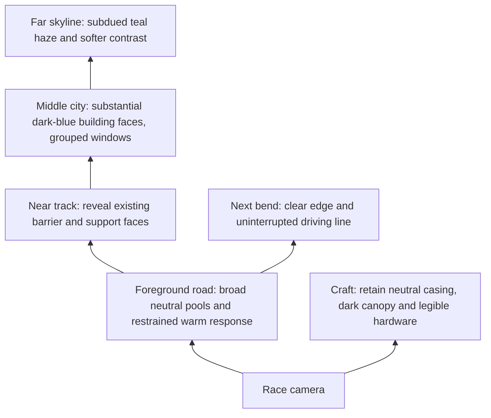

# Opening-city lighting layout

This is a schematic of the intended depth/light relationships, based on the unmodified [crest view](selected/frame-0283.png), [mast approach](selected/frame-0149.png) and [portal approach](selected/frame-0398.png). It does not depict a newly rendered candidate or propose new geometry.

| Camera view | Light hierarchy and direction of attention |
| --- | --- |
| .15 / frame149 | Road leads into left bend; readable supports below the crossing track; mast remains distinct on the right; quieter sky/city behind. |
| .22 / frame211 | Broad road rises toward the gate; close mast face and internal dark gap stay separate; background never becomes the brightest object. |
| .30 / frame283 | Road descends toward the next bend; thermal drums at left retain curvature; middle/far city separates through atmosphere rather than brighter individual windows. |
| .37 / frame398 | Road curve stays legible beside the near support; existing gallery illumination remains the destination. The close strut's geometry is unchanged in this stage. |
| .43 / frame472 | Portal frame is foreground; external light continues coherently onto the road and skyline beyond. |

Candidate A will test the broad light/haze hierarchy with the current road reflection state. Candidate B will change only the road's retained cubemap-sampling variant initially. Neither comparison will inject a camera/racer pose or use a brighter HUD/bloom setting as evidence of improvement.
