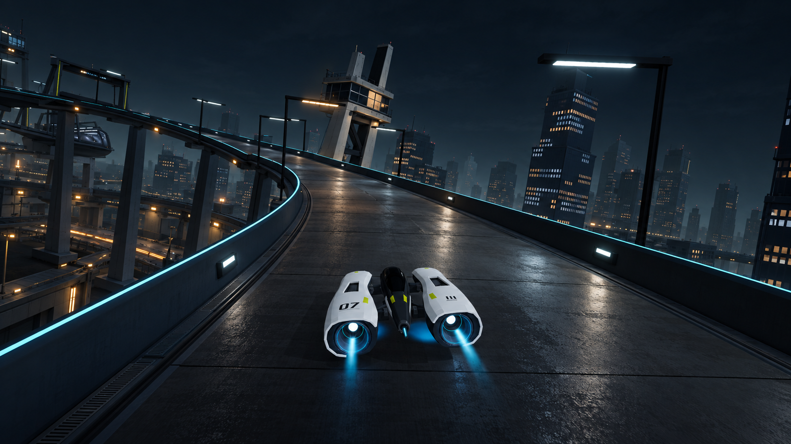
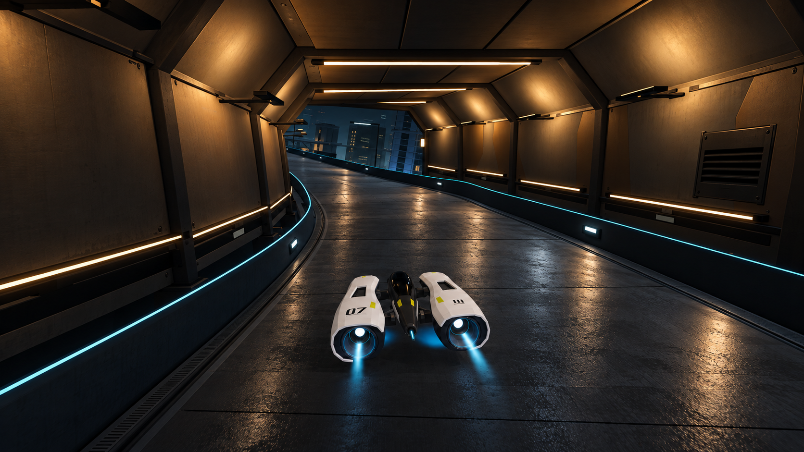
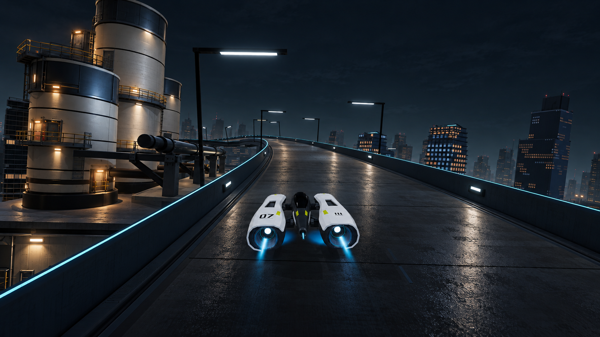
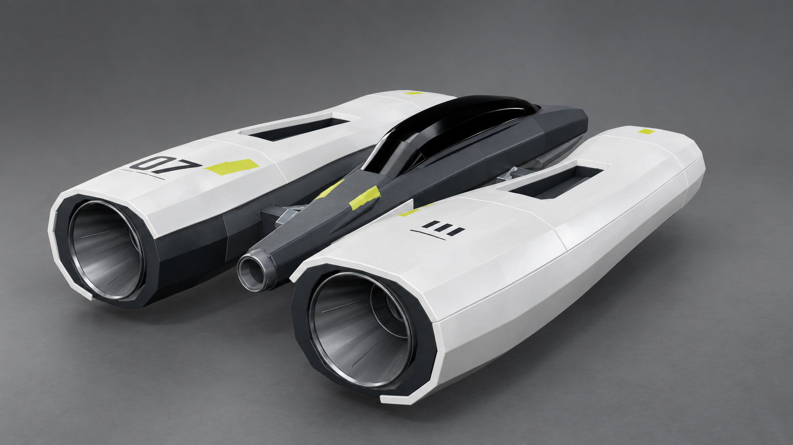

# Nocturne V2 — consistent visual targets and gap evaluation

These four images are generated art-direction targets for the existing Vector Rush game. They are proposals for its appearance, not native screenshots, performance evidence, or a claim that the renderer can already produce them. The owner requested this reference refresh and evaluation after reviewing the project handoff.

**[Open the illustrated native-versus-target comparison](../../docs/visual-targets-v2.html).** Each view can show both images or enlarge either one. The native files remain original and unaltered.

## Shared direction

Keep the current Nocturne circuit and recognizable Kestrel 07. Build a solid industrial transit district with pearl craft armor, dark graphite structure, blue-slate architecture, cool-white practical lamps, localized amber interiors, and restrained cyan guidance. Separate near construction, middle city, and distant atmosphere. Broad lighting should explain surfaces and construction. The road should remain dark and readable while picking up broken elongated highlights from the surrounding light sources.

The central goal is a coherent complete racing image. Adding reflective road alone will not supply the connected architecture, surface shading, and material distinctions visible here.

The generation workflow establishes A as the master appearance reference. B, C, and D each use A plus their own native composition/geometry reference. All four were made with the built-in `image_gen.imagegen` tool. [Exact prompts and input roles](prompts.json) and [file hashes, dimensions, native camera metadata, and scope](provenance.json) are retained. Originals are 1672 × 941 PNGs, approximately 16:9; they were copied without resizing or image editing.

## A — opening city bend

[Actual native control](../../evidence/night-production/road-response/control/selected/frame-0149.png), frame 149, race time 6.330 s. Current control GUID `40bed5f53c2449418e7fb56bf59739f6`.

**What carries over:** the banked bend, crossing elevated road, paired signal mast, large skyline relationships, small lower-center twin-nacelle craft, original livery, and white/amber lamp family. The target improves the existing composition rather than proposing a different circuit.

**What the comparison reveals:** native fog already separates the skyline, but much of the space below and beside the track remains black or sparsely connected. The target gives those spaces visible podiums, service levels, supported track edges, and a few occupied recesses. Native road response is largely soft light patches over uniform panels. Target highlights and darker intervals give it a more legible surface and curvature. The mast gains framing, braces, and depth around its occupied room.

**Gap: large.** The main work spans scene lighting, reflected-source response, and connected near/middle architecture. It cannot be attributed to one smoothness setting. Source geometry and native camera transforms remain authoritative; generated placements are compositional suggestions.

## B — amber gallery

[Actual native control](../../evidence/night-production/road-response/control/full-lap/03-middle.png), frame 943, race time 39.409 s, same current control app.

**What carries over:** the leftward route, chamfered shell and ribs, right service hatch, long practical fixtures, cool city exit, same Kestrel and chase scale.

**What the comparison reveals:** the native gallery already has the important spatial construction and warm-to-cool transition. The target makes joints, rib contacts, hatch depth, and metal/paint separation more convincing. Warm illumination follows the structure, while broad broken road highlights reinforce the length and bend of the passage. It does not need a wholly new tunnel concept.

**Gap: moderate for architecture; large for road/light response.** This is the most bounded place to establish the finish standard after checking the road technique in the current opening benchmark. Copying tiny fasteners is lower priority than getting the wall/ceiling/road relationship right.

## C — thermal passage

[Actual native control](../../evidence/night-production/road-response/control/selected/frame-0607.png), frame 607, race time 25.410 s, same current control app.

**What carries over:** the three staggered cylinders on the left, broad pipe and support relationship, rising leftward course, right skyline, and same racing craft/material language.

**What the comparison reveals:** the landmark already reads as three cylinders and pipes. The target makes it read as a functioning facility through accessible maintenance levels, inset doors, connections to its platform, pipe supports, material edges, and selective light. The immediate track/world relationship becomes clearer. Far-tower repetition still exists in the generated target; it is not an unlimited city-design solution.

**Gap: moderate for the main silhouette; large for construction context and local lighting.** Keep the existing landmark identity. Select a small repeatable service kit instead of rebuilding the whole plant or copying every generated railing and lamp. The target's added service geometry and lights are future work, not present assets.

## D — craft materials under neutral inspection

[Historical native geometry control](../../evidence/ship-native-v4-control-01/01-studio-rear-three-quarter.png). This is the contact-corrected craft with the previous surface maps, used for geometry and camera identity. It is not a fresh material render of the current app. Current gameplay appearance is assessed in A–C.

**What carries over:** the two waisted nacelles, narrow black canopy, dark center and gaps, deep rear engine mouths, tiny central nozzle, recessed top intakes, and the original paint layout. Engine emission is intentionally off in the target to expose the physical construction.

**What the comparison reveals:** the existing craft is already close to this target's primary design. More convincing pearl specular roll, graphite roughness, canopy reflections, nozzle metal, and contact shading can add quality without another silhouette redesign. The target also exposes the limits of the current relatively simple surfaces; the goal is controlled refinement rather than covering them with detail.

**Gap: modest in primary form; moderate in finish and integration.** The studio target is useful for material vocabulary and construction inspection. Its lighting differs from the native rig, so it cannot quantify the current texture deficit. Verify any material work in a fresh neutral native rig and the normal chase camera.

## Evaluation of the reference set itself

**Suitable as a coherent working art direction.** A–C visibly retain the same craft, livery, recessed engines, cyan guidance, overhead lamp family, dark road treatment, and blue/amber balance. B changes the local illumination while retaining the exterior's materials. D retains the same primary craft design under intentionally neutral lighting. These are substantially more consistent with the implemented craft and spaces than the earlier independently invented Nocturne designs.

The images still need interpretation:

- **Composition is approximate.** Generated geometry, camera projection, panel lines, and small proportions drift. They are not calibrated camera matches, mesh blueprints, or pixel-difference tests. Never move the real camera or reshape the craft simply to reproduce an incidental generated contour.
- **Road sheen is an upper limit.** A–C lean toward damp rough pavement, and some fine grain is stronger than the intended satin composite. Adopt the large-scale light response while keeping substantial dark surface area; avoid covering the track with small bright noisy patches. Stability has to be checked in motion.
- **Cyan remains stronger than ideal in places.** The long guide line and some nozzle rims are still prominent. Preserve navigation, but let lit road and architecture carry more of the scene. Bright annuli are not a new design requirement.
- **Added details are proposals.** Service levels, drains, braces, doors, and small lamps demonstrate how construction can read. They are not all necessary, nor does generated light transport prove SSR or any other specific implementation.
- **HUD and racing are outside this set's verdict.** Native views retain their HUD; generated views omit it. No improvement is credited to removing the interface. The selected native views have no visible rival, so the targets deliberately add none. These images cannot establish overtaking, racing tension, audio, handling, or continuous motion quality.

This is the parent assistant's review, not an independently delegated critic's verdict. No owner approval of every generated detail or overall production-quality pass is implied.

## Priorities and observable goals

| Priority | Current gap | What a useful native improvement must show |
| --- | --- | --- |
| 1 | Road and surrounding illumination do not interact strongly enough. | Broad broken highlights related to visible sources, readable dark panels and edges, stable response through bends, and no noisy sparkle, sliding shapes or glare over the racing line. Preserve the current control for comparison. |
| 2 | The exterior city's lower/middle construction is too disconnected. | At ordinary chase size, show a supported track edge, a connected service/podium layer, and quieter distant buildings. Retain landmark silhouettes and clear sky gaps. |
| 3 | Architecture often reads as large uniformly shaded surfaces. | Make a few wall/ceiling returns, thermal connections and service entrances visibly change light with their orientation and depth. Judge the complete view before adding microdetail. |
| 4 | Craft material response is less convincing than its established form. | Distinguish pearl, graphite, glass and nozzle metal under neutral and warm/cool native lighting; keep the same silhouette, clean surface contacts, and restrained engines. |
| Separate gate | Static imagery cannot establish the racing experience. | Watch the same native passage continuously, exercise manual input with sound, check rivals/readability, and measure the selected rendering approach in a separate real-time run. |

The existing proposed SSR experiment remains an availability and visual test, not the conclusion of this reference exercise. A successful prototype would address part of priority 1. It would not close the environment, craft, or experience gaps. Keep the current opening passage as the benchmark, use B to check a controlled warm interior, and use C as the landmark regression view. Require visible whole-frame gain before expanding a technique across the circuit.

## Verification and delivery scope

All four generated PNGs and all four native comparison PNGs passed PNG chunk CRC and decompression checks. The provenance file records SHA-256 identities and sizes. The comparison links point to the original native files. Runtime, shaders, imported art and the local app were not changed; Unity tests and native runs were not repeated for this reference/documentation step. The earlier references and all rejected rendering experiments remain preserved.
