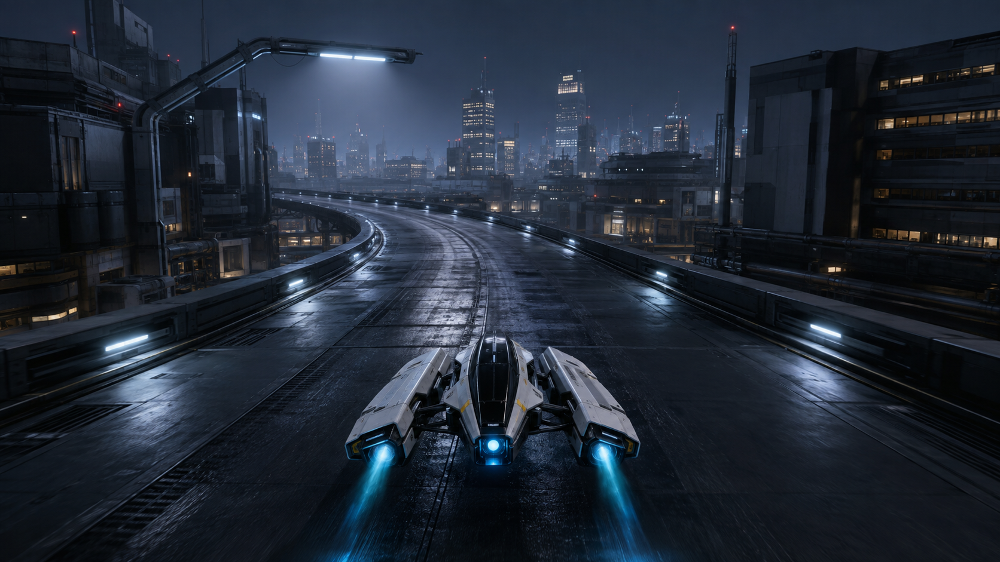
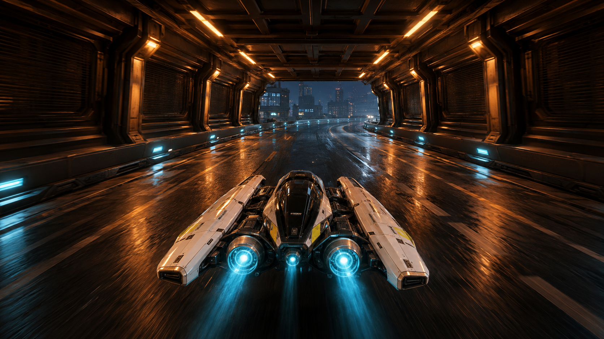
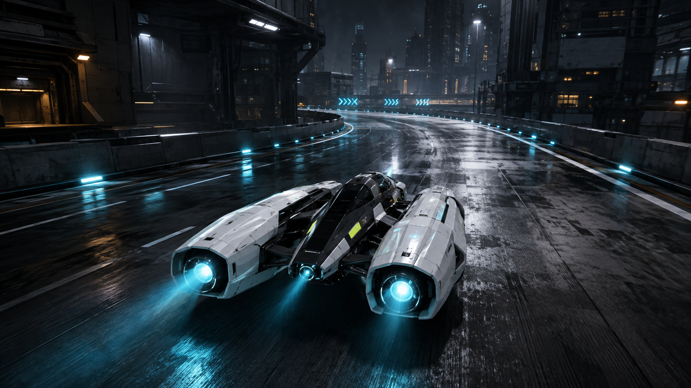

# Nocturne visual targets

These three images were generated with the built-in image generation tool at the user's request. They are aspirational art-direction references, not native gameplay screenshots or evidence of implemented quality. Original outputs are preserved separately; these copies belong to this project.

## A — Open city straight



Target: a readable bend, designed light pools and damp-road highlights; occupied near architecture and progressively quieter city layers. Avoid the equal-contrast window wallpaper in native pass02.

## B — Amber light corridor — recommended primary target



Target: a controlled modular space with deep roof and wall cassettes, a clear exit, alternating warm light pools and restrained cyan navigation fixtures. This is the strongest first scene to match because a small set of authored modules can define most of the view.

## C — Craft and road materials



Target: pearl armor thickness, differentiated dark structure, readable recessed engine cores, soft short plasma and convincing reflection/roughness. The generated craft proportions vary slightly between references; use these for material/lighting targets, not as three conflicting asset blueprints.

## Use before further implementation

Keep the normal racing camera and compare native captures against these targets. Prioritize B's spatial construction and lighting, C's craft/material response, and A's atmospheric depth. Do not claim the game matches them until actual captures support it. The third native build was already running when the user requested references; its visual review remains pending.

## Exact prompts

### A

```text
Use case: stylized-concept. Asset type: art-direction reference for the existing original VECTOR RUSH anti-gravity racing game, not a screenshot or delivery claim. Generate a single high-quality wide 16:9 image, cinematic but plausible as a polished real-time 3D game scene. Consistent design language: midnight industrial city, near-black charcoal structure, cool white practical lamps, concentrated cyan navigation lights, occasional warm amber windows and service lights. Large clean modular architectural forms with authored depth and restrained material detail; atmospheric separation between near, middle and distant buildings. The original hovercraft has two long pearl-white armored side nacelles, exposed dark graphite suspension structure, a narrow central glossy black cockpit, small citron accent panels, two recessed circular cyan engine throats and a tiny central nozzle. No wheels. Soft compact cyan plasma exhaust with pale cores and subtle road light spill. No oversized solid cone exhaust. Wet-dark composite road with broken roughness, controlled reflections and darker intervals, never an all-mirror surface. No existing franchise assets or logos, no HUD, no captions, no watermark. Keep the craft and driving line readable; do not flood everything with bloom. Avoid cartoon window grids, a million tiny buildings, giant billboards, busy cyberpunk clutter, impossible megastructures, low-poly toy rendering, black featureless voids.
Reference A — OPEN CITY STRAIGHT. A real gameplay-like chase camera, about 10m behind and 4m above the craft, 65-degree field of view; craft lower center at roughly one-fifth image width. An elevated 22m-wide circuit sweeps gently left toward a composed layered skyline. Foreground: a cool-white overhead lamp creates a broad shaped pool, subtle long damp-road glints, recessed rail lights mounted in believable dark barriers, fine expansion seams and drainage detail. Middle ground: several strong mixed-height office and industrial volumes, alternating solid service faces and recessed window bands, occupied lower streets beneath the elevated course. Far buildings dissolve into blue-gray night haze. Clear hierarchy: pearl craft first, luminous road bend second, city atmosphere third. A controlled premium night-racing target that is achievable with a limited modular kit, physically convincing materials and carefully composed lighting.
```

### B

```text
Use case: stylized-concept. Asset type: art-direction reference for the existing original VECTOR RUSH anti-gravity racing game, not a screenshot or delivery claim. Generate a single high-quality wide 16:9 image, cinematic but plausible as a polished real-time 3D game scene. Consistent design language: midnight industrial city, near-black charcoal structure, cool white practical lamps, concentrated cyan navigation lights, occasional warm amber windows and service lights. Large clean modular architectural forms with authored depth and restrained material detail; atmospheric separation between near, middle and distant buildings. The original hovercraft has two long pearl-white armored side nacelles, exposed dark graphite suspension structure, a narrow central glossy black cockpit, small citron accent panels, two recessed circular cyan engine throats and a tiny central nozzle. No wheels. Soft compact cyan plasma exhaust with pale cores and subtle road light spill. No oversized solid cone exhaust. Wet-dark composite road with broken roughness, controlled reflections and darker intervals, never an all-mirror surface. No existing franchise assets or logos, no HUD, no captions, no watermark. Keep the craft and driving line readable; do not flood everything with bloom. Avoid cartoon window grids, a million tiny buildings, giant billboards, busy cyberpunk clutter, impossible megastructures, low-poly toy rendering, black featureless voids.
Reference B — AMBER LIGHT CORRIDOR. The same craft design and ordinary chase-camera proportions, speeding through a short enclosed industrial light gallery on the elevated circuit. Rectangular dark metal roof cassettes and deep ribbed side panels form a grounded, buildable modular tunnel with generous width and clear sightline. Closely spaced warm amber ceiling strips produce rhythmic warm pools and narrow elongated reflections on damp charcoal road; inset cyan guide lights close to barriers provide a restrained cool counterpoint. A soft cyan plume glows behind the pearl-white nacelles, white panels pick up alternating cool and warm light with visible cavities and panel thickness. The exit frames a small blue-hazed night-city view and the next bend. Strong depth, occlusion and light falloff; slight peripheral sense of speed but crisp craft and next bend. Make this a coherent playable racing-space lighting reference, not an abstract neon tunnel.
```

### C

```text
Use case: stylized-concept. Asset type: art-direction reference for the existing original VECTOR RUSH anti-gravity racing game, not a screenshot or delivery claim. Generate a single high-quality wide 16:9 image, cinematic but plausible as a polished real-time 3D game scene. Consistent design language: midnight industrial city, near-black charcoal structure, cool white practical lamps, concentrated cyan navigation lights, occasional warm amber windows and service lights. Large clean modular architectural forms with authored depth and restrained material detail; atmospheric separation between near, middle and distant buildings. The original hovercraft has two long pearl-white armored side nacelles, exposed dark graphite suspension structure, a narrow central glossy black cockpit, small citron accent panels, two recessed circular cyan engine throats and a tiny central nozzle. No wheels. Soft compact cyan plasma exhaust with pale cores and subtle road light spill. No oversized solid cone exhaust. Wet-dark composite road with broken roughness, controlled reflections and darker intervals, never an all-mirror surface. No existing franchise assets or logos, no HUD, no captions, no watermark. Keep the craft and driving line readable; do not flood everything with bloom. Avoid cartoon window grids, a million tiny buildings, giant billboards, busy cyberpunk clutter, impossible megastructures, low-poly toy rendering, black featureless voids.
Reference C — CRAFT AND ROAD MATERIAL TARGET. Low, close rear three-quarter chase view of the same twin-nacelle anti-gravity craft, roughly 7m behind and 2.5m above, with the whole craft visible occupying the lower central 40 percent width. Show the pearl ceramic armor thickness, layered panel overlaps, dark open structural gaps, restrained graphite roughness, small fasteners and inset citron panels. The two engine throats are recessed, with a compact almost-white plasma core, thin dim cyan annuli and soft translucent exhaust fading within 1–2m; cyan light gently grazes the nearby road and lower hull. Craft floats about a meter above the road with believable soft contact shadow/light interaction. A cool-white overhead lamp makes a clean specular roll across the body; a distant amber practical gives a restrained secondary rim. Background city and luminous bend are softly atmospheric and less visually dominant. Damp road microstructure is visible only in highlights, not glitter or noisy grain. Premium tactile hard-surface game art, no exaggerated greebles, no studio pedestal, no UI.
```
